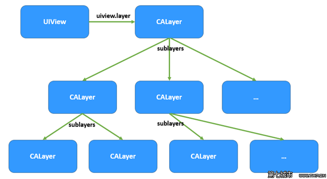

## CoreAnimation 并不只是完成动画，而是让数据快速的显示到屏幕上的一个引擎或底层类库


### 图层（CALayer）、图层树（CALayer Tree）

- (1) 每一部分要显示的数据，被某一个单独的`图层`管理
- (2) 所有的`图层`存储在一个叫做`图层树`的体系之中


而CoreAnimation，就是负责将所有的图层进行`复合`处理成为可以显示在屏幕上的东西。

## 图层（CALayer）与 视图（UIView）的关系


### 他们两的关系图示为如下:





### iOS中的视图（UIView）分类、以及继承层级

```c
- NSObject
	- UIResponder
		- UIView
			- UIControl
				- UIButton
				- UISwitch
				- UITextField
			- UIAlertView
			- UILabel
			- UIScrollView
				- UITextView
				- UITableView
				- UICollectionView
			- UIToolbar
			- UITabBar
```


### iOS中的图层（CALayer）分类、以及继承层级

```c
- NSObject
	- CALayer
		- CAShapeLayer、一个通过矢量图形而不是bitmap来绘制的图层子类。
		- CATextLayer、以图层的形式包含了UILabel几乎所有的绘制特性，并且额外提供了一些新的特性。CATextLayer也要比UILabel渲染得快得多。
		- CATransformLayer、做一些3D变换的操作。
		- CAGradientLayer、用来生成两种或更多颜色平滑渐变，真正好处在于绘制使用了【硬件加速】。
		- CAReplicatorLayer、为了高效生成许多【相似】的图层。它会绘制一个或多个图层的子图层，并在每个复制体上应用不同的变换
		- CAScrollLayer、类似于UIScrollView。
		- CATiledLayer、为载入大图造成的性能问题提供了一个解决方案：将大图分解成小片然后将他们单独按需载入。
		- CAEmitterLayer、一个高性能的粒子引擎，被用来创建实时例子动画如：烟雾，火，雨等等这些效果。
		- CAEAGLLayer、用来操作OpenGL来绘制图像。
		- AVPlayerLayer、AVPlayerLayer是用来在iOS上播放视频的。
```

### CALayer 与 UIView，最大的不同是CALayer不处理用户的事件交互

CALayer，虽然是提供了一个方法实现`containsPoint:`来判断触摸事件Point是否位于CALayer区域内部。

但是并没有实现如何参与`事件响应链`的代码，因为只有`UIView`实现了

```objc
//1. 查询是否能够响应触摸事件
- (nullable UIView *)hitTest:(CGPoint)point withEvent:(nullable UIEvent *)event;

//2. 触摸事件Point是否位于UIView内
- (BOOL)pointInside:(CGPoint)point withEvent:(nullable UIEvent *)event;
```
	
而CALayer虽然也实现了上面两个类似的函数，但是并没有用来接收`UIEvent *`类型对象的参数，所以是无法参与事件传递的

```objc
//1.
- (nullable CALayer *)hitTest:(CGPoint)p;

//2.
- (BOOL)containsPoint:(CGPoint)p;
```

### CALayer 与 UIView，是平行的层级关系

CALayer类在概念上和UIView类似，同样也是一些被层级关系树管理的矩形块，同样也可以包含一些内容（像图片，文本或者背景色），管理子图层的位置。它们都有一些方法和属性用来做`动画 Animaiton`和`变换 Transform`。

每一个视图（UIView）都有一个图层（CALayer）实例，也就是所谓的`backing layer`。

视图（UIView）的职责：

- (1) 创建并管理这个图层（CALayer）
- (2) 确保当子视图（subviews）在层级关系中，添加或者被移除的时候，他们关联的图层（CALayer），也同样对应在层级关系树当中有相同的操作


实际上这些背后关联的 `图层（CALayer）` 才是真正用来在屏幕上`显示`和`做动画`的，`视图（UIView）`仅仅是对它的一个`封装`，提供了如下:

- (1) 用户与屏幕，触摸事件响应处理
- (2) frame、bounds、backgroudColor、text、font...赋值给CALayer实例
- (4) 添加/删除UIView层级，同时添加/删除CALayer层级
- (5) 操作CoreAnimation库的高级接口


### 图层（CALayer）除开不能接收事件响应之后，提供了视图（UIView）所不具备的能力

- (1) 阴影、圆角、带颜色的边框
- (2) 3D变换
- (3) 非矩形 范围
- (4) 透明遮罩
- (5) 多级 非线性 动画

### 使用图层（CALayer）的简单代码、在一个UIView对象内直接添加一个CALayer图层来显示

```objc
#import "ViewController.h"
#import <QuartzCore/QuartzCore.h>

@interface ViewController ()
@property (nonatomic, weak) IBOutlet UIView *view;
@end

@implementation ViewController
- (void)viewDidLoad
{
    [super viewDidLoad];
	
	//1. 创建要显示数据的layer
    CALayer *blueLayer = [CALayer layer];
    blueLayer.frame = CGRectMake(50.0f, 50.0f, 100.0f, 100.0f);
    blueLayer.backgroundColor = [UIColor blueColor].CGColor;

	//2. 将layer添加到UIView内部的layer层级中
    [self.view.layer addSublayer:blueLayer];
}
@end
```

一个视图只有一个相关联的图层（自动创建），同时它也可以支持添加无数多个子图层。

通常情况下，并不会单独使用CALayer，然后去`addSublayer:`、`removeFromSuperlayer`...。

而是UIView关联，好处在于你能在使用所有CALayer底层特性的同时，也可以使用UIView的高级API（比如自动排版，布局和事件处理）。

### 使用CALayer而不是UIView的场景

- (1) 开发同时可以在Mac OS上运行的`跨平台`应用
- (2) 使用多种CALayer的子类，并且不想创建额外的UIView去包封装他们
- (3) 做一些对性能特别挑剔的工作，比如:
	- CALayer相比UIView轻量级的多，占用资源也更少
	- 专有的CALayer，能够做很多性能优化（直接OpenGL绘图、文字处理、大图切割...）
	- CALayer异步子线程完成绘图
