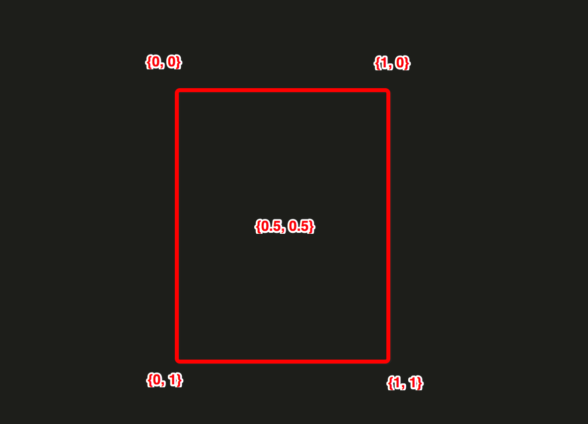
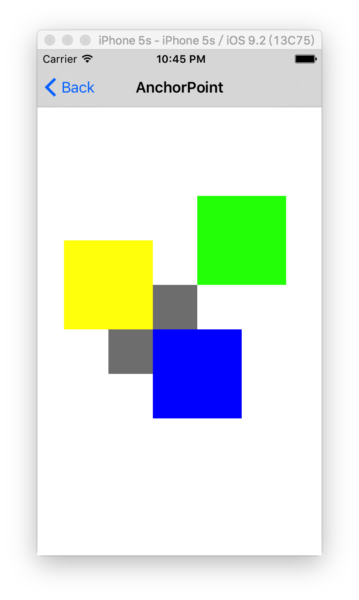
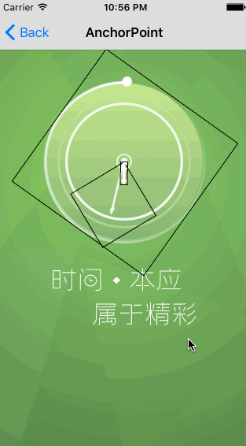
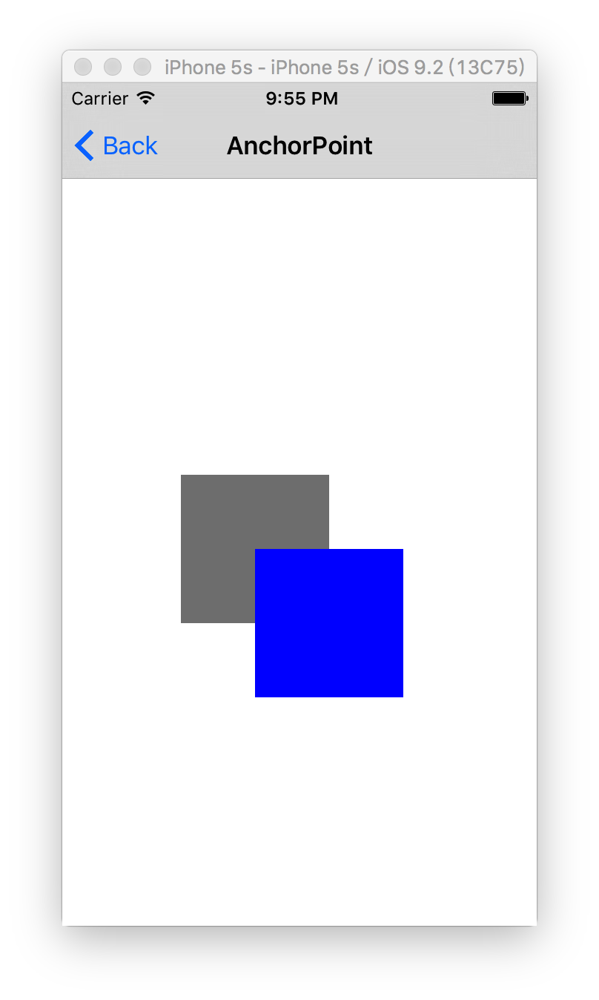
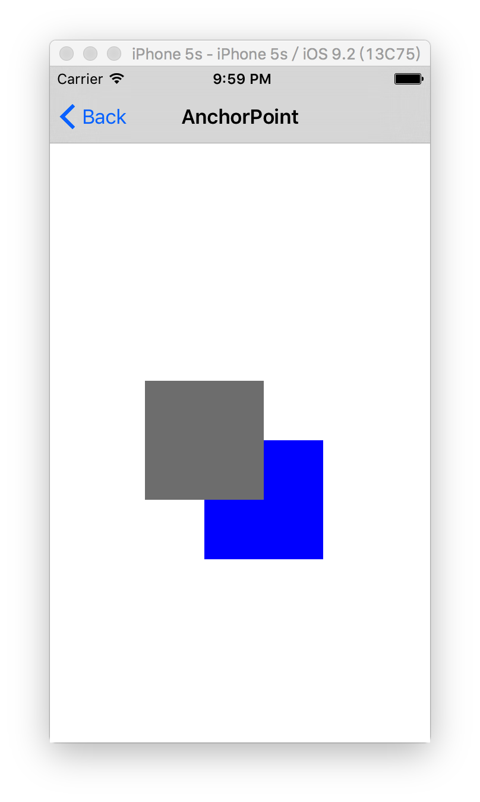

## 布局

UIView有三个比较重要的布局属性：

- (1) frame
- (2) bounds
- (3) center

CALayer对应的三个属性叫做：

- (1) frame
- (2) bounds
- (3) position

为了能清楚区分，CALayer用了`position`，UIView用了`center`，但是他们都代表同样的值。

### frame

代表了图层CALayer在父图层（Super CALayer）上占据的位置和大小。


### bounds

`{0, 0, super.width, super.height}`。x，y默认都是0。

### UIView.center 和 CALayer.position

center和position都代表了当前UIView或CALayer内部区域的`中心点 {width/2.0, height/2.0}`，出现在`super UIView/CALayer`内部的坐标点。

UIView对象的frmae、bounds、center 只是操作CALayer对象属性的 getter/setter。内部其实调用的CALayer的frame、bounds、position属性。

### frame 与 bounds、position、transform 这三个属性值有关系

> 当对CALayer图层做transform变换时，frame实际上代表了覆盖在图层旋转之后的整个轴对齐的矩形区域。

如下图是UIView/CALayer，`没有`做变换之前的frame区域。


而下图是UIView/CALayer，`做了`变换之前的frame区域。


可以看到，做了变换后UIView、CALayer占用的frame区域，比之前大一些了，而且x、y、width、height都与之前不一样了。


## 锚点（anchorPoint）


### anchorPoint与position的区别：

- (1) position是一个`CGRect`，而anchorPoint是一个单位点`{0到1，0到1}`

- (2) position代表的是相对父亲layer的bounds区域内的一个frame区域

- (3) anchorPoint是当前layer自身内部的一个点

- (4) anchorPoint指向的内部点，将会出现在position的位置

### AnchorPoint是一个单位坐标点:



关于AnchorPoint的几点:

- (1) 默认来说，anchorPoint位于CALayer的`中心点`，所以CALayer将会以这个点为中心放置

- (2) anchorPoint属性并没有被UIView接口暴露出来，这也是UIView的position属性被叫做`center`的原因

- (3) CALayer的anchorPoint坐标，是可以移动的。可以认为anchorPoint是用来移动图层的把柄。

AnchorPoint使用的例子1、

```objc
@implementation AnchorPointVC

- (void)test1 {
    
    // 1. 灰色
    UIView *view1 = [[UIView alloc] initWithFrame:CGRectMake(80, 200, 100, 100)];
    view1.backgroundColor = [UIColor grayColor];
    view1.layer.anchorPoint = (CGPoint){0.5, 0.5};
    [self.view addSubview:view1];
    NSLog(@"view1.layer.position = %@", NSStringFromCGPoint(view1.layer.position));
    
    // 2. 蓝色
    UIView *view2 = [[UIView alloc] initWithFrame:CGRectMake(80, 200, 100, 100)];
    view2.backgroundColor = [UIColor blueColor];
    view2.layer.anchorPoint = (CGPoint){0, 0};
    [self.view addSubview:view2];
    NSLog(@"view2.layer.position = %@", NSStringFromCGPoint(view2.layer.position));
    
    // 3. 黄色
    UIView *view3 = [[UIView alloc] initWithFrame:CGRectMake(80, 200, 100, 100)];
    view3.backgroundColor = [UIColor yellowColor];
    view3.layer.anchorPoint = (CGPoint){1, 1};
    [self.view addSubview:view3];
    NSLog(@"view3.layer.position = %@", NSStringFromCGPoint(view3.layer.position));
    
    // 4. 绿色
    UIView *view4 = [[UIView alloc] initWithFrame:CGRectMake(80, 200, 100, 100)];
    view4.backgroundColor = [UIColor greenColor];
    view4.layer.position = (CGPoint){CGRectGetMaxX(view1.frame), CGRectGetMinY(view1.frame)};
    view4.layer.anchorPoint = (CGPoint){0, 1};
    [self.view addSubview:view4];
    NSLog(@"view4.layer.position = %@", NSStringFromCGPoint(view4.layer.position));
}

- (void)viewDidLoad {
    [super viewDidLoad];
    self.title = @"AnchorPoint";
    self.view.backgroundColor = [UIColor whiteColor];
    
    [self test1];
}

- (UIRectEdge)edgesForExtendedLayout {
    return UIRectEdgeNone;
}

@end
```

输出如下

```
2017-02-13 22:36:39.649 CoreAnimationDemo[1109:49338] view1.layer.position = {130, 250}
2017-02-13 22:36:39.650 CoreAnimationDemo[1109:49338] view2.layer.position = {130, 250}
2017-02-13 22:36:39.650 CoreAnimationDemo[1109:49338] view3.layer.position = {130, 250}
2017-02-13 22:36:39.651 CoreAnimationDemo[1109:49338] view4.layer.position = {180, 200}
```

注：CALayer的position属性，就等价于UIView的center属性。

从输出上可以看到，前面三个CALayer的position属性值，都是等于{130, 250}。

而只有最后一个由于执行了`view4.layer.position = (CGPoint){CGRectGetMaxX(view1.frame), CGRectGetMinY(view1.frame)};`，导致最后一个CALayer的position变为了{180, 200}。

那说明，前面3个CALayer的position都没变化，而只是按照anchorPoint指向的那一个点，将整个CALayer移动到CALayer的position为{130, 250}这一个坐标点上。

所以，也就是根据anchorPoint指示的CALayer内部的某一个单位点，将CALayer`平移`到CALayer的`position`所示的`frame坐标系点`的位置。

如上代码运行的效果图:



所以，当改变anchorPoint值的时候，position值并没有发生改变，但是`frame却移动`了。


> 实际上就是让layer.postion{x,y}坐标点，出现在layer内部的某一个锚点（单位点）{0.5, 0.5}的位置。

## 时钟动画代码

效果图如下:




整个代码大致结构如下:

```objc
@implementation AnchorPointVC {
    CALayer *_cirCle3Layer;//最外面不停转动的layer
    CALayer *_shizhenLayer;//时针
    CALayer *_miaozhenLayer;//秒针
}

- (void)viewDidLoad {
    [super viewDidLoad];
    self.title = @"AnchorPoint";
    self.view.backgroundColor = [UIColor whiteColor];
    
    [self test2];
}

- (void)test2 {
    
    //1. 添加背景图片
    [self addClockBackgroud];
    
    //2. 添加时钟View、几个圈View
    [self addClock];
    
    //3. 添加用来不断执行动画的几个layer
    [self addAnimationLayers];
}

- (void)addClockBackgroud {
    UIImageView * imageView = [[UIImageView alloc]initWithImage:[UIImage imageNamed:@"welcome_background"]];
    imageView.frame = self.view.frame;
    [self.view addSubview:imageView];
}

- (void)addClock {
    
    // 时钟背景
    UIImageView * imageView = [[UIImageView alloc]initWithImage:[UIImage imageNamed:@"clock_background"]];
//    imageView.layer.borderWidth = 1;
    imageView.frame = CGRectMake(0, 0, 200, 200);
    imageView.center = CGPointMake(self.view.bounds.size.width/2, self.view.bounds.size.height/4);
    [self.view addSubview:imageView];
    
    // 时钟最中间的2个圈的图片
    UIImageView * imageCenter = [[UIImageView alloc]initWithImage:[UIImage imageNamed:@"clock_center"]];
//    imageCenter.layer.borderWidth = 1;
    imageCenter.frame = CGRectMake(0, 0, 20, 20);
    imageCenter.center = CGPointMake(self.view.bounds.size.width/2, self.view.bounds.size.height/4);
    [self.view addSubview:imageCenter];
    
    // 时钟第三个圈
    UIImageView * imageCircle1 = [[UIImageView alloc]initWithImage:[UIImage imageNamed:@"clock_circle1"]];
    imageCircle1.frame = CGRectMake(0, 0, 150, 150);
//    imageCircle1.layer.borderWidth = 1;
    imageCircle1.center = CGPointMake(self.view.bounds.size.width/2, self.view.bounds.size.height/4);
    [self.view addSubview:imageCircle1];
    
    // 时钟第4个圈
    UIImageView * imageCircle2 = [[UIImageView alloc]initWithImage:[UIImage imageNamed:@"clock_circle2"]];
//    imageCircle2.layer.borderWidth = 1;
    imageCircle2.frame = CGRectMake(0, 0, 170, 170);
    imageCircle2.center = CGPointMake(self.view.bounds.size.width/2, self.view.bounds.size.height/4);
    [self.view addSubview:imageCircle2];
}

- (void)addAnimationLayers {
    
    //1. 最外面的旋转的圈的动画层
    [self addCircle3AnimationLayer];
    
    //2. 时钟动画层
    [self addShizhenAnimationLayer];
    
    //3. 秒钟动画层
    [self addMiaozhenAnimationLayer];
}

- (void)addCircle3AnimationLayer {
	// 完成最外层不断转圈的动画
}

- (void)addShizhenAnimationLayer {
	// 完成时钟不断转圈的动画
}

- (void)addMiaozhenAnimationLayer {
	// 完成秒针不断转圈的动画
}

#pragma mark - CALayer Delegate

-(void)drawLayer:(CALayer *)layer inContext:(CGContextRef)ctx{
	// 不断的绘制图像
}

@end
```

可以看出，先添加不做动画的普通View，底层自动转化为CALayer去显示。然后，继续添加如下三种专门不断的做动画的CALayer。

- `addCircle3AnimationLayer`的实现:

```objc
- (void)addCircle3LayerAndRotateAnimation {
    
    //1. 创建图层，设置图层位置、大小，添加图层到图层数
    _cirCle3Layer = [CALayer layer];
    _cirCle3Layer.borderWidth = 1;
    
    //2. 只设置layer的width、height
    _cirCle3Layer.frame = CGRectMake(0, 0, 207, 207);
    
    //3. 设置layer的center坐标，默认出现在anchorPoint{0.5, 0.5}的位置
    // （也就是让layer居中显示在父layer中）
    _cirCle3Layer.position = CGPointMake(self.view.bounds.size.width/2+1,
                                         self.view.bounds.size.height/4+1);
    
    //4. 添加sub layer
    [self.view.layer addSublayer:_cirCle3Layer];
    
    //5. 设置动画代理
    _cirCle3Layer.delegate = self;
    
    //6. 通知绘制图像
    [_cirCle3Layer setNeedsDisplay];
    
    //7. 创建核心动画，作用在layer某个属性上
    // （默认：动画效果【不会】影响layer原有的属性值）
    CABasicAnimation * animation = [CABasicAnimation animationWithKeyPath:@"transform.rotation"];
    
    //8. 动画时长
    animation.duration = 1.0;
    
    //9. 动画的初始值
    animation.fromValue = [NSNumber numberWithFloat:0];
    
    //10. 动画的结束时的值，旋转360度，即一群
    // 比如，只需要旋转指定angle角度====> [NSNumber numberWithFloat:((angle * M_PI) / 180.f)]
    animation.toValue = [NSNumber numberWithFloat:((360*M_PI)/180.f)];
    
    //8. 动画执行完毕之后的操作
    //kCAFillModeForwards       保持结束时的状态
    //kCAFillModeBackwards      回到开始时的状态
    //kCAFillModeBoth           兼顾以上的两种效果
    //kCAFillModeRemoved        结束时删除效果
    animation.fillMode = kCAFillModeForwards;
    
    //9. 动画的重复次数
    animation.repeatCount = MAXFLOAT;
    
    //10. 开始动画
    [_cirCle3Layer addAnimation:animation forKey:@"rotation"];
}
```

可以看做，整个`_cirCle3Layer`旋转一圈。

- `addShizhenAnimationLayer`的实现:

```objc
- (void)addShizhenLayerAndRotateAnimation {
    
    //1.
    _shizhenLayer = [CALayer layer];
    _shizhenLayer.borderWidth = 1;
    
    //2.
    _shizhenLayer.frame = CGRectMake(0, 0, 80, 80);
    
    //3.
    _shizhenLayer.position = CGPointMake(self.view.bounds.size.width/2,
                                         self.view.bounds.size.height/4);
    
    //4.
    [self.view.layer addSublayer:_shizhenLayer];
    
    //5.
    [_shizhenLayer setNeedsDisplay];
    
    //6.
    _shizhenLayer.anchorPoint = CGPointMake(0, 0);
    
    //7.
    _shizhenLayer.delegate = self;
    
    //8.
    CABasicAnimation * animation2 = [CABasicAnimation animationWithKeyPath:@"transform.rotation"];
    animation2.duration = 60;
    animation2.fromValue = [NSNumber numberWithFloat:0];
    animation2.toValue = [NSNumber numberWithFloat:((360*M_PI)/180)];
    animation2.repeatCount = MAXFLOAT;
    animation2.fillMode = kCAFillModeForwards;
    
    //9.
    [_shizhenLayer addAnimation:animation2 forKey:@"rotation.x"];
}
```

- `addMiaozhenAnimationLayer`的实现:

```
省略......
```

注意，如上三个负责完成动画的layer，在创建的时候，并没有指定contents属性值，而是通过调用`-[CALayer setNeedsDisplay]`，调用如下的`CALAyerDelegate`回调函数中，使用`CoreGraphics进行图像的绘制`。

```objc
-(void)drawLayer:(CALayer *)layer inContext:(CGContextRef)ctx{
    
    //1.
    CGContextSaveGState(ctx);
    
    //2.
    if (layer == _cirCle3Layer) {
        
        //2.1
        UIImage * image = [UIImage imageNamed:@"clock_circle3"];
        
        //2.2
        CGContextDrawImage(ctx, CGRectMake(0, 0, 207, 207), image.CGImage);
    }
    
    //3.
    if (layer == _shizhenLayer) {
        UIImage * image = [UIImage imageNamed:@"clock_min"];
        CGContextDrawImage(ctx, CGRectMake(0, 0, 50, 50), image.CGImage);
    }
    
    //4.
    if (layer == _miaozhenLayer) {
        UIImage * image = [UIImage imageNamed:@"clock_time"];
        CGContextDrawImage(ctx, CGRectMake(0, 0, 10, 30), image.CGImage);
    }
    
    //5.
    CGContextRestoreGState(ctx);
}
```

就是不停的将对应的图像，重新绘制当当前传入的layer所在的区域中。


> 从面的时钟，总结写一些复杂动画的套图:

- (1) 先添加不做动画的固定不动的UIView/CALayer
- (2) 然后每一种动画，专门创建一个CALayer来负责完成
- (3) 将负责完成动画的CALayer，也逐个添加到root layer中
- (4) 在CALayerDelegate回调中，使用CoreGraphics完成对应layer要显示的图像绘制

## 坐标系

和UIView一样，CALayer在图层树当中也是相对于`父CALayer`按层级关系放置。只要父CALayer的位置发生变化，子CALayer跟着变化，这个和UIView保持一致的。

> （坐标系转换）CALayer给不同坐标系之间的图层转换提供了一些工具类方法：

第一类，fromLayer 转换 Point或Rect

```c
//1. 
- (CGPoint)convertPoint:(CGPoint)point fromLayer:(CALayer *)layer; 

//2.
- (CGRect)convertRect:(CGRect)rect fromLayer:(CALayer *)layer;
```

第二类，toLayer 转换 Point或Rect

```c
//3.
- (CGPoint)convertPoint:(CGPoint)point toLayer:(CALayer *)layer; 

//4.
- (CGRect)convertRect:(CGRect)rect toLayer:(CALayer *)layer;
```

这些方法可以把定义在一个图层坐标系下的点或者矩形，转换成另一个图层坐标系下的点或者矩形。

## CALayer的绘制顺序

和UIView严格的二维坐标系不同，CALayer存在于一个三维空间当中。除了我们已经讨论过的position和anchorPoint属性之外，CALayer还有另外两个属性，`zPosition`和`anchorPointZ`。

`zPosition`属性在大多数情况下其实并不常用，一般只会在如下两个方面使用:

- (1) CALayer的3D矩阵变化（`CATransform3D`）
- (2) **改变图层的显示顺序**

通常，图层是根据当前要绘制的layer的`所有sublayers的出现顺序`来类绘制的，这就是所谓的画家的算法，就像一个画家在墙上作画，越在`后面`画的图案，就越出现在画板的`最上面`。

但是通过`增加layer的zPosition属性值`，就可以把图层向相机方向`前置（往画板最上面）`，于是它就在所有其他图层的`前面`了。

下面是通过增加zPosition值，调整layer的展现顺序:

```objc
- (void)test3 {
    
    // 灰色
    UIView *view1 = [[UIView alloc] initWithFrame:CGRectMake(80, 200, 100, 100)];
    view1.backgroundColor = [UIColor grayColor];
    view1.layer.anchorPoint = (CGPoint){0.5, 0.5};
    [self.view addSubview:view1];
    NSLog(@"view1.layer.zPosition = %f", view1.layer.zPosition);
    
    // 蓝色
    UIView *view2 = [[UIView alloc] initWithFrame:CGRectMake(80, 200, 100, 100)];
    view2.backgroundColor = [UIColor blueColor];
    view2.layer.anchorPoint = (CGPoint){0, 0};
    [self.view addSubview:view2];
    NSLog(@"view2.layer.zPosition = %f", view2.layer.zPosition);
}
```

输出

```
2017-02-15 21:56:22.050 CoreAnimationDemo[2210:28125] view1.layer.zPosition = 0.000000
2017-02-15 21:56:22.051 CoreAnimationDemo[2210:28125] view2.layer.zPosition = 0.000000
```

默认情况下，zPosition值都是`0`。



```objc
- (void)test4 {
    
    // 灰色
    UIView *view1 = [[UIView alloc] initWithFrame:CGRectMake(80, 200, 100, 100)];
    view1.layer.zPosition = 1;//调整layer的zPosition值，让layer靠前显示
    view1.backgroundColor = [UIColor grayColor];
    view1.layer.anchorPoint = (CGPoint){0.5, 0.5};
    [self.view addSubview:view1];
    NSLog(@"view1.layer.position = %@", NSStringFromCGPoint(view1.layer.position));
    
    // 蓝色
    UIView *view2 = [[UIView alloc] initWithFrame:CGRectMake(80, 200, 100, 100)];
    view2.backgroundColor = [UIColor blueColor];
    view2.layer.anchorPoint = (CGPoint){0, 0};
    [self.view addSubview:view2];
    NSLog(@"view2.layer.position = %@", NSStringFromCGPoint(view2.layer.position));
}
```



效果就是UIView的如下几个函数:

```c
//1. 
- (void)bringSubviewToFront:(UIView *)view

//2.
- (void)insertSubview:(UIView *)view atIndex:(NSInteger)index;

//3.
- (void)exchangeSubviewAtIndex:(NSInteger)index1 withSubviewAtIndex:(NSInteger)index2;
```

> zPosition属性可以明显改变屏幕上图层的顺序，但不能改变事件传递的顺序:

如果改变了图层的z轴顺序，你会发现将不能够检测到最前方的视图点击事件，这是因为被另一个图层遮盖住了，虽然它的zPosition值较小，但是在图层树中的顺序靠前。

## Hit Testing

一般情况下，最好使用UIKit提供的相关UIView子类，而不是创建独立CALayer，因为`CALayer无法接收用户各种UI触摸事件`。

CALayer并不关心任何`响应链事件`，所以不能直接处理触摸事件或者手势。但是它有一系列的方法帮你处理事件：

```c
@interface CALayer : NSObject <NSCoding, CAMediaTiming>

- (BOOL)containsPoint:(CGPoint)p;

- (nullable CALayer *)hitTest:(CGPoint)p;

@end
```

对比下UIView完成同样功能的函数:

```c
@interface UIView(UIViewGeometry)

- (BOOL)pointInside:(CGPoint)point withEvent:(nullable UIEvent *)event;

- (nullable UIView *)hitTest:(CGPoint)point withEvent:(nullable UIEvent *)event;

@end
```

可以看到UIView提供的两个函数中，有一个额外的方法回传参数就是`UIEvent *`类型的对象。

CALayer的两个回调函数中，正因为没有`UIEvent *`类型的对象，所以是无法处理用户的触摸事件的。

`-containsPoint:`接受一个在`当前layer`内部的一个CGPoint，如果这个点在图层frame范围内就返回YES。

那么，可以通过使用`-containsPoint:`方法来判断当前触摸点CGPoint处于哪一个layer中，进而做一些事件回调处理。

这样是可以，但是需要将CGPoint转换成所有layer内部的坐标系，太麻烦了。

### 使用containsPoint判断被点击的图层:

```objc
@interface ViewController ()
@property (nonatomic, weak) IBOutlet UIView *layerView;
@property (nonatomic, weak) CALayer *blueLayer;
@end

@implementation ViewController

- (void)viewDidLoad
{
    [super viewDidLoad];
    
    //1. create sublayer
    self.blueLayer = [CALayer layer];
    self.blueLayer.frame = CGRectMake(50.0f, 50.0f, 100.0f, 100.0f);
    self.blueLayer.backgroundColor = [UIColor blueColor].CGColor;
    
    //2. add it to our view
    [self.layerView.layer addSublayer:self.blueLayer];
}

- (void)touchesBegan:(NSSet *)touches withEvent:(UIEvent *)event
{
    //1. get touch position relative to main view
    CGPoint point = [[touches anyObject] locationInView:self.view];
    
    //2. convert point to the white layer's coordinates
    point = [self.layerView.layer convertPoint:point fromLayer:self.view.layer];
    
    //3. get layer using containsPoint:
    if ([self.layerView.layer containsPoint:point]) {
    
        //4. convert point to blueLayer’s coordinates
        point = [self.blueLayer convertPoint:point fromLayer:self.layerView.layer];
        
        //5. 
        if ([self.blueLayer containsPoint:point]) {
            [[[UIAlertView alloc] initWithTitle:@"Inside Blue Layer" 
                                        message:nil
                                       delegate:nil 
                              cancelButtonTitle:@"OK"
                              otherButtonTitles:nil] show];
        } else {
            [[[UIAlertView alloc] initWithTitle:@"Inside White Layer"
                                        message:nil 
                                       delegate:nil
                              cancelButtonTitle:@"OK"
                              otherButtonTitles:nil] show];
        }
    }
}

@end
```

### CALayer的手动布局（类似UIView布局）

实现`CALayerDelegate`中如下回调函数，实现对当前layer内部的所有的sublayers进行布局

```c
- (void)layoutSublayersOfLayer:(CALayer *)layer
```

当layer的`bounds`发生改变时，通过调用`[CALayer setNeedsLayout]`来重新走上面的`layoutSublayersOfLayer:`回调函数，来调整内部的所有的sublayer的布局。

就有一点类似UIView的布局subviews的函数:

```c
- (void)layoutSubviews;
```

CALayer并不能像UIView的autoresizingMask和constraints属性做到自适应屏幕旋转。

这也是为什么最好使用UIView，而不是单独的CALayer，来构建应用程序的另一个重要原因之一。