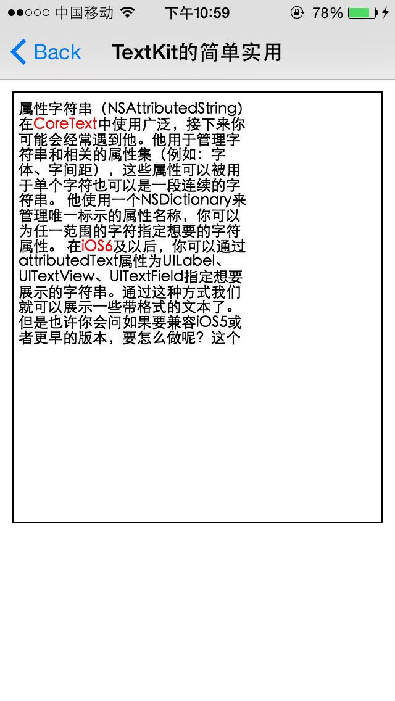
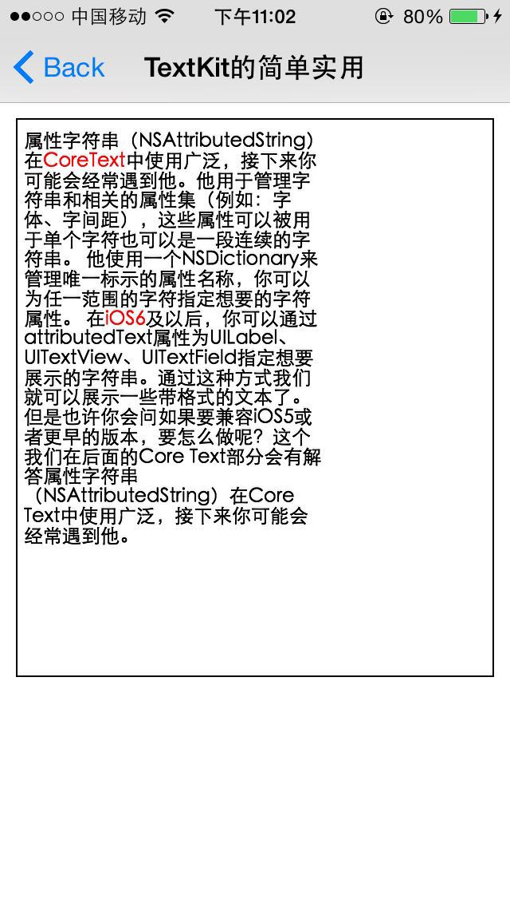
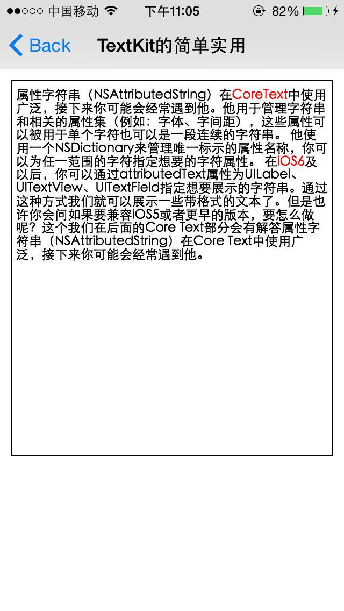
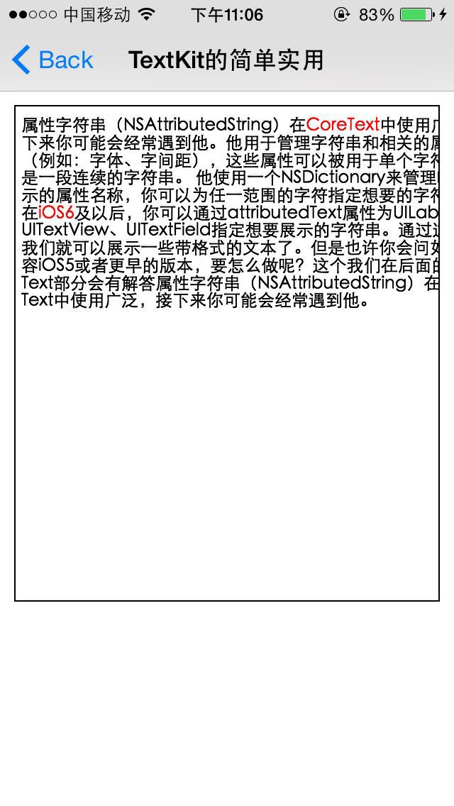

## TextKit是iOS7推出的，对CoreText的文本绘制代码进行的封装，主要的api

```objc
NSTextContainer 控制显示文本内容的区域大小
NSTextStorage  可以设置富文本属性，来包装要显示的文本
NSLayoutManager 文本的排版布局
```

## 简单的使用例子、只让TextView内部一部分显示文本内容，并且给关键字以红色显示

```objc
@implementation TextKitDemoVC {
    NSString            *_text;             // 显示的文本
    UITextView          *_txtView;          // 显示文本的UI控件
    NSTextContainer     *_textContainer;    // 控制TextView显示文本的区域
}

- (void)viewDidLoad {
    [super viewDidLoad];
    [self setupText];
    [self drawText];
}

- (void)setupText {
    
    _text = @"属性字符串（NSAttributedString）在CoreText中使用广泛，接下来你可能会经常遇到他。他用于管理字符串和相关的属性集（例如：字体、字间距），这些属性可以被用于单个字符也可以是一段连续的字符串。 他使用一个NSDictionary来管理唯一标示的属性名称，你可以为任一范围的字符指定想要的字符属性。 在iOS6及以后，你可以通过attributedText属性为UILabel、UITextView、UITextField指定想要展示的字符串。通过这种方式我们就可以展示一些带格式的文本了。但是也许你会问如果要兼容iOS5或者更早的版本，要怎么做呢？这个我们在后面的Core Text部分会有解答属性字符串（NSAttributedString）在Core Text中使用广泛，接下来你可能会经常遇到他。";
}

- (void)drawText {
    
    //1. NSTextContainer >>> 控制显示文本内容的区域大小
    _textContainer = [[NSTextContainer alloc] initWithSize:CGSizeMake(200, 200)];
    
    //2. NSLayoutManager >>> 文本的排版布局
    NSLayoutManager *layout = [[NSLayoutManager alloc] init];
    [layout addTextContainer:_textContainer];
    
    //3. 构建富文本属性字符串
    NSDictionary *attrsDic = @{NSTextEffectAttributeName: NSTextEffectLetterpressStyle};
    
    //4. NSTextStorage >>> 可以设置富文本属性，来包装要显示的文本
    NSTextStorage *storage = [[NSTextStorage alloc] initWithString:_text attributes:attrsDic];
    [storage addLayoutManager:layout];
    
    //5. 还可以单独设置富文本给storage
    /*
     NSDictionary *attrsDic = @{NSTextEffectAttributeName: NSTextEffectLetterpressStyle};
     NSMutableAttributedString *attrStr = [[NSMutableAttributedString alloc] initWithString:_txtView.text attributes:attrsDic];
     [storage setAttributedString:attrStr];
     */
    
    //6. 实用 NSTextContainer 创建TextView
    CGRect textViewRect = CGRectMake(10, 10, 300, 350);
    _txtView = [[UITextView alloc] initWithFrame:textViewRect textContainer:_textContainer];
    _txtView.layer.borderWidth = 1;
    _txtView.scrollEnabled = NO;
    _txtView.editable = NO;
    [self.view addSubview:_txtView];
    
    //7. 开始文字排版
    [storage beginEditing];
    
    //8. 查找特定的单词，单独设置效果
    [self markWord:@"iOS6" inTextStorage:storage];
    [self markWord:@"CoreText" inTextStorage:storage];
    
    //9. 结束排版，调用CoreText进行最终的渲染字形图片
    [storage endEditing];
    
}

- (void) markWord:(NSString*)word inTextStorage:(NSTextStorage*)textStorage
{
    //1. 正则式过滤
    NSRegularExpression *regex = [NSRegularExpression regularExpressionWithPattern:word
                                                                           options:0
                                                                             error:nil];
    
    //2. 查找到单词的位置
    NSArray *matches = [regex matchesInString:_txtView.text
                                      options:0
                                        range:NSMakeRange(0, [_txtView.text length])];
    
    //3. 设置文字效果
    for (NSTextCheckingResult *match in matches) {
        
        // 文字的range
        NSRange matchRange = [match range];
        
        // storage添加属性字符串设置
        [textStorage addAttribute:NSForegroundColorAttributeName
                            value:[UIColor redColor]
                            range:matchRange];
    }
}

- (UIRectEdge)edgesForExtendedLayout {
    return UIRectEdgeNone;
}

@end
```

上面的TextView与TextContainer的尺寸:

- (1) TextView: `300 * 350` 
- (2) TextContainer: `200 * 200`

效果图如下:



### 再将TextView与TextContainer的尺寸改为:

- (1) TextView: `300 * 350` 
- (2) TextContainer: `200 * 350`



可以看到文字可以展示完毕了，但是也只是展示到宽度为200的样子。

### 再将TextView与TextContainer的尺寸改为:

- (1) TextView: `300 * 350` 
- (2) TextContainer: `300 * 350`



文字已经可以占据TextView的整个宽度了。

### 再将TextView与TextContainer的尺寸改为:

- (1) TextView: `300 * 350` 
- (2) TextContainer: `350 * 200`



可以看到文字已经超出了TextView的宽度了。

## 小结TextKit几个核心类

- (1) `NSTextContainer`不能单独使用，必须配合`UITextView`进行使用
- (2) `NSTextContainer`控制`UITextView`内部显示文本内容的`区域`
- (3) `NSTextStorage`对要绘制的富文本内容的包装
- (4) `NSLayoutManager`负责文本内容的最终绘制