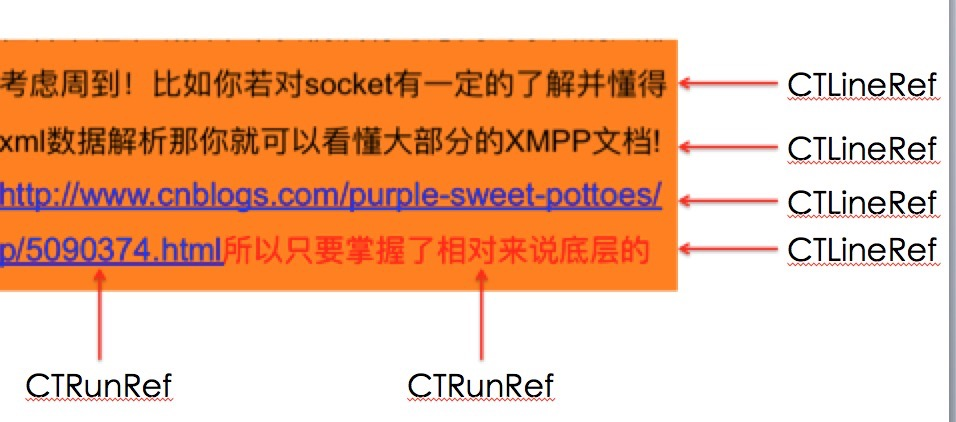
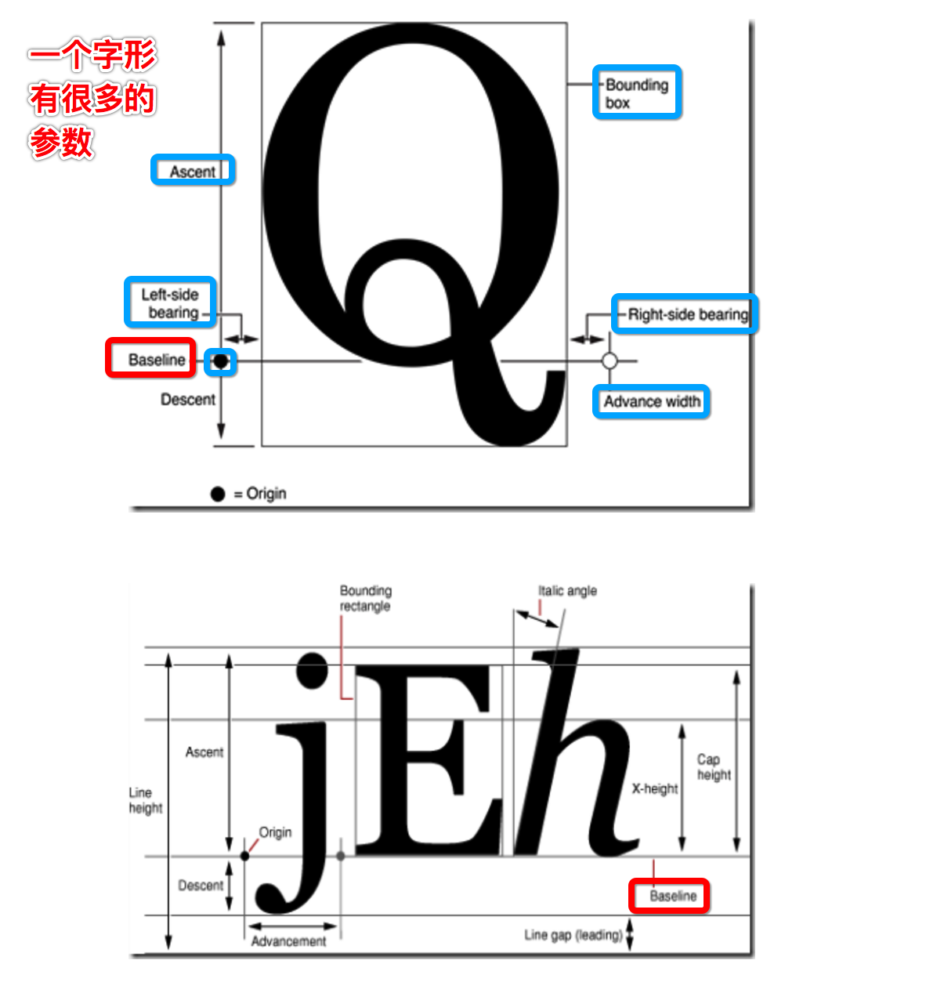
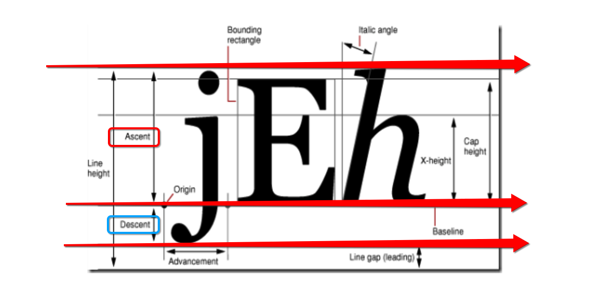
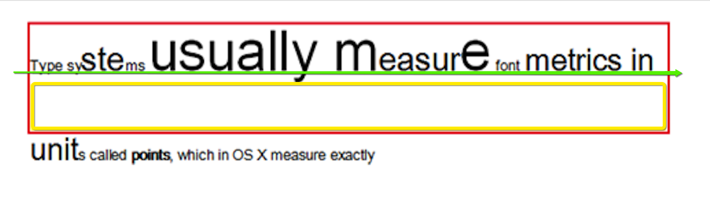
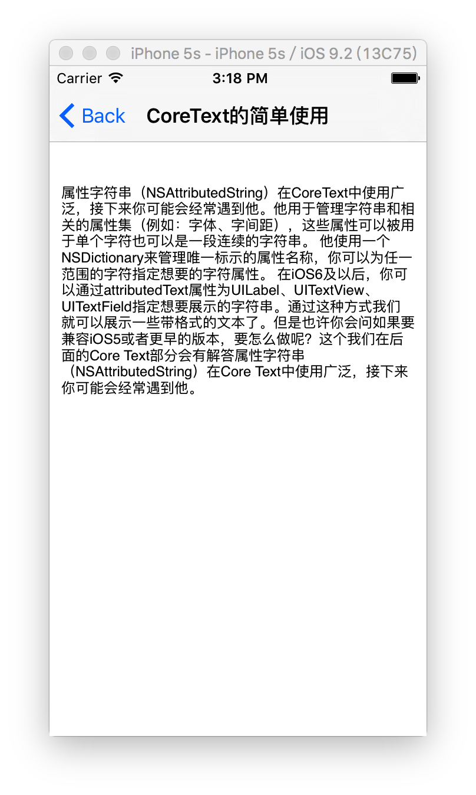
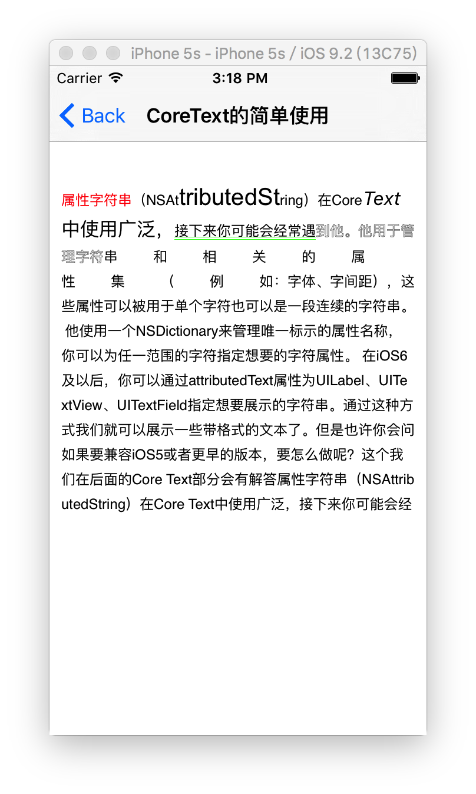
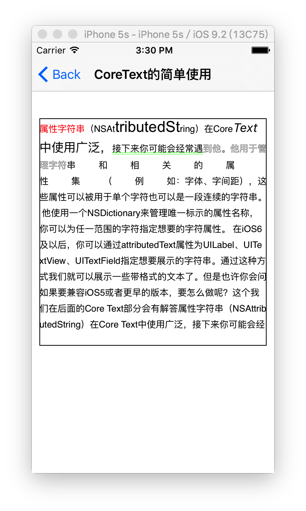
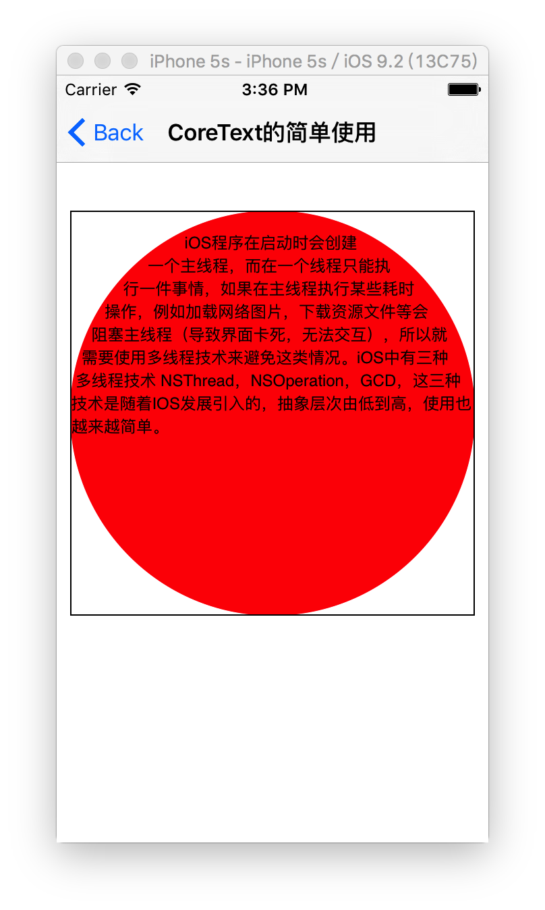

## 本章记录使用CoreText进行文本渲染的步骤模板、以及不同的方法

### CoreText所有api组成结构




### CoreText核心操作的列举

```
/**
 *	一、CTFramesetterRef 容器包含
 * (1) CTFrame 某一页显示的文字
 * (2) CTLine	 某一行显示的文字
 * (3) CTRun	某一行中的某一个小块（显示文字或一个图片）
 *
 *	二、CTParagraphStyle 段落样式设置
 *	typedef CF_ENUM(uint32_t, CTParagraphStyleSpecifier) {
 *		对齐方式,
 *	 	首行缩进,
 *	  	段尾缩进 ,
 *	   换行模式 ,
 *	   多行高 ,
 *	   行距 ,
 *	   段落间距,
 *	   行距调整 ,
 *	   .....等等
 * };
 *
 *	三、文字绘制
 *  (1) CTRunDraw(CTRunRef run, CGContextRef context, CFRange range)
 *  (2) CTLineDraw(CTLineRef line, CGContextRef context)
 *  (3) CTFrameDraw(CTFrameRef frame, CGContextRef context);
 * 
 * 四、CTRunDelegateRef 回调获取某一个块显示的内容
 * 比如、显示emoji时，需要回调获取显示的内容：
 * (1) 图片
 * (2) 宽度
 * (3) 高度
 */ 
```

### 在文本排版中的一些术语


- 字体(Font)
	- 是一系列字号、样式和磅值相同的`字符`
	- 当我们为文字设置粗体，斜体时其实是使用了另外一种字体(下划线不算)

- 字体集(Font family)
	- 表示一个字体簇
	- 每一个字体簇，包含多种不同的字体Font

- 磅值(Weight)
	- 于描述字体的`粗`度
	- 如: 有极细、细、book、中等、半粗、粗、较粗、极粗

- 样式(Style)
	- `字形`的样式，有三种样式:
	- roman type >>> 直体
	- oblique type >>> 斜体
	- utakuc type >>> 斜体兼曲线

- x高度(X height)
	- 指 `小写字母` 的 平均高度，以`字母x`为基准值

- Cap高度(Cap height)
	- 指 `大写字母` 的 平均高度，因 `字母C`为基准值

- 字符(Character)和字形(Glyphs)
	- 排版过程中一个重要的步骤就是从字符到字形的转换
	- 字符表示`信息`本身，字符一般就是指某种`编码`，如Unicode编码 >>>> 到底是什么字（数据）
		- 我们输入的一个具体的字，但是在计算机中使用编码存储
	- 字形是它的图形`表现形式`，字形则是这些编码对应的`图片` >>> 长什么样（图片）
		- 最终被渲染在iOS系统界面上的图片
	- 那么一个字就可以使用不同的样式表现出来，所以字符与字形并不是一一对应

- 字形描述集(Glyphs Metris)
	- `字形` 的 所有的 参数



- 边框(Bounding Box)
	- 一个假想的边框，尽可能地容纳整个字形

- 基线(Baseline)
	- 一条假想的参照线，以此为基础进行字形的渲染
	- 一般来说是一条横线

- 基础原点(Origin)
	- 首先是位于`基线`上
	- 处于基线`最左侧`的位置

- 行间距(Leading)
	- 行与行 之间的间距

- 字间距(Kerning)
	- 字与字 之间的距离
	- 为了排版的美观，`并不是` 所有的字形之间的距离都是一致的

- 上行高度(Ascent)和下行高度(Decent)
	- 上行高度(Ascent) >>> 字形的最高点 ~ 基线的距离 >>> 正数
	- 下行高度(Decent) >>> 字形的最低点 ~ 基线的距离 >>> 负数



再看下 `行高`、 `上行高度` 、`下行高度`、 `行间距`  他们之间的关系图:



- 行高 >>> 整个红色框的高度
- 上行高度 >>> 红色框顶部线 ~ 绿色基线 的距离
- 下行高度 >>> 绿色基线 ~ 黄色框顶部线 的距离
- 行间距 >>> 整个黄色框的高度

那么说，行高其实是包含一个行间距的。由此可以得出：lineHeight(行高) = Ascent（上行高度） + |Decent（下行高度）| + Leading（行间距）

- 段落样式（Paragragh Style）

主要是控制段落文字显示的风格样式

```objc
@interface NSMutableParagraphStyle : NSParagraphStyle

@property(NS_NONATOMIC_IOSONLY) CGFloat lineSpacing;
@property(NS_NONATOMIC_IOSONLY) CGFloat paragraphSpacing;
@property(NS_NONATOMIC_IOSONLY) NSTextAlignment alignment;
@property(NS_NONATOMIC_IOSONLY) CGFloat firstLineHeadIndent;
@property(NS_NONATOMIC_IOSONLY) CGFloat headIndent;
@property(NS_NONATOMIC_IOSONLY) CGFloat tailIndent;
@property(NS_NONATOMIC_IOSONLY) NSLineBreakMode lineBreakMode;
@property(NS_NONATOMIC_IOSONLY) CGFloat minimumLineHeight;
@property(NS_NONATOMIC_IOSONLY) CGFloat maximumLineHeight;
@property(NS_NONATOMIC_IOSONLY) NSWritingDirection baseWritingDirection;
@property(NS_NONATOMIC_IOSONLY) CGFloat lineHeightMultiple;
@property(NS_NONATOMIC_IOSONLY) CGFloat paragraphSpacingBefore;
@property(NS_NONATOMIC_IOSONLY) float hyphenationFactor;
@property(null_resettable, copy, NS_NONATOMIC_IOSONLY) NSArray<NSTextTab *> *tabStops NS_AVAILABLE(10_0, 7_0);
@property(NS_NONATOMIC_IOSONLY) CGFloat defaultTabInterval NS_AVAILABLE(10_0, 7_0);
@property(NS_NONATOMIC_IOSONLY) BOOL allowsDefaultTighteningForTruncation NS_AVAILABLE(10_11, 9_0);

- (void)addTabStop:(NSTextTab *)anObject NS_AVAILABLE(10_0, 9_0);
- (void)removeTabStop:(NSTextTab *)anObject NS_AVAILABLE(10_0, 9_0);

- (void)setParagraphStyle:(NSParagraphStyle *)obj NS_AVAILABLE(10_0, 9_0);

@end
```

属性的意思如其名，大概意思就那样的了...

- 描边(Stroke)
	- 组成字符的 `线或曲线`，并且可以加粗或改变字符形状

## 第一种绘制文本的方式、重写UIView的`drawRect:`进行文本绘制

### 负责重写`drawRect:`的自定义View

```objc
#import <CoreText/CoreText.h>

@implementation CoreTextDemoView

- (void)drawRect:(CGRect)rect {
    
    //1. 直接使用UIKit提供的文本绘制
    [self drawRect1:rect];
    
    //2. 在一个自定义的原型路径中，进行简单文本绘制
    [self drawRect2:rect];
    
    //3. 构建富文本属性字符串，进行丰富的文本绘制
    [self drawRect3:rect];
}

- (void)drawRect1:(CGRect)rect {
    
    //1. 获取当前绘图上下文
    CGContextRef context = UIGraphicsGetCurrentContext();
    
    //2. 背景色填充为白色，否则默认为黑色
    [[UIColor whiteColor] set];
    CGContextFillRect(context, rect);
    
    //3. 使用UIKit提供的文字的直接绘制方法
    NSString *text = @"属性字符串（NSAttributedString）在CoreText中使用广泛，接下来你可能会经常遇到他。他用于管理字符串和相关的属性集（例如：字体、字间距），这些属性可以被用于单个字符也可以是一段连续的字符串。 他使用一个NSDictionary来管理唯一标示的属性名称，你可以为任一范围的字符指定想要的字符属性。 在iOS6及以后，你可以通过attributedText属性为UILabel、UITextView、UITextField指定想要展示的字符串。通过这种方式我们就可以展示一些带格式的文本了。但是也许你会问如果要兼容iOS5或者更早的版本，要怎么做呢？这个我们在后面的Core Text部分会有解答属性字符串（NSAttributedString）在Core Text中使用广泛，接下来你可能会经常遇到他。";
    
    [text drawInRect:rect withAttributes:nil];
}

- (void)drawRect2:(CGRect)rect {
    
    //1. 得到当前用于绘制画布的上下文，用于后续将内容绘制在画布上
    // 因为Core Text要配合Core Graphic 配合使用的，如Core Graphic一样，绘图的时候需要获得当前的上下文进行绘制
    CGContextRef context = UIGraphicsGetCurrentContext();
    
    //2. 背景色填充为白色，否则默认为黑色
    [[UIColor whiteColor] set];
    CGContextFillRect(context, rect);
    
    //3. 翻转当前的坐标系（因为对于底层绘制引擎来说，屏幕左下角为（0，0））
    CGContextSetTextMatrix(context, CGAffineTransformIdentity);
    CGContextTranslateCTM(context, 0, self.bounds.size.height);
    CGContextScaleCTM(context, 1.0, -1.0);
    
    //4. 创建NSAttributedString
    NSMutableAttributedString *attrString = [[NSMutableAttributedString alloc] initWithString:@"iOS程序在启动时会创建一个主线程，而在一个线程只能执行一件事情，如果在主线程执行某些耗时操作，例如加载网络图片，下载资源文件等会阻塞主线程（导致界面卡死，无法交互），所以就需要使用多线程技术来避免这类情况。iOS中有三种多线程技术 NSThread，NSOperation，GCD，这三种技术是随着IOS发展引入的，抽象层次由低到高，使用也越来越简单。"];
    
    //5. 根据NSAttributedString创建CTFramesetterRef
    CTFramesetterRef frameSetter = CTFramesetterCreateWithAttributedString((CFAttributedStringRef)attrString);
    
    //6. 创建绘制区域CGPathRef
    CGMutablePathRef path = CGPathCreateMutable();
    CGPathAddEllipseInRect(path, NULL, self.bounds);
    [[UIColor redColor]set];
    CGContextFillEllipseInRect(context, self.bounds);
    
    //7. 根据CTFramesetterRef和CGPathRef创建CTFrame；
    CTFrameRef frame = CTFramesetterCreateFrame(frameSetter, CFRangeMake(0, [attrString length]), path, NULL);
    
    //8. CTFrameDraw绘制
    CTFrameDraw(frame, context);
    
    //9. 内存管理
    CFRelease(frame);
    CFRelease(path);
    CFRelease(frameSetter);
}

- (void)drawRect3:(CGRect)rect {
    
    NSString *text = @"属性字符串（NSAttributedString）在CoreText中使用广泛，接下来你可能会经常遇到他。他用于管理字符串和相关的属性集（例如：字体、字间距），这些属性可以被用于单个字符也可以是一段连续的字符串。 他使用一个NSDictionary来管理唯一标示的属性名称，你可以为任一范围的字符指定想要的字符属性。 在iOS6及以后，你可以通过attributedText属性为UILabel、UITextView、UITextField指定想要展示的字符串。通过这种方式我们就可以展示一些带格式的文本了。但是也许你会问如果要兼容iOS5或者更早的版本，要怎么做呢？这个我们在后面的Core Text部分会有解答属性字符串（NSAttributedString）在Core Text中使用广泛，接下来你可能会经常遇到他。属性字符串（NSAttributedString）在CoreText中使用广泛，接下来你可能会经常遇到他。他用于管理字符串和相关的属性集（例如：字体、字间距），这些属性可以被用于单个字符也可以是一段连续的字符串。 他使用一个NSDictionary来管理唯一标示的属性名称，你可以为任一范围的字符指定想要的字符属性。 在iOS6及以后，你可以通过attributedText属性为UILabel、UITextView、UITextField指定想要展示的字符串。通过这种方式我们就可以展示一些带格式的文本了。但是也许你会问如果要兼容iOS5或者更早的版本，要怎么做呢？这个我们在后面的Core Text部分会有解答属性字符串（NSAttributedString）在Core Text中使用广泛，接下来你可能会经常遇到他。";
    
    //1. 获取当前绘图上下文
    CGContextRef context = UIGraphicsGetCurrentContext();
    if (context == NULL) {return;}
    
    //2. 背景色填充为白色，否则默认为黑色
    [[UIColor whiteColor] set];
    CGContextFillRect(context, rect);
    
    //3. CoreText的坐标系与UIKit的坐标系的y轴是相反的，所以需要翻转绘图上下文的y轴
    CGContextSetTextMatrix(context, CGAffineTransformIdentity);
    CGContextTranslateCTM(context, 0, rect.size.height);
    CGContextScaleCTM(context, 1.0, -1.0);
    
    //4. 创建绘制文字的区域
    CGMutablePathRef path = CGPathCreateMutable();
    CGPathAddRect(path, NULL, rect);
    
    //5. 创建要绘制的富文本容器
    NSMutableAttributedString* attString = [[NSMutableAttributedString alloc] initWithString:text];
    
    //6. 给富文本容器添加属性
    {
        // 字体颜色
        [attString addAttribute:(id)kCTForegroundColorAttributeName value:[UIColor redColor] range:NSMakeRange(0 , 5)];
        
        // 字体样式
        CGFloat fontSize = 20;
        CTFontRef fontRef = CTFontCreateWithName((CFStringRef)@"ArialMT", fontSize, NULL);
        [attString addAttribute:(id)kCTFontAttributeName value:(__bridge id)fontRef range:NSMakeRange(10, 10)];
        
        // 设置斜体
        CTFontRef italicFontRef = CTFontCreateWithName((CFStringRef)[UIFont italicSystemFontOfSize:20].fontName, 16, NULL);
        [attString addAttribute:(id)kCTFontAttributeName value:(__bridge id)italicFontRef range:NSMakeRange(30, 10)];
        
        // 设置下划线
        [attString addAttribute:(id)kCTUnderlineStyleAttributeName value:(id)[NSNumber numberWithInteger:kCTUnderlineStyleDouble] range:NSMakeRange(40, 10)];
        
        // 设置下划线颜色（必须是设置了下划线的range，才起作用）
        [attString addAttribute:(id)kCTUnderlineColorAttributeName value:(id)[UIColor greenColor].CGColor range:NSMakeRange(40, 10)];
        
        // 置空心字
        long number1 = 2;
        CFNumberRef numRef = CFNumberCreate(kCFAllocatorDefault, kCFNumberSInt8Type, &number1);
        [attString addAttribute:(id)kCTStrokeWidthAttributeName value:(__bridge id)numRef range:NSMakeRange(50, 10)];
        
        // 设置字体间距
        long number = 30;
        CFNumberRef num = CFNumberCreate(kCFAllocatorDefault, kCFNumberSInt8Type, &number);
        [attString addAttribute:(id)kCTKernAttributeName value:(__bridge id)num range:NSMakeRange(60, 10)];
        
        // 所有文字的默认的配置
        {
            // 设置行间距
            CTParagraphStyleSetting lineBreakMode;
            CTLineBreakMode lineBreak = kCTLineBreakByCharWrapping; //换行模式
            lineBreakMode.spec = kCTParagraphStyleSpecifierLineBreakMode;
            lineBreakMode.value = &lineBreak;
            lineBreakMode.valueSize = sizeof(CTLineBreakMode);
            
            // 设置段落间距
            CTParagraphStyleSetting LineSpacing;
            CGFloat spacing = 4.0;  //指定间距
            LineSpacing.spec = kCTParagraphStyleSpecifierLineSpacingAdjustment;
            LineSpacing.value = &spacing;
            LineSpacing.valueSize = sizeof(CGFloat);
            
            // 组合上面的两种设置
            CTParagraphStyleSetting settings[] = {lineBreakMode, LineSpacing};
            
            // 使用setttings创建段落样式，第二个参数为settings的长度
            CTParagraphStyleRef paragraphStyle = CTParagraphStyleCreate(settings, 2);
            
            // 将段落样式，设置到富文本容器中
            [attString addAttribute:(id)kCTParagraphStyleAttributeName value:(__bridge id)paragraphStyle range:NSMakeRange(0, [attString length])];
        }
    }
    
    //7. 富文本容器创建 CTFramesetterRef
    CTFramesetterRef framesetter = CTFramesetterCreateWithAttributedString((CFAttributedStringRef)attString);
    
    //8. CTFramesetterRef 计算生成 文字需要显示的区域、尺寸 CTFrameRef
    CTFrameRef frame = CTFramesetterCreateFrame(framesetter, CFRangeMake(0, [attString length]), path, NULL);
    
    //9. 将 CTFrameRef 包含的文本数据 绘制到 context 中
    CTFrameDraw(frame, context);
    
    //10. 废弃掉系统对象
    CFRelease(frame);
    CFRelease(path);
    CFRelease(framesetter);
}

@end
```

该View有三个绘制文字的效果例子。然后在VC中使用这个绘制文本的View:

```objc
#import <CoreText/CoreText.h>
#import "CoreTextDemoView.h"

@implementation CoreTextDemoVC

- (void)viewDidLoad {
    [super viewDidLoad];
    [self drawText1];
}

- (void)drawText1 {
    CoreTextDemoView *view = [[CoreTextDemoView alloc] initWithFrame:CGRectMake(10, 100, 300, 300)];
    [self.view addSubview:view];
}

@end
```

### `drawRect1:`的效果



### `drawRect2:`的效果


### `drawRect3:`的效果



### 总结

这种重写UIView的`drawRect:`进行绘制的代码，会触发CPU的离屏渲染，而且会立刻创建一个用于绘图的`寄宿图`，很占用内存。

## 第二种绘制文本的方式、预先使用CoreText将文本绘制到ImageContext，然后从ImageContext获取渲染后的Image，再将Image设置给UIImageView显示


### demo1

```objc
@implementation CoreTextDemoVC {
    
    // 用于显示最终渲染得到的Image
    UIImageView *_labelImageView;
}

- (void)viewDidLoad {
    [super viewDidLoad];
    
    // 自行开启绘图上下文，进行文本的绘制
    [self drawText2_1];    
}

- (void)drawText2_1 {
    
    //1. ImageView的frame
    CGRect rect = CGRectMake(10, 100, 300, 300);
    _labelImageView = [[UIImageView alloc] initWithFrame:rect];
    _labelImageView.layer.borderWidth = 1;
    _labelImageView.contentMode = UIViewContentModeScaleAspectFit;
    _labelImageView.clipsToBounds = YES;
    [self.view addSubview:_labelImageView];
    
    //2. 创建一个绘图上下文
    UIGraphicsBeginImageContextWithOptions(rect.size, NO, 0);
    
    //3. 获取上下文
    CGContextRef context = UIGraphicsGetCurrentContext();
    
    //4. 背景色填充为白色，否则默认为黑色
    [[UIColor whiteColor] set];
    CGContextFillRect(context, rect);
    
    //5. 翻转当前的坐标系（因为对于底层绘制引擎来说，屏幕左下角为（0，0））
    CGContextSetTextMatrix(context, CGAffineTransformIdentity);
    CGContextTranslateCTM(context, 0, rect.size.height);
    CGContextScaleCTM(context, 1.0, -1.0);
    
    //6. 创建NSAttributedString
    NSMutableAttributedString *attrString = [[NSMutableAttributedString alloc] initWithString:@"iOS程序在启动时会创建一个主线程，而在一个线程只能执行一件事情，如果在主线程执行某些耗时操作，例如加载网络图片，下载资源文件等会阻塞主线程（导致界面卡死，无法交互），所以就需要使用多线程技术来避免这类情况。iOS中有三种多线程技术 NSThread，NSOperation，GCD，这三种技术是随着IOS发展引入的，抽象层次由低到高，使用也越来越简单。"];
    
    //7. 根据NSAttributedString创建CTFramesetterRef
    CTFramesetterRef frameSetter = CTFramesetterCreateWithAttributedString((CFAttributedStringRef)attrString);
    
    //8. 【重要】创建绘制文字的区域，必须是{0,0,width,height}，不要写为view.frame
    CGMutablePathRef path = CGPathCreateMutable();
    CGPathAddEllipseInRect(path, NULL, CGRectMake(0, 0, rect.size.width, rect.size.height));
    [[UIColor redColor]set];
    CGContextFillEllipseInRect(context, CGRectMake(0, 0, rect.size.width, rect.size.height));
    
    //9. 根据CTFramesetterRef和CGPathRef创建CTFrame；
    CTFrameRef frame = CTFramesetterCreateFrame(frameSetter, CFRangeMake(0, [attrString length]), path, NULL);
    
    //10. CTFrameDraw绘制
    CTFrameDraw(frame, context);
    
    //11. 内存管理
    CFRelease(frame);
    CFRelease(path);
    CFRelease(frameSetter);
    
    //12. 继续翻转上下文，恢复到UIKit的坐标系
    CGContextSetTextMatrix(context,CGAffineTransformIdentity);
    CGContextTranslateCTM(context, 0, rect.size.height);
    CGContextScaleCTM(context, 1.0, -1.0);
    
    //13. 从上下文获取渲染完毕的Image
    UIImage *img = UIGraphicsGetImageFromCurrentImageContext();
    UIGraphicsEndImageContext();
    
    //14.
    _labelImageView.image = img;
}

@end
```

效果图如下


可以看到，和之前的一个例子效果基本上没区别。但实际上，性能会好很多。

> 预先将文本使用CoreText会知道ImageContext渲染成为Image，这个手段也是进行界面流畅优化的重要方法之一。


### demo2、

```objc
@implementation CoreTextDemoVC {
    
    // 用于显示最终渲染得到的Image
    UIImageView *_labelImageView;
}

- (void)viewDidLoad {
    [super viewDidLoad];
    
    // 自行开启绘图上下文，进行文本的绘制
    [self drawText2_2];    
}

- (void)drawText2_2 {
    
    //1. ImageView的frame
    CGRect rect = CGRectMake(10, 100, 300, 300);
    _labelImageView = [[UIImageView alloc] initWithFrame:rect];
    _labelImageView.layer.borderWidth = 1;
    _labelImageView.contentMode = UIViewContentModeScaleAspectFit;
    _labelImageView.clipsToBounds = YES;
    [self.view addSubview:_labelImageView];
    
    //2. 要绘制的内容
    NSString *text = @"属性字符串（NSAttributedString）在CoreText中使用广泛，接下来你可能会经常遇到他。他用于管理字符串和相关的属性集（例如：字体、字间距），这些属性可以被用于单个字符也可以是一段连续的字符串。 他使用一个NSDictionary来管理唯一标示的属性名称，你可以为任一范围的字符指定想要的字符属性。 在iOS6及以后，你可以通过attributedText属性为UILabel、UITextView、UITextField指定想要展示的字符串。通过这种方式我们就可以展示一些带格式的文本了。但是也许你会问如果要兼容iOS5或者更早的版本，要怎么做呢？这个我们在后面的Core Text部分会有解答属性字符串（NSAttributedString）在Core Text中使用广泛，接下来你可能会经常遇到他。属性字符串（NSAttributedString）在CoreText中使用广泛，接下来你可能会经常遇到他。";
    
    //3. 创建一个绘图上下文
    UIGraphicsBeginImageContextWithOptions(rect.size, NO, 0);

    
    //4. 获取上下文
    CGContextRef context = UIGraphicsGetCurrentContext();
    if (context == NULL) {return;}
    
    //5. 背景色填充为白色，否则默认为黑色
    [[UIColor whiteColor] set];
    CGContextFillRect(context, rect);
    
    //6. CoreText的坐标系与UIKit的坐标系的y轴是相反的，所以需要翻转绘图上下文的y轴
    CGContextSetTextMatrix(context, CGAffineTransformIdentity);
    CGContextTranslateCTM(context, 0, rect.size.height);
    CGContextScaleCTM(context, 1.0, -1.0);
    
    //7. 【重要】创建绘制文字的区域，必须是{0,0,width,height}，不要写为view.frame
    CGMutablePathRef path = CGPathCreateMutable();
    CGPathAddRect(path, NULL, CGRectMake(0, 0, rect.size.width, rect.size.height));
    
    //8. 创建要绘制的富文本容器
    NSMutableAttributedString* attString = [[NSMutableAttributedString alloc] initWithString:text];
    
    //9. 给富文本容器添加属性
    {
        // 字体颜色
        [attString addAttribute:(id)kCTForegroundColorAttributeName value:[UIColor redColor] range:NSMakeRange(0 , 5)];
        
        // 字体样式
        CGFloat fontSize = 20;
        CTFontRef fontRef = CTFontCreateWithName((CFStringRef)@"ArialMT", fontSize, NULL);
        [attString addAttribute:(id)kCTFontAttributeName value:(__bridge id)fontRef range:NSMakeRange(10, 10)];
        
        // 设置斜体
        CTFontRef italicFontRef = CTFontCreateWithName((CFStringRef)[UIFont italicSystemFontOfSize:20].fontName, 16, NULL);
        [attString addAttribute:(id)kCTFontAttributeName value:(__bridge id)italicFontRef range:NSMakeRange(30, 10)];
        
        // 设置下划线
        [attString addAttribute:(id)kCTUnderlineStyleAttributeName value:(id)[NSNumber numberWithInteger:kCTUnderlineStyleDouble] range:NSMakeRange(40, 10)];
        
        // 设置下划线颜色（必须是设置了下划线的range，才起作用）
        [attString addAttribute:(id)kCTUnderlineColorAttributeName value:(id)[UIColor greenColor].CGColor range:NSMakeRange(40, 10)];
        
        // 置空心字
        long number1 = 2;
        CFNumberRef numRef = CFNumberCreate(kCFAllocatorDefault, kCFNumberSInt8Type, &number1);
        [attString addAttribute:(id)kCTStrokeWidthAttributeName value:(__bridge id)numRef range:NSMakeRange(50, 10)];
        
        // 设置字体间距
        long number = 30;
        CFNumberRef num = CFNumberCreate(kCFAllocatorDefault, kCFNumberSInt8Type, &number);
        [attString addAttribute:(id)kCTKernAttributeName value:(__bridge id)num range:NSMakeRange(60, 10)];
        
        // 所有文字的默认的配置
        {
            // 设置行间距
            CTParagraphStyleSetting lineBreakMode;
            CTLineBreakMode lineBreak = kCTLineBreakByCharWrapping; //换行模式
            lineBreakMode.spec = kCTParagraphStyleSpecifierLineBreakMode;
            lineBreakMode.value = &lineBreak;
            lineBreakMode.valueSize = sizeof(CTLineBreakMode);
            
            // 设置段落间距
            CTParagraphStyleSetting LineSpacing;
            CGFloat spacing = 4.0;  //指定间距
            LineSpacing.spec = kCTParagraphStyleSpecifierLineSpacingAdjustment;
            LineSpacing.value = &spacing;
            LineSpacing.valueSize = sizeof(CGFloat);
            
            // 组合上面的两种设置
            CTParagraphStyleSetting settings[] = {lineBreakMode, LineSpacing};
            
            // 使用setttings创建段落样式，第二个参数为settings的长度
            CTParagraphStyleRef paragraphStyle = CTParagraphStyleCreate(settings, 2);
            
            // 将段落样式，设置到富文本容器中
            [attString addAttribute:(id)kCTParagraphStyleAttributeName value:(__bridge id)paragraphStyle range:NSMakeRange(0, [attString length])];
        }
    }
    
    //10. 富文本容器创建 CTFramesetterRef
    CTFramesetterRef framesetter = CTFramesetterCreateWithAttributedString((CFAttributedStringRef)attString);
    
    //11. CTFramesetterRef 计算生成 文字需要显示的区域、尺寸 CTFrameRef
    CTFrameRef frame = CTFramesetterCreateFrame(framesetter, CFRangeMake(0, [attString length]), path, NULL);
    
    //12. 将 CTFrameRef 包含的文本数据 绘制到 context 中
    CTFrameDraw(frame, context);
    
    //13. 废弃掉系统对象
    CFRelease(frame);
    CFRelease(path);
    CFRelease(framesetter);
    
    //14.
    CGContextSetTextMatrix(context,CGAffineTransformIdentity);
    CGContextTranslateCTM(context, 0, rect.size.height);
    CGContextScaleCTM(context, 1.0, -1.0);
    
    //15.
    UIImage *img = UIGraphicsGetImageFromCurrentImageContext();
    UIGraphicsEndImageContext();
    
    //16.
    _labelImageView.image = img;
}

@end
```

效果图如下



同样和之前的一个例子效果也没有区别，但同样性能好很多。

### 基于demo1、进行异步子线程完成绘制文字并渲染得到Image

```objc
@implementation CoreTextDemoVC {
    
    // 用于显示最终渲染得到的Image
    UIImageView *_labelImageView;
}

- (void)viewDidLoad {
    [super viewDidLoad];
    
    // 自行开启绘图上下文，进行文本的绘制
    [self drawText2_3];
}

- (void)drawText2_3 {
    
    //1. ImageView的frame
    CGRect rect = CGRectMake(10, 100, 300, 300);
    _labelImageView = [[UIImageView alloc] initWithFrame:rect];
    _labelImageView.layer.borderWidth = 1;
    _labelImageView.contentMode = UIViewContentModeScaleAspectFit;
    _labelImageView.clipsToBounds = YES;
    [self.view addSubview:_labelImageView];
    
    //2.【重要】将之前CoreText绘制代码全部放到子线程异步完成
    dispatch_async(dispatch_get_global_queue(0, 0), ^{
        
        //2.1 创建一个绘图上下文
        UIGraphicsBeginImageContextWithOptions(rect.size, NO, 0);
        
        //2.2 获取上下文
        CGContextRef context = UIGraphicsGetCurrentContext();
        
        //2.3 背景色填充为白色，否则默认为黑色
        [[UIColor whiteColor] set];
        CGContextFillRect(context, rect);
        
        //2.4 翻转当前的坐标系（因为对于底层绘制引擎来说，屏幕左下角为（0，0））
        CGContextSetTextMatrix(context, CGAffineTransformIdentity);
        CGContextTranslateCTM(context, 0, rect.size.height);
        CGContextScaleCTM(context, 1.0, -1.0);
        
        //2.5 创建NSAttributedString
        NSMutableAttributedString *attrString = [[NSMutableAttributedString alloc] initWithString:@"iOS程序在启动时会创建一个主线程，而在一个线程只能执行一件事情，如果在主线程执行某些耗时操作，例如加载网络图片，下载资源文件等会阻塞主线程（导致界面卡死，无法交互），所以就需要使用多线程技术来避免这类情况。iOS中有三种多线程技术 NSThread，NSOperation，GCD，这三种技术是随着IOS发展引入的，抽象层次由低到高，使用也越来越简单。"];
        
        //2.6 根据NSAttributedString创建CTFramesetterRef
        CTFramesetterRef frameSetter = CTFramesetterCreateWithAttributedString((CFAttributedStringRef)attrString);
        
        //2.7 【重要】创建绘制文字的区域，必须是{0,0,width,height}，不要写为view.frame
        CGMutablePathRef path = CGPathCreateMutable();
        CGPathAddEllipseInRect(path, NULL, CGRectMake(0, 0, rect.size.width, rect.size.height));
        [[UIColor redColor]set];
        CGContextFillEllipseInRect(context, CGRectMake(0, 0, rect.size.width, rect.size.height));
        
        //2.8 根据CTFramesetterRef和CGPathRef创建CTFrame；
        CTFrameRef frame = CTFramesetterCreateFrame(frameSetter, CFRangeMake(0, [attrString length]), path, NULL);
        
        //2.9 CTFrameDraw绘制
        CTFrameDraw(frame, context);
        
        //2.10 内存管理
        CFRelease(frame);
        CFRelease(path);
        CFRelease(frameSetter);
        
        //2.11 继续翻转上下文，恢复到UIKit的坐标系
        CGContextSetTextMatrix(context,CGAffineTransformIdentity);
        CGContextTranslateCTM(context, 0, rect.size.height);
        CGContextScaleCTM(context, 1.0, -1.0);
        
        //2.12 从上下文获取渲染完毕的Image
        UIImage *img = UIGraphicsGetImageFromCurrentImageContext();
        UIGraphicsEndImageContext();
        
        //2.13 【重要】操作UIKit对象，必须回到主线程
        dispatch_async(dispatch_get_main_queue(), ^{
            _labelImageView.image = img;
        });
    });
}

@end
```

效果图



基本上效果没变化，但是性能绝对是提高了搞多了，不会在`主线程`进行文本渲染成Image的操作了，全部都放到了`子线程`，界面的流畅度提高很多。

## 第三种绘制文本的方式、使用CATextLayer

### 继承UILabel一个子类，内部使用CATextLabel完成文本的绘制

```objc
@interface CoreTextDemoLabel : UILabel

@end
```

```objc
@implementation CoreTextDemoLabel

+ (Class)layerClass
{
    //this makes our label create a CATextLayer //instead of a regular CALayer for its backing layer
    return [CATextLayer class];
}

- (CATextLayer *)textLayer
{
    // 直接将系统创建的self.lay强转
    return (CATextLayer *)self.layer;
}

- (void)setUp
{
    //set defaults from UILabel settings
    self.text = self.text;
    self.textColor = self.textColor;
    self.font = self.font;
    
    //we should really derive these from the UILabel settings too
    //but that's complicated, so for now we'll just hard-code them
    [self textLayer].alignmentMode = kCAAlignmentJustified;
    [self textLayer].wrapped = YES;
    
    //re draw
    [self.layer display];
}

- (id)initWithFrame:(CGRect)frame
{
    //called when creating label programmatically
    if (self = [super initWithFrame:frame]) {
        [self setUp];
    }
    return self;
}

- (void)awakeFromNib
{
    //called when creating label using Interface Builder
    [self setUp];
}

- (void)setText:(NSString *)text
{
    super.text = text;
    
    //set layer text
    [self textLayer].string = text;
}

- (void)setTextColor:(UIColor *)textColor
{
    super.textColor = textColor;
    
    //set layer text color
    [self textLayer].foregroundColor = textColor.CGColor;
}

- (void)setFont:(UIFont *)font
{
    super.font = font;
    
    //set layer font
    CFStringRef fontName = (__bridge CFStringRef)font.fontName;
    CGFontRef fontRef = CGFontCreateWithFontName(fontName);
    [self textLayer].font = fontRef;
    [self textLayer].fontSize = font.pointSize;
    
    CGFontRelease(fontRef);
}

@end
```

注意，CATextLayer也可以直接设`置富文本字符串`，反正可以减少很多的CoreText代码，并且会使用`OpenGL高性能绘制`。

### VC中测试

```objc
@implementation CoreTextDemoVC

- (void)viewDidLoad {
    [super viewDidLoad];
	[self drawText3];
}

- (void)drawText3 {
    
    //1.
    CoreTextDemoLabel *label = [[CoreTextDemoLabel alloc] initWithFrame:CGRectMake(10, 100, 300, 300)];
    
    //2.
    label.text = @"大会大会为丢我嗲嗲id哎往会丢哎往会丢i";
    
    //3.
    [self.view addSubview:label];
}

@end
```

