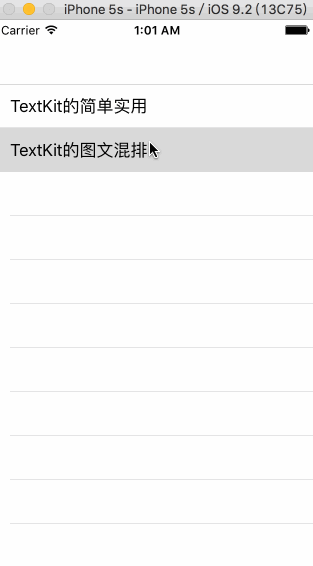

## TextKit来完成图文混排的代码示例





## ViewController

```objc
@implementation TextKitImageTextVC {
    NSString *_text;
    TextkitImageTtextView *_textView;
}

- (void)viewDidLoad {
    [super viewDidLoad];
    
    //1.
    [self setupData];
    
    //2.
    [self setupTextView];
    
    //3.
    [self settingTextView];
}

- (void)setupData {
    NSString *path = [[NSBundle mainBundle] pathForResource:@"lorem" ofType:@"txt"];
    _text = [NSString stringWithContentsOfFile:path encoding:NSUTF8StringEncoding error:nil];
}

- (void)setupTextView {
    CGSize screenSize = [UIScreen mainScreen].bounds.size;
    _textView = [[TextkitImageTtextView alloc] initWithFrame:CGRectMake(10,
                                                                        10,
                                                                        screenSize.width-20,
                                                                        450)];
    _textView.layer.borderWidth = 1;
    [self.view addSubview:_textView];
    
}

- (void)settingTextView {
    
    //1. 设置文本内容
    _textView.text = _text;
    
    //2. 构造文本内容的段落样式
    NSMutableDictionary *paregaphyAttributes = nil;
    {
        paregaphyAttributes = [NSMutableDictionary dictionary];
        
        //2.1 字体颜色
        {
            UIColor *textColor = [UIColor blueColor];
            [paregaphyAttributes setValue:textColor forKey:NSForegroundColorAttributeName];
        }
        
        //2.2 字体样式
        {
            UIFont *textFont = [UIFont fontWithName:@"FZQKBYSJW--GB1-0" size:22.f];
            [paregaphyAttributes setValue:textFont forKey:NSFontAttributeName];
        }
        
        //2.3 段落样式
        {
            NSMutableParagraphStyle *style = [[NSMutableParagraphStyle alloc] init];
            style.lineSpacing = 10;// 字体的行间距
            style.firstLineHeadIndent = 20.f;//首行缩进
            style.alignment = NSTextAlignmentLeft;
            style.lineBreakMode = NSLineBreakByWordWrapping;
            style.minimumLineHeight = 10;//最低行高
            style.maximumLineHeight = 20;//最大行高
            style.paragraphSpacing = 15;//段与段之间的间距
            style.lineHeightMultiple = 15;
            style.hyphenationFactor = 1;//连字属性 在iOS，唯一支持的值分别为0和1
            [paregaphyAttributes setValue:style forKey:NSParagraphStyleAttributeName];
        }
        
        //2.4 每个字的间距
        NSNumber *kern = @(2);
        [paregaphyAttributes setValue:kern forKey:NSKernAttributeName];
    }
    _textView.paregaphyAttributes = paregaphyAttributes;
    
    //3. 针对性的对某一些特殊文本内容富文本设置
    NSMutableArray *textAttributes = [[NSMutableArray alloc] init];
    [textAttributes addObject:[XZHTextAttribute foregroundColor:[UIColor redColor] range:NSMakeRange(0, 9)]];
    [textAttributes addObject:[XZHTextAttribute font:[UIFont systemFontOfSize:22.0f] range:NSMakeRange(0, 9)]];
    _textView.textAttributes = textAttributes;
    
    //4. 设置不进行文本绘制的区域
    {
        TextkitImageView *excludeView1 = [[TextkitImageView alloc] initWithFrame:CGRectMake(20, 50, 100, 100)];
        UIImageView *iv1       = [[UIImageView alloc] initWithFrame:excludeView1.bounds];
        iv1.image              = [UIImage imageNamed:@"exclude"];
        [excludeView1 addSubview:iv1];

        TextkitImageView *excludeView2 = [[TextkitImageView alloc] initWithFrame:CGRectMake(100, 200, 100, 150)];
        UIImageView *iv2       = [[UIImageView alloc] initWithFrame:excludeView2.bounds];
        iv2.image              = [UIImage imageNamed:@"exclude"];
        [excludeView2 addSubview:iv2];
        
        NSArray *excludes = @[excludeView1, excludeView2];
        
        _textView.excludeViews = excludes;
    }
    
    //5. 通知textview绘制文字
    [_textView drawText];
}

- (UIRectEdge)edgesForExtendedLayout {
    return UIRectEdgeNone;
}

@end
```

## TextkitImageTtextView

```objc
@interface TextkitImageTtextView : UIView

// 显示的文本内容
@property (nonatomic, copy) NSString *text;

// 段落样式设置
@property (nonatomic, strong) NSDictionary *paregaphyAttributes;

// 对文本内容的额外设置
@property (nonatomic, strong) NSArray *textAttributes;

// 不会绘制文字的区域
@property (nonatomic, strong) NSArray *excludeViews;

// 开始进行文本内容的绘制
- (void)drawText;

@end
```

```objc
@interface TextkitImageTtextView ()
@property (nonatomic, strong) UITextView        *textView;
@property (nonatomic, strong) NSTextStorage     *textStorage;
@property (nonatomic, strong) NSLayoutManager   *layoutManager;
@property (nonatomic, strong) NSTextContainer   *textContainer;
@end

@implementation TextkitImageTtextView

- (void)drawText {
    //1. 添加富文本属性
    [self addAllTextAttributes];
    
    //2. 添加插入图片的位置
    [self configExcludeRect];
    
    //3. 添加TextView
    [self addSubview:self.textView];
}

- (void)addAllTextAttributes {
    for (XZHTextAttribute *item in _textAttributes) {
        [self.textStorage addAttribute:[item key]
                                 value:[item value]
                                 range:[item range]];
    }
}

- (void)configExcludeRect {
    if ((!_excludeViews) || (_excludeViews.count == 0)) {
        return;
    }
    
    NSMutableArray *excludePaths = [NSMutableArray arrayWithCapacity:_excludeViews.count];
    
    for (TextkitImageView *excludeView in _excludeViews) {
        
        //将排除不显示文字的view依次加入到 _textView
        [self.textView addSubview:excludeView];
        
        // 构建插入图片的view的边界路径
        UIBezierPath *bezierPath = [excludeView excludePath];
        
        // 数组保存所有插入图片的边界路径
        [excludePaths addObject:bezierPath];
    }
    
    // 【重要】将不显示文字的区域，设置给 textView.textContainer
    self.textContainer.exclusionPaths = excludePaths;
}

- (void)storeTextViewHeight {
    
    //1. 先偏移到文本末尾位置
    [UIView setAnimationsEnabled:NO];
    [self.textView scrollRangeToVisible:NSMakeRange([self.textView.text length], 0)];
    [UIView setAnimationsEnabled:YES];
    
    //2. 再偏移到文本开头位置
    [UIView setAnimationsEnabled:NO];
    [self.textView scrollRangeToVisible:NSMakeRange(0, 0)];
    [UIView setAnimationsEnabled:YES];
}


#pragma mark - getters

- (UITextView *)textView {
    if (!_textView) {
        
        _textView = [[UITextView alloc] initWithFrame:self.frame
                                        textContainer:self.textContainer];
        
        _textView.scrollEnabled                    = YES;
        _textView.editable                         = NO;
        _textView.selectable                       = NO;
        _textView.layer.masksToBounds              = YES;
        _textView.showsVerticalScrollIndicator     = NO;
    }
    return _textView;
}

- (NSTextStorage *)textStorage {
    if (!_textStorage) {
        _textStorage = [[NSTextStorage alloc] initWithString:_text
                                                  attributes:_paregaphyAttributes];
    }
    return _textStorage;
}

- (NSLayoutManager *)layoutManager {
    if (!_layoutManager) {
        _layoutManager = [[NSLayoutManager alloc] init];
        [self.textStorage addLayoutManager:self.layoutManager];
    }
    return _layoutManager;
}

- (NSTextContainer *)textContainer {
    if (!_textContainer) {
        _textContainer = [[NSTextContainer alloc] init];
        
        CGFloat width  = self.frame.size.width;
        CGSize size = CGSizeMake(width, MAXFLOAT);//TODO: 让TextView无限制向下显示文本内容
        
        _textContainer.size = size;
        
        [self.layoutManager addTextContainer:_textContainer];
    }
    return _textContainer;
}

@end
```

这个自定义View类，主要用来操作TextKit完成图文的混排处理。

## TextkitImageView

```objc
@interface TextkitImageView : UIView
- (UIBezierPath *)excludePath;
@end
```

```objc
@implementation TextkitImageView

- (UIBezierPath *)excludePath {
    return [UIBezierPath bezierPathWithRect:self.frame];
}

@end
```

这个自定义View类，主要用来控制TextView内部不显示文本的区域，然后可以再这个View上添加其他自定义View来显示图片，或者其他各种效果。

## XZHTextAttribute

```objc
@interface XZHTextAttribute : NSObject

@property (copy, nonatomic) NSString *key;
@property (copy, nonatomic) id value;
@property (assign, nonatomic) NSRange range;

//通用配置
+ (instancetype)attributeWithKey:(NSString *)key
                           value:(id)value
                           range:(NSRange)range;


// 配置字体
+ (instancetype)font:(UIFont *)font
               range:(NSRange)range;

// 配置字体颜色
+ (instancetype)foregroundColor:(UIColor *)color
                          range:(NSRange)range;

// 配置字体背景颜色
+ (instancetype)backgroundColor:(UIColor *)color
                          range:(NSRange)range;

// 字体描边颜色
+ (instancetype)strokeColor:(UIColor *)color
                      range:(NSRange)range;

// 字体描边宽度
+ (instancetype)strokeWidth:(float)number
                      range:(NSRange)range;

// 配置字体阴影
+ (instancetype)shadow:(NSShadow *)shadow
                 range:(NSRange)range;

// 配置文字的中划线
+ (instancetype)strikethroughStyle:(NSInteger)number
                             range:(NSRange)range;

// 配置文字的下划线
+ (instancetype)underlineStyle:(NSInteger)number
                         range:(NSRange)range;

// 字间距
+ (instancetype)kern:(float)number
               range:(NSRange)range;

// 段落样式(需要将UILabel中的numberOfLines设置成0才有用)
+ (instancetype)paragraphStyle:(NSMutableParagraphStyle *)style
                         range:(NSRange)range;

@end
```

```objc
@implementation XZHTextAttribute

//通用配置
+ (instancetype)attributeWithKey:(NSString *)key
                           value:(id)value
                           range:(NSRange)range
{
    XZHTextAttribute *attr = [self new];
    attr.key        = key;
    attr.value      = value;
    attr.range      = range;
    return attr;
}


// 配置字体
+ (instancetype)font:(UIFont *)font
               range:(NSRange)range
{
    XZHTextAttribute *attr = [self new];
    attr.key        = NSFontAttributeName;
    attr.value      = font;
    attr.range      = range;
    return attr;
}

// 配置字体颜色
+ (instancetype)foregroundColor:(UIColor *)color
                          range:(NSRange)range
{
    XZHTextAttribute *attr = [self new];
    attr.key        = NSForegroundColorAttributeName;
    attr.value      = color;
    attr.range      = range;
    return attr;
}

// 配置字体背景颜色
+ (instancetype)backgroundColor:(UIColor *)color
                          range:(NSRange)range
{
    XZHTextAttribute *attr = [self new];
    attr.key        = NSBackgroundColorAttributeName;
    attr.value      = color;
    attr.range      = range;
    return attr;
}

// 字体描边颜色
+ (instancetype)strokeColor:(UIColor *)color
                      range:(NSRange)range
{
    XZHTextAttribute *attr = [self new];
    attr.key        = NSStrokeColorAttributeName;
    attr.value      = color;
    attr.range      = range;
    return attr;
}

// 字体描边宽度
+ (instancetype)strokeWidth:(float)number
                      range:(NSRange)range
{
    XZHTextAttribute *attr = [self new];
    attr.key        = NSStrokeWidthAttributeName;
    attr.value      = @(number);
    attr.range      = range;
    return attr;
}

// 配置字体阴影
+ (instancetype)shadow:(NSShadow *)shadow
                 range:(NSRange)range
{
    XZHTextAttribute *attr = [self new];
    attr.key        = NSShadowAttributeName;
    attr.value      = shadow;
    attr.range      = range;
    return attr;
}

// 配置文字的中划线
+ (instancetype)strikethroughStyle:(NSInteger)number
                             range:(NSRange)range
{
    XZHTextAttribute *attr = [self new];
    attr.key        = NSStrikethroughStyleAttributeName;
    attr.value      = @(number);
    attr.range      = range;
    return attr;
}

// 配置文字的下划线
+ (instancetype)underlineStyle:(NSInteger)number
                         range:(NSRange)range
{
    XZHTextAttribute *attr = [self new];
    attr.key        = NSUnderlineStyleAttributeName;
    attr.value      = @(number);
    attr.range      = range;
    return attr;
}

// 字间距
+ (instancetype)kern:(float)number
               range:(NSRange)range
{
    XZHTextAttribute *attr = [self new];
    attr.key        = NSKernAttributeName;
    attr.value      = @(number);
    attr.range      = range;
    return attr;
}

// 段落样式(需要将UILabel中的numberOfLines设置成0才有用)
+ (instancetype)paragraphStyle:(NSMutableParagraphStyle *)style
                         range:(NSRange)range
{
    XZHTextAttribute *attr = [self new];
    attr.key        = NSParagraphStyleAttributeName;
    attr.value      = style;
    attr.range      = range;
    return attr;
}

@end
```

这个类主要是用来封装`-[NSMutableAttributedString addAttribute:value:range:];`。