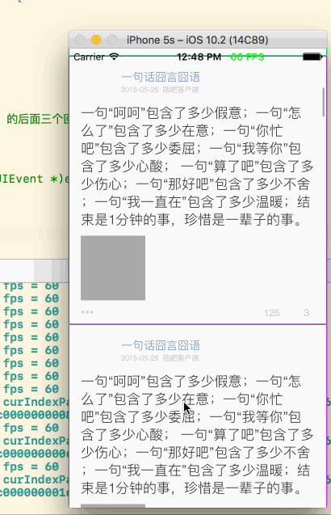

## 先看下最终优化后的TableView滚动的渲染效果图



可以看到:

- (1) 快速滚动时，对中间一闪而过的cell，没有进行数据的绘制
- (2) 数据的绘制，都是异步进行的，等cell出现之后，才会慢慢的显示数据
- (3) FPS一直都是维持在60，已经很流畅了

下面开始总结下，一些主要的优化点。

## 优化一、异步子线程frame计算并缓存

```objc
- (void)viewDidLoad {
    [super viewDidLoad];

    //1. 创建tableView
    _tableView = [[XZHTableView alloc] initWithFrame:self.view.bounds style:UITableViewStylePlain];
    _tableView.contentInset = UIEdgeInsetsMake(20, 0, 0, 0);
    _tableView.scrollIndicatorInsets = _tableView.contentInset;
    _tableView.separatorStyle = UITableViewCellSeparatorStyleNone;
    _tableView.dataSource = self;
    _tableView.delegate = self;
    [self.view addSubview:_tableView];
    
    //2. 异步线程加载数据、frame解析
    XZHDispatchQueueAsyncBlockWithQOSUserInteractive(^{
    	
    	//2.1 加载数据、以及frame计算缓存
        _tweetList = [XZHModelManager tweetList];
        
        //2.2 刷新tableview
        dispatch_async(dispatch_get_main_queue(), ^{
            //3. 刷新tableView
            [_tableView reloadData];
        });
    });
}
```

## 优化二、使用CoreText完成图文混排并绘制到一个BitmapImageContext中，再从BitmapImageContext获取渲染完毕的Image，然后将Image塞给UI或Layer显示，整个过程都在`子线程`异步完成

> 这是很关键的一个步骤，必须要使用CoreText完成图文的预先的渲染，否则无法开展后面的优化步骤。

通常情况下，我们使用UIImageView、UILabel、UIButton、UITextView...然后对他们设置位置大小、以及要显示的数据就可以完成显示效果了。

但是到最终显示到屏幕上的这一系列过程，都是在`主线程`完成的，这一系列过程包含:

- (1) UI对象的创建、frame计算、frame调整、以及各种其他属性的调整
- (2) 对UILabel设置的显示文本，使用CoreText或WebKit，进行渲染得到Image
- (3) UIImageView设置的通常是没有`解压`的PNG图像，最终还得在`渲染得到Image之前`，完成PNG压缩格式的解压，得到真实的图像文件
- (4) 每一种UIView都会被渲染得到一个Image图像
- (5) 多个层叠的UIView或CALayer各自渲染得到的Image，还会进行Image的合并处理
- (6) 最终处理为`一个`Image，并交给GPU进行处理

上面所有的过程，当我们使用UIView构建界面时，都是在`主线程`上完成的。

> 我们可以自己来完成文本、图片的渲染，并得到Image，以及Image的合成。并且最重要的是，我们将这一系列过程，都放到`子线程`上异步执行。

摘抄一段XZHLabel自己绘制文本，并渲染成为Image，然后设置给UI显示的代码:

```objc
- (void)asyncDraw {
    
    /**
     *  渲染生成图像的过程，全部都在子线程异步完成
     */
    
    XZHDispatchQueueAsyncBlockWithQOSBackgroud(^{
        
        //1. 设置画布的大小
        CGSize size = self.frame.size;
        size.height += 10;
        
        //2. 创建一个画布
        UIGraphicsBeginImageContextWithOptions(size, ![self.backgroundColor isEqual:[UIColor clearColor]], 0);
        CGContextRef context = UIGraphicsGetCurrentContext();
        if (context==NULL) {return;}
        
        //3. 填充画板的背景色，否则默认是黑色的
        if (![self.backgroundColor isEqual:[UIColor clearColor]]) {
            [self.backgroundColor set];
            CGContextFillRect(context, CGRectMake(0, 0, size.width, size.height));
        }
        
        //3. 翻转上下文的y坐标轴，因为CoreText与UIKit的，坐标系y轴是`相反`的
        CGContextSetTextMatrix(context,CGAffineTransformIdentity);
        CGContextTranslateCTM(context,0,size.height);
        CGContextScaleCTM(context,1.0,-1.0);
        
        //4. 尝试使用 [绘制原始文字的 MD5] 值，从缓存进行读取CTFrameRef的
        NSString *md5 = [_text xzh_MD5];
        CTFrameRef ctFrame = CTFrameForKey(md5);
        
        //5. 绘制时产生的临时变量，需要在绘制结束后进行释放废弃
        CTFontRef font;
        CTFramesetterRef framesetter;

        //6. 判断是否使用缓存的CTFrameRef，进行直接绘制
        CGRect rect = CGRectMake(0, 5,(size.width),(size.height-5));
        if (!_highlighting && ctFrame) {
            //6.1 使用缓存的CTFrame进行绘制，不必再进行文本的解析、渲染
            [self drawWithCTFrame:ctFrame inRect:rect context:context];
        } else {
            //6.2 重新对文本进行富文本设置、解析、CTFrameRef渲染
            
            //6.2.1 准备要绘制的富文本内容 >>> NSMutableAttributedString
            UIColor* textColor = self.textColor;
            CGFloat minimumLineHeight = self.font.pointSize,maximumLineHeight = minimumLineHeight, linespace = self.lineSpace;
            font = CTFontCreateWithName((__bridge CFStringRef)self.font.fontName, self.font.pointSize,NULL);
            CTLineBreakMode lineBreakMode = kCTLineBreakByWordWrapping;
            CTTextAlignment alignment = CTTextAlignmentFromUITextAlignment(self.textAlignment);
            CTParagraphStyleRef style = CTParagraphStyleCreate((CTParagraphStyleSetting[6]){
                {kCTParagraphStyleSpecifierAlignment, sizeof(alignment), &alignment},
                {kCTParagraphStyleSpecifierMinimumLineHeight,sizeof(minimumLineHeight),&minimumLineHeight},
                {kCTParagraphStyleSpecifierMaximumLineHeight,sizeof(maximumLineHeight),&maximumLineHeight},
                {kCTParagraphStyleSpecifierMaximumLineSpacing, sizeof(linespace), &linespace},
                {kCTParagraphStyleSpecifierMinimumLineSpacing, sizeof(linespace), &linespace},
                {kCTParagraphStyleSpecifierLineBreakMode,sizeof(CTLineBreakMode),&lineBreakMode}
            },6);
            
            NSDictionary* attributes = [NSDictionary dictionaryWithObjectsAndKeys:(__bridge id)font,(NSString*)kCTFontAttributeName,
                                        textColor.CGColor,kCTForegroundColorAttributeName,
                                        style,kCTParagraphStyleAttributeName,
                                        nil];
            NSMutableAttributedString *attributedStr = [[NSMutableAttributedString alloc] initWithString:_text
                                                                                              attributes:attributes];
            
            //6.2.2 NSMutableAttributedString >>> CTFramesetterRef
            CFAttributedStringRef attributedString = (__bridge CFAttributedStringRef)[self highlightText:attributedStr];
            framesetter = CTFramesetterCreateWithAttributedString((CFAttributedStringRef)attributedString);
            
            //6.2.3 CGPath + CTFramesetterRef >>> CTFrameRef。设置要绘制文字的路径:
            CGMutablePathRef path = CGPathCreateMutable();
            CGPathAddRect(path, NULL, rect);
            
            //6.2.4 生成该区域绘制文本的数据 CTFrameRef
            CTFrameRef ctFrame = CTFramesetterCreateFrame(framesetter,
                                                        CFRangeMake(0, _text.length),
                                                        path,
                                                        NULL);
            
            //6.2.5 将CTFrameRef实例，缓存起来，避免重复对同一段文本进行解析
            CacheCTFrameWithKey(ctFrame, md5);
            
            //6.2.6 将重新解析CTFrame进行绘制
            [self drawWithCTFrame:ctFrame inRect:rect context:context];
            
            //6.2.7 不对frame废弃，在内存中缓存起来
            //CFRelease(ctFrame);
        }
        
        //7. 继续翻转y轴，得到UIKit的y轴方向
        CGContextSetTextMatrix(context,CGAffineTransformIdentity);
        CGContextTranslateCTM(context,0,size.height);
        CGContextScaleCTM(context,1.0,-1.0);
        
        //8. 从上下文获取渲染得到的图像
        UIImage *screenShotimage = UIGraphicsGetImageFromCurrentImageContext();
        
        //9. 结束绘图上下文
        UIGraphicsEndImageContext();
        
        //10. 回到主线程，将渲染得到的图像，给给layer显示
        dispatch_async(dispatch_get_main_queue(), ^{
//            if (font) {CFRelease(font);}
//            if (framesetter) {CFRelease(framesetter);}

            if (_highlighting) {
                _highlightImageView.image = nil;
                if (_highlightImageView.width!=screenShotimage.size.width) {
                    _highlightImageView.width = screenShotimage.size.width;
                }
                if (_highlightImageView.height!=screenShotimage.size.height) {
                    _highlightImageView.height = screenShotimage.size.height;
                }
                _highlightImageView.image = screenShotimage;
            } else {
                if (_labelImageView.width!=screenShotimage.size.width) {
                    _labelImageView.width = screenShotimage.size.width;
                }
                if (_labelImageView.height!=screenShotimage.size.height) {
                    _labelImageView.height = screenShotimage.size.height;
                }
                
                // 清空高亮view的图像
                _highlightImageView.image = nil;
                
                _labelImageView.image = nil;
                _labelImageView.image = screenShotimage;
            }
            
//            [self debugDraw];//绘制可触摸区域
        });
    });
}
```

主要有几个步骤:

- (1) 切换到一个子线程上
- (2) 开起一个BitmapImageContext
- (3) 使用CoreText完成文本的绘制，并绘制到BitmapImageContext
- (4) 从BitmapImageContext，获取渲染完毕的Image
- (5) 切主线程，将Image塞给UI显示

## 优化三、对CoreText对一段文本渲染时产生的`CTFrameRef`实例进行内存缓存，避免再对同一段文本继续解析

使用缓存进行绘制的地方

```objc
//1. 尝试使用 [绘制原始文字的 MD5] 值
NSString *md5 = [_text xzh_MD5];

//2. 从缓存进行读取CTFrameRef实例
CTFrameRef ctFrame = CTFrameForKey(md5);
    
//3. 绘制时产生的临时变量，需要在绘制结束后进行释放废弃
CTFontRef font;
CTFramesetterRef framesetter;

//4. 判断是否使用缓存的CTFrameRef，进行直接绘制
CGRect rect = CGRectMake(0, 5,(size.width),(size.height-5));
if (!_highlighting && ctFrame) {
    //4.1 使用缓存的CTFrame进行绘制，不必再进行文本的解析、渲染
    [self drawWithCTFrame:ctFrame inRect:rect context:context];
} else {
     //4.1.1 重新生成NSMutableAttributedString
     //4.1.2 重新生成CTFramesetterRef
     //4.1.3 重新生成CTFrameRef
     //4.1.4 【重要】将CTFrameRef使用内存缓存起来
     //4.1.5  [self drawWithCTFrame:ctFrame inRect:rect context:context]; 进行绘制
}
```

内存缓存CTFrameRef的代码

```objc
static dispatch_semaphore_t semephore() {
    static dispatch_semaphore_t _semepore = nil;
    static dispatch_once_t onceToken;
    dispatch_once(&onceToken, ^{
        _semepore = dispatch_semaphore_create(1);
    });
    return _semepore;
};

static CFMutableDictionaryRef dictionry() {
    static CFMutableDictionaryRef _dic;
    static dispatch_once_t onceToken;
    dispatch_once(&onceToken, ^{
        _dic = CFDictionaryCreateMutable(CFAllocatorGetDefault(), 32, &kCFTypeDictionaryKeyCallBacks, &kCFTypeDictionaryValueCallBacks);
    });
    return _dic;
}

void CacheCTFrameWithKey(CTFrameRef ctframe, NSString *md5) {
    dispatch_semaphore_wait(semephore(), DISPATCH_TIME_FOREVER);
    CFDictionarySetValue(dictionry(), (__bridge const void *)(md5), ctframe);
    dispatch_semaphore_signal(semephore());
}

CTFrameRef CTFrameForKey(NSString *md5) {
    dispatch_semaphore_wait(semephore(), DISPATCH_TIME_FOREVER);
    CTFrameRef frame = CFDictionaryGetValue(dictionry(), (__bridge const void *)(md5));
    dispatch_semaphore_signal(semephore());
    return frame;
}
```

主要是`dispatch_semaphore_t`进行多线程的同步排队控制。

## 优化四、tableview快速滚动时，如果中间滚动超过一定数的cell时，忽略掉中间快速滚过的cell的数据绘制

### 主要是利用`UIScrollViewDelegate`的回调函数完成对当前滚动的状态记录，以及快速滚动时最终需要绘制的indexpath

- (1) `scrollViewWillBeginDragging:` 开始滚动

```objc
- (void)scrollViewWillBeginDragging:(UIScrollView *)scrollView{
    
    //1. 标记正在滚动ing
    _isScrolling = YES;
    
    //2. 清除之前保存的绘制cell的indexPath
    [_drawableIndexPaths removeAllObjects];
}
```

- (2) `scrollViewWillEndDragging:withVelocity:targetContentOffset:` 手指离开屏幕

```objc
- (void)scrollViewWillEndDragging:(UIScrollView *)scrollView
                     withVelocity:(CGPoint)velocity
              targetContentOffset:(inout CGPoint *)targetContentOffset
{
    //1. 发生滚动之前，当前可见区域的最上面的一个cell的indexPath
    NSIndexPath *curIndexPath = [_tableView xzh_firstVisbledCellIndexPath];
    
    //2. 最终停止滚动时，出现在屏幕上可见区域的最下方的坐标点(x,y)
    CGPoint stoppedPoint = CGPointMake(0, targetContentOffset->y);
    
    //3. 通过stoppedPoint，查询到所处的IndexPath
    NSIndexPath *stopedIndexPath = [_tableView indexPathForRowAtPoint:stoppedPoint];
    
    //4.
    NSLog(@"curIndexPath = %@, stopedIndexPath = %@", curIndexPath, stopedIndexPath);
    
    //5. 设置 【滚动前的row】 到 【滚动停止时的row】之前最大相差的【行数】
    NSInteger skipCount = 8;
    
    /**
     *  6. 如果 【滚动前的row】 距离 【滚动停止时的row】，超过了 skipCount
     *  - (1) 则忽略中间的 skipCount个 cell的绘制
     *  - (2) 只在停止滚动的【前后】指定的 3行 cell进行绘制
     */
    BOOL isOverSkipCount = labs(stopedIndexPath.row - curIndexPath.row) > skipCount;
    
    //7. 如果超过了skipCount，则完成上的(1)、(2)
    if (isOverSkipCount) {

        //7.1 获取最终停止滚动位置时，在屏幕上可见的cell对应的IndexPath
        NSArray *stoppedVisbleIndexpaths = [_tableView indexPathsForRowsInRect:CGRectMake(0,
                                                                                          targetContentOffset->y,
                                                                                          _tableView.width,
                                                                                          _tableView.height)];
        
        //7.2
        NSMutableArray *mutableIndexPaths = [NSMutableArray arrayWithArray:stoppedVisbleIndexpaths];
        
        //7.3 判断是继续正方向滚动或反方向滚动
        if (velocity.y > 0) {
            // 7.3.1 正方向滚动
            // 获取【最后】一个可见的cell的IndexPath
            NSIndexPath *idx = [mutableIndexPaths lastObject];
            
            // 添加下方的顺数三个cell的IndexPath
            if ((idx.row + 3) < _tweetList.count) {
                NSIndexPath *next1 = [idx xzh_nextRow];
                NSIndexPath *next2 = [next1 xzh_nextRow];
                NSIndexPath *next3 = [next2 xzh_nextRow];
                [mutableIndexPaths addObject:next1];
                [mutableIndexPaths addObject:next2];
                [mutableIndexPaths addObject:next3];
            }
            
        } else {
            //7.3.2 反方向滚动
            // 获取【最前面】一个可见的cell的IndexPath
            NSIndexPath *idx = [mutableIndexPaths firstObject];
            
            // 添加上方的倒数三个cell的IndexPath
            if ((idx.row - 3) >= 0) {
                NSIndexPath *prev1 = [idx xzh_previousRow];
                NSIndexPath *prev2 = [prev1 xzh_previousRow];
                NSIndexPath *prev3 = [prev2 xzh_previousRow];
                [mutableIndexPaths addObject:prev1];
                [mutableIndexPaths addObject:prev2];
                [mutableIndexPaths addObject:prev3];
            }
        }
        
        //7.4 保存需要进行绘制的cell的indexPath
        [_drawableIndexPaths addObjectsFromArray:mutableIndexPaths];
        
    } else {
        
        /**
         *  走到这里，不会走scrollview下面的几个delegate函数，
         *  所以，直接标记停止滚动，并绘制当前scrollview的可见区域的subviews
         */
        
        //7.1 标记停止滚动
        _isScrolling = NO;
        
        //7.2 绘制当前可见区域的cell
        [self drawVisbledCells];
    }
}
```

如果滚动超过指定的cell数，那么忽略掉中间滚过的cell的绘制。只对最终滚动停止时，出现在屏幕上的几个cell，以及周围的三个cell的绘制。

> 分两种滚动情况: 第一种，快速的大量的滚动。第二种，很慢的滚动几个。

对于第一种，使用`_drawableIndexPaths`数组保存最终需要绘制的cell的NSIndexPath。此时`tableView:cellForRowAtIndexPath:`被回调:

```objc
- (UITableViewCell *)tableView:(UITableView *)tableView cellForRowAtIndexPath:(NSIndexPath *)indexPath{
    
    //1. 分配一个cell
    XZHTableViewCell *cell = [tableView dequeueReusableCellWithIdentifier:@"cell"];
    if (cell==nil) {
        cell = [[XZHTableViewCell alloc] initWithStyle:UITableViewCellStyleDefault reuseIdentifier:@"cell"];
        cell.selectionStyle = UITableViewCellSelectionStyleNone;
    }
    
    //2. 调用VC的绘制过滤逻辑，过滤掉滚动中的cell绘制
    [self drawCell:cell whenCellForRowAtIndexPathCalledWithIndexPath:indexPath];
    
    //4.
    return cell;
}
```

然后走`drawCell: whenCellForRowAtIndexPathCalledWithIndexPath:`方法，完成判断当前绘制cell的NSIndexpath是否位于`_drawableIndexPaths`数组，当前TableView是否正在滚动，来决定是执行cell的绘制函数

```objc
- (void)drawCell:(XZHTableViewCell *)cell whenCellForRowAtIndexPathCalledWithIndexPath:(NSIndexPath *)indexPath{
    
    //1. 取出indexPath对应cell，要绘制的实体数据
    NSDictionary *data = [_tweetList objectAtIndex:indexPath.row];
    cell.selectionStyle = UITableViewCellSelectionStyleNone;
    
    //2. 先清除掉之前绘制的内容
    [cell clear];
    
    //3. 设置最新要绘制的内容
    cell.data = data;
    
    //4. 传入的cell的indexpath，必须要包含在 _drawableIndexPaths 中，才能够绘制
    if ((_drawableIndexPaths.count > 0) && ([_drawableIndexPaths indexOfObject:indexPath] == NSNotFound)) {
        return;
    }
    
    //5. 如果tableview仍然处于滚动中，则不进行任何的绘制
    if (_isScrolling) {
        return;
    }
    
    //6. 真正的通知cell进行内容的绘制
    [cell asyncDraw];
}
```

对于第二种，`直接`去绘制当前TableView的可见NSIndexPath。

```objc
- (void)drawVisbledCells {
    
    //1. 正在滚动，不加载数据
    if (_isScrolling) {
        return;
    }
    
    //2. 当前TableView是否存在【可见】的cell对应的indexpath
    if (_tableView.indexPathsForVisibleRows.count <= 0) {
        return;
    }
    
    //3. 通知当前【可见】的cell进行内容的绘制
    if (_tableView.visibleCells && _tableView.visibleCells.count>0) {
    
    	// 依次通知可见cell完成数据的绘制
        for (id temp in [_tableView.visibleCells copy]) {
            XZHTableViewCell *cell = (XZHTableViewCell *)temp;
            [cell asyncDraw];
        }
    }
}
```

- (3) `scrollViewShouldScrollToTop:` 是否允许滚动到顶部

```objc
- (BOOL)scrollViewShouldScrollToTop:(UIScrollView *)scrollView{
    
    //1. 标记正在滚动ing
    _isScrolling = YES;
    
    //2. 允许滚动到顶部
    return YES;
}
```

- (4) `scrollViewDidScrollToTop:` 已经滚动到顶部

```objc
- (void)scrollViewDidScrollToTop:(UIScrollView *)scrollView{
    
    //1. 标记已经停止滚动
    _isScrolling = NO;
    
    //2. 绘制当前可见的cell
    [self drawVisbledCells];
}
```

- (5) `scrollViewDidEndDecelerating:` 停止滚动

```objc
- (void)scrollViewDidEndDecelerating:(UIScrollView *)scrollView {
    
    //1. 标记已经停止滚动
    _isScrolling = NO;
    
    //2. 绘制当前可见的cell
    [self drawVisbledCells];
}
```

这样就可以控制，当快速滚动的过程中，对那些一滚而过的NSIndexPath位置的cell，不进行数据内容的绘制，从而提高效率。

## 优化五、自定义一个`串行 dispatch_queue_t`实例的缓存池。按照QOS的分类，进行对应的缓存。其缓存的`dispatch_queue_t`个数等于当前CPU激活的核心数

为什么要缓存`串行 dispatch_queue_t`，而不是`并发 dispatch_queue_t` ?

- (1) 并发队列，会无限制的创建子线程，来完成调度的任务
- (2) 串行队列，只会创建唯一一个子线程，来完成调度任务

串行队列，不会导致创建过多的线程，而让CPU切换线程做过多的消耗。

并且使用iOS8推荐的`QualityOfService`来创建`dispatch_queue_t`。

### queue的缓存池结构如下:

```
- (1) QOS_CLASS_USER_INTERACTIVE Dispatch Context 对象
	- 缓存的dispatch_queue_t 实例1
	- 缓存的dispatch_queue_t 实例1
	- ....
	- 缓存的dispatch_queue_t 实例n
	
- (2) QOS_CLASS_USER_INITIATED Dispatch Context 对象
	- 缓存的dispatch_queue_t 实例1
	- 缓存的dispatch_queue_t 实例1
	- ....
	- 缓存的dispatch_queue_t 实例n
	
- (3) QOS_CLASS_DEFAULT Dispatch Context 对象
	- 缓存的dispatch_queue_t 实例1
	- 缓存的dispatch_queue_t 实例1
	- ....
	- 缓存的dispatch_queue_t 实例n
	
- (4) QOS_CLASS_UTILITY Dispatch Context 对象
	- 缓存的dispatch_queue_t 实例1
	- 缓存的dispatch_queue_t 实例1
	- ....
	- 缓存的dispatch_queue_t 实例n
	
- (5) QOS_CLASS_BACKGROUND Dispatch Context 对象
	- 缓存的dispatch_queue_t 实例1
	- 缓存的dispatch_queue_t 实例1
	- ....
	- 缓存的dispatch_queue_t 实例n
```


这样就可以将`图像解码、对象释放、异步绘制`等，都按`优先级`放入不同的全局的 serial queue 中执行，这样尽量避免了过多线程导致的性能问题。

## 其他可以参考的优化点

- (1) 对于圆角、阴影等效果，使用CGPath或UIBezirePath + BitmapImageContext，预先在子线程处理渲染

- (2) 使用专用图层

- (3) ASDK、YYAsyncLayer 学习