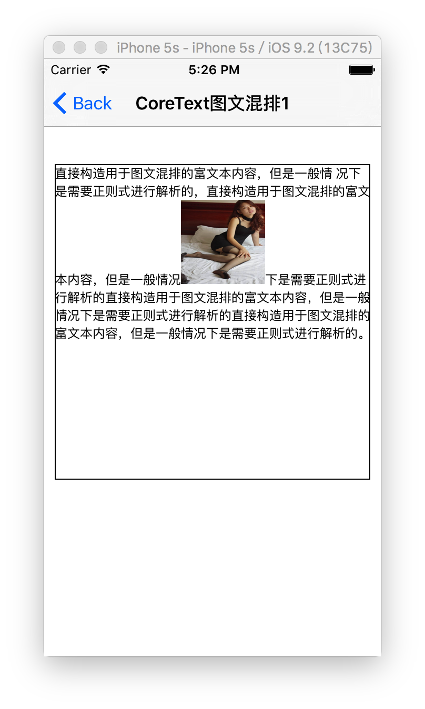

## CoreText图文混排demo示例

### 自定义View内部使用CoreText完成图文的混排

```objc
@interface ImageText1View : UIView
@end
```

```objc
#import <CoreText/CoreText.h>

//CTRun的回调，销毁内存的回调
void RunDelegateDeallocCallback( void* refCon ){
    
}

//CTRun的回调，获取上行高度
CGFloat RunDelegateGetAscentCallback( void *refCon ){
//    真实情况下，取出传入图片的尺寸
//    NSString *imageName = (__bridge NSString*)refCon;
//    [UIImage imageNamed:imageName].size.height;
    
    return 80;
}

//CTRun的回调，获取下行高度
CGFloat RunDelegateGetDescentCallback(void *refCon){
    return 0;
}
//CTRun的回调，获取宽度
CGFloat RunDelegateGetWidthCallback(void *refCon){
//    真实情况下，取出传入图片的尺寸
//    NSString *imageName = (__bridge NSString*)refCon;
//    [UIImage imageNamed:imageName].size.width;
 
    return 80;
}

@implementation ImageText1View {
    NSString *_text;
    NSMutableAttributedString *_content;
    
    CTFrameRef _ctFrame;
}

- (instancetype)initWithFrame:(CGRect)frame
{
    self = [super initWithFrame:frame];
    if (self) {
        //TODO: 直接构造用于图文混排的富文本内容，但是一般情况下是需要正则式进行解析的
        // 在index为21的位置，使用一个空格符，作为后续插入图片的位置（一般去下需要使用正则式匹配得到，这里只是为了简单）
        // 使用oxFFFC作为空白占位符
        
        
        // 1. 最终要显示的富文本
        NSString *text = @"直接构造用于图文混排的富文本内容，但是一般情 况下是需要正则式进行解析的，直接构造用于图文混排的富文本内容，但是一般情况下是需要正则式进行解析的直接构造用于图文混排的富文本内容，但是一般情况下是需要正则式进行解析的直接构造用于图文混排的富文本内容，但是一般情况下是需要正则式进行解析的。";
        NSMutableAttributedString *attrString = [[NSMutableAttributedString alloc] initWithString:text];
        
        
        //2. 简单起见，用来插入图片用的富文本
        NSMutableAttributedString *imageAttributedString = [[NSMutableAttributedString alloc] initWithString:@" "];
        
        //3. 创建CTRunDelegate callbacks
        CTRunDelegateCallbacks imageCallbacks;
        imageCallbacks.version = kCTRunDelegateVersion1;
        imageCallbacks.dealloc = RunDelegateDeallocCallback;
        imageCallbacks.getAscent = RunDelegateGetAscentCallback;
        imageCallbacks.getDescent = RunDelegateGetDescentCallback;
        imageCallbacks.getWidth = RunDelegateGetWidthCallback;
        
        //4. 创建CTRunDelegate
        struct context {
            void *imageName;
        };
        struct context ctx = {0};
        CTRunDelegateRef runDelegate = CTRunDelegateCreate(&imageCallbacks, &ctx);
        
        //5. 将CTRunDelegate添加到富文本字符串中
        [imageAttributedString addAttribute:(NSString *)kCTRunDelegateAttributeName
                                      value:(__bridge id)runDelegate
                                      range:NSMakeRange(0, 1)];
        
        //6. 不再需要CTRunDelegateRef
        CFRelease(runDelegate);
        
        //7. 设置图片预留字符使用一个imageName的属性，区别于其他字符
        [imageAttributedString addAttribute:@"imageName"
                                      value:@"exclude"
                                      range:NSMakeRange(0, 1)];
        
        //8. 将带有CTRunDelegate的测试富文本，插入到最终处理的富文本中
        [attrString insertAttributedString:imageAttributedString atIndex:60];
        
        //9.
        _content = attrString;
        
    }
    return self;
}

- (void)drawRect:(CGRect)rect {
    
    //1.
    CGContextRef context = UIGraphicsGetCurrentContext();
    
    //2. 背景色填充为白色，否则默认为黑色
    [[UIColor whiteColor] set];
    CGContextFillRect(context, rect);

    //3. 设置context的ctm，用于适应core text的坐标体系
    CGContextSaveGState(context);
    CGContextSetTextMatrix(context, CGAffineTransformIdentity);
    CGContextTranslateCTM(context, 0, rect.size.height);
    CGContextScaleCTM(context, 1.0, -1.0);
    
    //4. 设置CTFramesetter
    CTFramesetterRef framesetter =  CTFramesetterCreateWithAttributedString((CFAttributedStringRef)_content);
    
    //5. 创建绘制路径
    CGMutablePathRef path = CGPathCreateMutable();
    CGPathAddRect(path, NULL, CGRectMake(0, 0, rect.size.width, rect.size.height));
    
    //6. 创建CTFrame
    _ctFrame = CTFramesetterCreateFrame(framesetter, CFRangeMake(0, _content.length), path, NULL);
    
    //7. 先将全部非文本内容绘制到context，其他不绘制的区域由CTRunDelegate来完成后续绘制
    CTFrameDraw(_ctFrame, context);
    
    //8. 获取CTLine数组
    CFArrayRef lines = CTFrameGetLines(_ctFrame);
    
    //9. 每一行CTLine的起始点
    CGPoint lineOrigins[CFArrayGetCount(lines)];
    CTFrameGetLineOrigins(_ctFrame, CFRangeMake(0, 0), lineOrigins);
    
    //9. 遍历每一个CTline
    for (int i = 0; i < CFArrayGetCount(lines); i++) {
        
        // 当前被遍历的CTLine
        CTLineRef line = CFArrayGetValueAtIndex(lines, i);
        
        // 获取当前遍历的CTLine的上行高度、下行高度、行距
        CGFloat lineAscent;
        CGFloat lineDescent;
        CGFloat lineLeading;
        CTLineGetTypographicBounds(line, &lineAscent, &lineDescent, &lineLeading);
        
        // 取出当前CTLine的所有的额CTRun
        CFArrayRef runs = CTLineGetGlyphRuns(line);
        
        // 遍历每个CTLine中所有的CTRun，找到空白字符的delegate
        for (int j = 0; j < CFArrayGetCount(runs); j++) {
            CGPoint lineOrigin = lineOrigins[i];
            
            // 当前run
            CTRunRef run = CFArrayGetValueAtIndex(runs, j);
            
            // run对应的属性字典
            NSDictionary* runAttributes = (NSDictionary*)CTRunGetAttributes(run);
            
            // 是否存在CTRunDelegate
            CTRunDelegateRef delegate = (__bridge CTRunDelegateRef)[runAttributes valueForKey:(id)kCTRunDelegateAttributeName];
            if (delegate == nil) {
                continue;
            }
            
            // 找到代理后开始计算空白字符的位置
            CGRect  runBounds;
            CGFloat runAscent;
            CGFloat runDescent;
            
            // 【重要】从CTRun设置的CTRunDelegate，获取run的宽度、上下高度、下行高度
            runBounds.size.width = CTRunGetTypographicBounds(run,
                                                             CFRangeMake(0,0),
                                                             &runAscent,
                                                             &runDescent,
                                                             NULL);
            // 计算run的高度
            runBounds.size.height = runAscent + runDescent;
            
            // 得到CTRun在行当中的x偏移量
            CGFloat xOffset = CTLineGetOffsetForStringIndex(line, CTRunGetStringRange(run).location, NULL);
            
            // 修正CTRun的x、y坐标
            runBounds.origin.x = lineOrigin.x + xOffset;
            runBounds.origin.y = lineOrigin.y - runDescent;
            
            // 图片渲染逻辑
            NSString *imageName = [runAttributes objectForKey:@"imageName"];
            if (imageName) {
                UIImage *image = [UIImage imageNamed:imageName];
                if (image) {
                    CGContextDrawImage(context, runBounds, image.CGImage);
                }
            }
        }
    }
    
    //10. 
    CFRelease(_ctFrame);
    CFRelease(path);
    CFRelease(framesetter);
}

@end
```

### VC中测试

```objc
@implementation CoreTextImageText1VC
- (void)viewDidLoad {
    [super viewDidLoad];
    
    ImageText1View *view = [[ImageText1View alloc] initWithFrame:CGRectMake(10, 100, 300, 300)];
    view.layer.borderWidth = 1;
    [self.view addSubview:view];
}
@end
```

### 效果图

