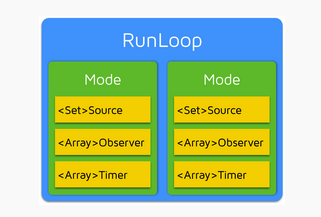

## 在`main.m`，查看当前线程的RunLoop对象

```objc
#import <UIKit/UIKit.h>
#import "AppDelegate.h"

int main(int argc, char * argv[]) {
    @autoreleasepool {
        NSThread *curThread = [NSThread currentThread];
        NSRunLoop *runloop = [NSRunLoop currentRunLoop];
        NSLog(@"");
        return UIApplicationMain(argc, argv, nil, NSStringFromClass([AppDelegate class]));
    }
}
```

输出如下

```
(lldb) po curThread
<NSThread: 0x7f8250606df0>{number = 1, name = main}

(lldb) po runloop
<CFRunLoop 0x7f8250401960 [0x10229f7b0]>{wakeup port = 0xb03, stopped = false, ignoreWakeUps = true, 

//【第一部分】
current mode = (none),

//【第二部分】
common modes = <CFBasicHash 0x7f8250401a20 [0x10229f7b0]>{type = mutable set, count = 1,
entries =>
	2 : <CFString 0x1022bfb60 [0x10229f7b0]>{contents = "kCFRunLoopDefaultMode"}
}
,

//【第三部分】
common mode items = (null),

//【第四部分】
modes = <CFBasicHash 0x7f8250401a80 [0x10229f7b0]>{type = mutable set, count = 1,
entries =>
	2 : <CFRunLoopMode 0x7f8250401ac0 [0x10229f7b0]>{name = kCFRunLoopDefaultMode, port set = 0xc03, timer port = 0xd03, 
	
	//【第五部分】
	sources0 = (null),
	sources1 = (null),
	observers = (null),
	timers = (null),
	
	currently 509356414 (487899157683) / soft deadline in: 1.84467436e+10 sec (@ -1) / hard deadline in: 1.84467436e+10 sec (@ -1)
},

}
}
```

这个就是主线程的runloop最开始的时候的结构，可以看到:

- (1) `current mode`等于`null`
- (2) `common modes`是一个`CFBasicHash`类型，其实即使一个`mutable set`，且最开始只有`kCFRunLoopDefaultMode`
- (3) `common mode items` 等于 `null`
- (4) `modes`是一个`CFBasicHash`类型，也是一个`mutable set`，存在四个`Array或Set`，都等于`null`
	- `sources0`
	- `sources1`
	- `observers`
	- `timers`

这也是RunLoop最简单的结构，方便后续对比增加的数据项。

## 在App进程启动后，查看主线程的RunLoop对象

```objc
@implementation AppDelegate

- (BOOL)application:(UIApplication *)application didFinishLaunchingWithOptions:(NSDictionary *)launchOptions {
    NSThread *curThread = [NSThread currentThread];
    NSRunLoop *runloop = [NSRunLoop currentRunLoop];
    NSLog(@"");
    return YES;
}

@end
```

输出如下

```
(lldb) po curThread
<NSThread: 0x7fa1fb604f20>{number = 1, name = main}

(lldb) po runloop
<CFRunLoop 0x7fa1fb400d30 [0x10b4147b0]>{wakeup port = 0x1403, stopped = false, ignoreWakeUps = false, 

//1. 
current mode = UIInitializationRunLoopMode,

//2.
common modes = <CFBasicHash 0x7fa1fb7032d0 [0x10b4147b0]>{type = mutable set, count = 2,
entries =>
	0 : <CFString 0x10c455270 [0x10b4147b0]>{contents = "UITrackingRunLoopMode"}
	2 : <CFString 0x10b434b60 [0x10b4147b0]>{contents = "kCFRunLoopDefaultMode"}
}
,

//3.
common mode items = <CFBasicHash 0x7fa1fb7030e0 [0x10b4147b0]>{type = mutable set, count = 16,
entries =>
	0 : <CFRunLoopSource 0x7fa1fb5040a0 [0x10b4147b0]>{signalled = No, valid = Yes, order = -1, context = <CFRunLoopSource context>{version = 0, info = 0x0, callout = PurpleEventSignalCallback (0x10e9ab779)}}
	1 : <CFRunLoopSource 0x7fa1fb402050 [0x10b4147b0]>{signalled = No, valid = Yes, order = 0, context = <CFMachPort 0x7fa1fb7052c0 [0x10b4147b0]>{valid = Yes, port = 1e03, source = 0x7fa1fb402050, callout = __IOHIDEventSystemClientAvailabilityCallback (0x10d632a2f), context = <CFMachPort context 0x7fa1fb401c60>}}
	3 : <CFRunLoopSource 0x7fa1fb70ab60 [0x10b4147b0]>{signalled = Yes, valid = Yes, order = 0, context = <CFRunLoopSource context>{version = 0, info = 0x7fa1fb707930, callout = FBSSerialQueueRunLoopSourceHandler (0x10df6af60)}}
	4 : <CFRunLoopObserver 0x7fa1fb40ab20 [0x10b4147b0]>{valid = Yes, activities = 0xa0, repeats = Yes, order = 2147483647, callout = _wrapRunLoopWithAutoreleasePoolHandler (0x10b6dac4e), context = <CFArray 0x7fa1fb40a8d0 [0x10b4147b0]>{type = mutable-small, count = 0, values = ()}}
	5 : <CFRunLoopObserver 0x7fa1fb619800 [0x10b4147b0]>{valid = Yes, activities = 0x20, repeats = Yes, order = 0, callout = _UIGestureRecognizerUpdateObserver (0x10bbba6ab), context = <CFRunLoopObserver context 0x0>}
	6 : <CFRunLoopSource 0x7fa1fb40ac80 [0x10b4147b0]>{signalled = No, valid = Yes, order = -1, context = <CFRunLoopSource context>{version = 0, info = 0x7fa1fb402710, callout = _UIApplicationHandleEventQueue (0x10b6db2db)}}
	9 : <CFRunLoopSource 0x7fa1fb401230 [0x10b4147b0]>{signalled = No, valid = Yes, order = 0, context = <CFMachPort 0x7fa1fb4013d0 [0x10b4147b0]>{valid = Yes, port = 1007, source = 0x7fa1fb401230, callout = _ZL20notify_port_callbackP12__CFMachPortPvlS1_ (0x10f1468a9), context = <CFMachPort context 0x0>}}
	10 : <CFRunLoopObserver 0x7fa1fb40aa40 [0x10b4147b0]>{valid = Yes, activities = 0x1, repeats = Yes, order = -2147483647, callout = _wrapRunLoopWithAutoreleasePoolHandler (0x10b6dac4e), context = <CFArray 0x7fa1fb40a8d0 [0x10b4147b0]>{type = mutable-small, count = 0, values = ()}}
	11 : <CFRunLoopSource 0x7fa1fb50f4f0 [0x10b4147b0]>{signalled = No, valid = Yes, order = 0, context = <CFRunLoopSource MIG Server> {port = 17927, subsystem = 0x10c43a920, context = 0x7fa1fb7039b0}}
	12 : <CFRunLoopObserver 0x7fa1fb40a900 [0x10b4147b0]>{valid = Yes, activities = 0xa0, repeats = Yes, order = 2001000, callout = _afterCACommitHandler (0x10b70da99), context = <CFRunLoopObserver context 0x7fa1fb402710>}
	13 : <CFRunLoopSource 0x7fa1fb5042c0 [0x10b4147b0]>{signalled = No, valid = Yes, order = -1, context = <CFRunLoopSource context>{version = 1, info = 0x2203, callout = PurpleEventCallback (0x10e9adcb0)}}
	15 : <CFRunLoopSource 0x7fa1fb402110 [0x10b4147b0]>{signalled = No, valid = Yes, order = 1, context = <CFMachPort 0x7fa1fb704db0 [0x10b4147b0]>{valid = Yes, port = 1b03, source = 0x7fa1fb402110, callout = __IOMIGMachPortPortCallback (0x10d63afce), context = <CFMachPort context 0x7fa1fb704d40>}}
	17 : <CFRunLoopSource 0x7fa1fb40a7b0 [0x10b4147b0]>{signalled = No, valid = Yes, order = 0, context = <CFRunLoopSource MIG Server> {port = 14599, subsystem = 0x10c427fe0, context = 0x0}}
	19 : <CFRunLoopObserver 0x7fa1fb706dc0 [0x10b4147b0]>{valid = Yes, activities = 0xa0, repeats = Yes, order = 2000000, callout = _ZN2CA11Transaction17observer_callbackEP19__CFRunLoopObservermPv (0x10f136320), context = <CFRunLoopObserver context 0x0>}
	20 : <CFRunLoopObserver 0x7fa1fb40a6e0 [0x10b4147b0]>{valid = Yes, activities = 0xa0, repeats = Yes, order = 1999000, callout = _beforeCACommitHandler (0x10b70da54), context = <CFRunLoopObserver context 0x7fa1fb402710>}
	21 : <CFRunLoopSource 0x7fa1fb401e90 [0x10b4147b0]>{signalled = No, valid = Yes, order = 0, context = <CFMachPort 0x7fa1fb704fe0 [0x10b4147b0]>{valid = Yes, port = 1d03, source = 0x7fa1fb401e90, callout = __IOHIDEventSystemClientQueueCallback (0x10d63287e), context = <CFMachPort context 0x7fa1fb401c60>}}
}
,

//4.
modes = <CFBasicHash 0x7fa1fb702470 [0x10b4147b0]>{type = mutable set, count = 5,
entries =>
	2 : <CFRunLoopMode 0x7fa1fb704810 [0x10b4147b0]>{name = UITrackingRunLoopMode, port set = 0x1707, timer port = 0x1803, 
	sources0 = <CFBasicHash 0x7fa1fb7048c0 [0x10b4147b0]>{type = mutable set, count = 3,
entries =>
	0 : <CFRunLoopSource 0x7fa1fb5040a0 [0x10b4147b0]>{signalled = No, valid = Yes, order = -1, context = <CFRunLoopSource context>{version = 0, info = 0x0, callout = PurpleEventSignalCallback (0x10e9ab779)}}
	1 : <CFRunLoopSource 0x7fa1fb70ab60 [0x10b4147b0]>{signalled = Yes, valid = Yes, order = 0, context = <CFRunLoopSource context>{version = 0, info = 0x7fa1fb707930, callout = FBSSerialQueueRunLoopSourceHandler (0x10df6af60)}}
	2 : <CFRunLoopSource 0x7fa1fb40ac80 [0x10b4147b0]>{signalled = No, valid = Yes, order = -1, context = <CFRunLoopSource context>{version = 0, info = 0x7fa1fb402710, callout = _UIApplicationHandleEventQueue (0x10b6db2db)}}
}
,
	sources1 = <CFBasicHash 0x7fa1fb704900 [0x10b4147b0]>{type = mutable set, count = 7,
entries =>
	0 : <CFRunLoopSource 0x7fa1fb402050 [0x10b4147b0]>{signalled = No, valid = Yes, order = 0, context = <CFMachPort 0x7fa1fb7052c0 [0x10b4147b0]>{valid = Yes, port = 1e03, source = 0x7fa1fb402050, callout = __IOHIDEventSystemClientAvailabilityCallback (0x10d632a2f), context = <CFMachPort context 0x7fa1fb401c60>}}
	1 : <CFRunLoopSource 0x7fa1fb40a7b0 [0x10b4147b0]>{signalled = No, valid = Yes, order = 0, context = <CFRunLoopSource MIG Server> {port = 14599, subsystem = 0x10c427fe0, context = 0x0}}
	2 : <CFRunLoopSource 0x7fa1fb50f4f0 [0x10b4147b0]>{signalled = No, valid = Yes, order = 0, context = <CFRunLoopSource MIG Server> {port = 17927, subsystem = 0x10c43a920, context = 0x7fa1fb7039b0}}
	4 : <CFRunLoopSource 0x7fa1fb401e90 [0x10b4147b0]>{signalled = No, valid = Yes, order = 0, context = <CFMachPort 0x7fa1fb704fe0 [0x10b4147b0]>{valid = Yes, port = 1d03, source = 0x7fa1fb401e90, callout = __IOHIDEventSystemClientQueueCallback (0x10d63287e), context = <CFMachPort context 0x7fa1fb401c60>}}
	8 : <CFRunLoopSource 0x7fa1fb401230 [0x10b4147b0]>{signalled = No, valid = Yes, order = 0, context = <CFMachPort 0x7fa1fb4013d0 [0x10b4147b0]>{valid = Yes, port = 1007, source = 0x7fa1fb401230, callout = _ZL20notify_port_callbackP12__CFMachPortPvlS1_ (0x10f1468a9), context = <CFMachPort context 0x0>}}
	10 : <CFRunLoopSource 0x7fa1fb5042c0 [0x10b4147b0]>{signalled = No, valid = Yes, order = -1, context = <CFRunLoopSource context>{version = 1, info = 0x2203, callout = PurpleEventCallback (0x10e9adcb0)}}
	12 : <CFRunLoopSource 0x7fa1fb402110 [0x10b4147b0]>{signalled = No, valid = Yes, order = 1, context = <CFMachPort 0x7fa1fb704db0 [0x10b4147b0]>{valid = Yes, port = 1b03, source = 0x7fa1fb402110, callout = __IOMIGMachPortPortCallback (0x10d63afce), context = <CFMachPort context 0x7fa1fb704d40>}}
}
,
	observers = <CFArray 0x7fa1fb40a780 [0x10b4147b0]>{type = mutable-small, count = 6, values = (
	0 : <CFRunLoopObserver 0x7fa1fb40aa40 [0x10b4147b0]>{valid = Yes, activities = 0x1, repeats = Yes, order = -2147483647, callout = _wrapRunLoopWithAutoreleasePoolHandler (0x10b6dac4e), context = <CFArray 0x7fa1fb40a8d0 [0x10b4147b0]>{type = mutable-small, count = 0, values = ()}}
	1 : <CFRunLoopObserver 0x7fa1fb619800 [0x10b4147b0]>{valid = Yes, activities = 0x20, repeats = Yes, order = 0, callout = _UIGestureRecognizerUpdateObserver (0x10bbba6ab), context = <CFRunLoopObserver context 0x0>}
	2 : <CFRunLoopObserver 0x7fa1fb40a6e0 [0x10b4147b0]>{valid = Yes, activities = 0xa0, repeats = Yes, order = 1999000, callout = _beforeCACommitHandler (0x10b70da54), context = <CFRunLoopObserver context 0x7fa1fb402710>}
	3 : <CFRunLoopObserver 0x7fa1fb706dc0 [0x10b4147b0]>{valid = Yes, activities = 0xa0, repeats = Yes, order = 2000000, callout = _ZN2CA11Transaction17observer_callbackEP19__CFRunLoopObservermPv (0x10f136320), context = <CFRunLoopObserver context 0x0>}
	4 : <CFRunLoopObserver 0x7fa1fb40a900 [0x10b4147b0]>{valid = Yes, activities = 0xa0, repeats = Yes, order = 2001000, callout = _afterCACommitHandler (0x10b70da99), context = <CFRunLoopObserver context 0x7fa1fb402710>}
	5 : <CFRunLoopObserver 0x7fa1fb40ab20 [0x10b4147b0]>{valid = Yes, activities = 0xa0, repeats = Yes, order = 2147483647, callout = _wrapRunLoopWithAutoreleasePoolHandler (0x10b6dac4e), context = <CFArray 0x7fa1fb40a8d0 [0x10b4147b0]>{type = mutable-small, count = 0, values = ()}}
)},
	timers = (null),
	currently 509356931 (1004757844023) / soft deadline in: 1.84467431e+10 sec (@ -1) / hard deadline in: 1.84467431e+10 sec (@ -1)
},

	3 : <CFRunLoopMode 0x7fa1fb4023f0 [0x10b4147b0]>{name = GSEventReceiveRunLoopMode, port set = 0x2003, timer port = 0x2103, 
	sources0 = <CFBasicHash 0x7fa1fb5041e0 [0x10b4147b0]>{type = mutable set, count = 1,
entries =>
	0 : <CFRunLoopSource 0x7fa1fb5040a0 [0x10b4147b0]>{signalled = No, valid = Yes, order = -1, context = <CFRunLoopSource context>{version = 0, info = 0x0, callout = PurpleEventSignalCallback (0x10e9ab779)}}
}
,
	sources1 = <CFBasicHash 0x7fa1fb504160 [0x10b4147b0]>{type = mutable set, count = 1,
entries =>
	1 : <CFRunLoopSource 0x7fa1fb402590 [0x10b4147b0]>{signalled = No, valid = Yes, order = -1, context = <CFRunLoopSource context>{version = 1, info = 0x2203, callout = PurpleEventCallback (0x10e9adcb0)}}
}
,
	observers = (null),
	timers = (null),
	currently 509356931 (1004758960509) / soft deadline in: 1.84467431e+10 sec (@ -1) / hard deadline in: 1.84467431e+10 sec (@ -1)
},

	4 : <CFRunLoopMode 0x7fa1fb7026b0 [0x10b4147b0]>{name = kCFRunLoopDefaultMode, port set = 0x1503, timer port = 0x1603, 
	sources0 = <CFBasicHash 0x7fa1fb703140 [0x10b4147b0]>{type = mutable set, count = 3,
entries =>
	0 : <CFRunLoopSource 0x7fa1fb5040a0 [0x10b4147b0]>{signalled = No, valid = Yes, order = -1, context = <CFRunLoopSource context>{version = 0, info = 0x0, callout = PurpleEventSignalCallback (0x10e9ab779)}}
	1 : <CFRunLoopSource 0x7fa1fb70ab60 [0x10b4147b0]>{signalled = Yes, valid = Yes, order = 0, context = <CFRunLoopSource context>{version = 0, info = 0x7fa1fb707930, callout = FBSSerialQueueRunLoopSourceHandler (0x10df6af60)}}
	2 : <CFRunLoopSource 0x7fa1fb40ac80 [0x10b4147b0]>{signalled = No, valid = Yes, order = -1, context = <CFRunLoopSource context>{version = 0, info = 0x7fa1fb402710, callout = _UIApplicationHandleEventQueue (0x10b6db2db)}}
}
,
	sources1 = <CFBasicHash 0x7fa1fb703c30 [0x10b4147b0]>{type = mutable set, count = 7,
entries =>
	0 : <CFRunLoopSource 0x7fa1fb402050 [0x10b4147b0]>{signalled = No, valid = Yes, order = 0, context = <CFMachPort 0x7fa1fb7052c0 [0x10b4147b0]>{valid = Yes, port = 1e03, source = 0x7fa1fb402050, callout = __IOHIDEventSystemClientAvailabilityCallback (0x10d632a2f), context = <CFMachPort context 0x7fa1fb401c60>}}
	1 : <CFRunLoopSource 0x7fa1fb40a7b0 [0x10b4147b0]>{signalled = No, valid = Yes, order = 0, context = <CFRunLoopSource MIG Server> {port = 14599, subsystem = 0x10c427fe0, context = 0x0}}
	2 : <CFRunLoopSource 0x7fa1fb50f4f0 [0x10b4147b0]>{signalled = No, valid = Yes, order = 0, context = <CFRunLoopSource MIG Server> {port = 17927, subsystem = 0x10c43a920, context = 0x7fa1fb7039b0}}
	4 : <CFRunLoopSource 0x7fa1fb401e90 [0x10b4147b0]>{signalled = No, valid = Yes, order = 0, context = <CFMachPort 0x7fa1fb704fe0 [0x10b4147b0]>{valid = Yes, port = 1d03, source = 0x7fa1fb401e90, callout = __IOHIDEventSystemClientQueueCallback (0x10d63287e), context = <CFMachPort context 0x7fa1fb401c60>}}
	8 : <CFRunLoopSource 0x7fa1fb401230 [0x10b4147b0]>{signalled = No, valid = Yes, order = 0, context = <CFMachPort 0x7fa1fb4013d0 [0x10b4147b0]>{valid = Yes, port = 1007, source = 0x7fa1fb401230, callout = _ZL20notify_port_callbackP12__CFMachPortPvlS1_ (0x10f1468a9), context = <CFMachPort context 0x0>}}
	10 : <CFRunLoopSource 0x7fa1fb5042c0 [0x10b4147b0]>{signalled = No, valid = Yes, order = -1, context = <CFRunLoopSource context>{version = 1, info = 0x2203, callout = PurpleEventCallback (0x10e9adcb0)}}
	12 : <CFRunLoopSource 0x7fa1fb402110 [0x10b4147b0]>{signalled = No, valid = Yes, order = 1, context = <CFMachPort 0x7fa1fb704db0 [0x10b4147b0]>{valid = Yes, port = 1b03, source = 0x7fa1fb402110, callout = __IOMIGMachPortPortCallback (0x10d63afce), context = <CFMachPort context 0x7fa1fb704d40>}}
}
,
	observers = <CFArray 0x7fa1fb40a8a0 [0x10b4147b0]>{type = mutable-small, count = 6, values = (
	0 : <CFRunLoopObserver 0x7fa1fb40aa40 [0x10b4147b0]>{valid = Yes, activities = 0x1, repeats = Yes, order = -2147483647, callout = _wrapRunLoopWithAutoreleasePoolHandler (0x10b6dac4e), context = <CFArray 0x7fa1fb40a8d0 [0x10b4147b0]>{type = mutable-small, count = 0, values = ()}}
	1 : <CFRunLoopObserver 0x7fa1fb619800 [0x10b4147b0]>{valid = Yes, activities = 0x20, repeats = Yes, order = 0, callout = _UIGestureRecognizerUpdateObserver (0x10bbba6ab), context = <CFRunLoopObserver context 0x0>}
	2 : <CFRunLoopObserver 0x7fa1fb40a6e0 [0x10b4147b0]>{valid = Yes, activities = 0xa0, repeats = Yes, order = 1999000, callout = _beforeCACommitHandler (0x10b70da54), context = <CFRunLoopObserver context 0x7fa1fb402710>}
	3 : <CFRunLoopObserver 0x7fa1fb706dc0 [0x10b4147b0]>{valid = Yes, activities = 0xa0, repeats = Yes, order = 2000000, callout = _ZN2CA11Transaction17observer_callbackEP19__CFRunLoopObservermPv (0x10f136320), context = <CFRunLoopObserver context 0x0>}
	4 : <CFRunLoopObserver 0x7fa1fb40a900 [0x10b4147b0]>{valid = Yes, activities = 0xa0, repeats = Yes, order = 2001000, callout = _afterCACommitHandler (0x10b70da99), context = <CFRunLoopObserver context 0x7fa1fb402710>}
	5 : <CFRunLoopObserver 0x7fa1fb40ab20 [0x10b4147b0]>{valid = Yes, activities = 0xa0, repeats = Yes, order = 2147483647, callout = _wrapRunLoopWithAutoreleasePoolHandler (0x10b6dac4e), context = <CFArray 0x7fa1fb40a8d0 [0x10b4147b0]>{type = mutable-small, count = 0, values = ()}}
)},
	timers = <CFArray 0x7fa1fb70eee0 [0x10b4147b0]>{type = mutable-small, count = 1, values = (
	0 : <CFRunLoopTimer 0x7fa1fb70ee20 [0x10b4147b0]>{valid = Yes, firing = No, interval = 0, tolerance = 0, next fire date = 509356911 (-19.361334 @ 985399644928), callout = (Delayed Perform) UIApplication _accessibilitySetUpQuickSpeak (0x10a8519f7 / 0x10bb019a6) (/Applications/Xcode.app/Contents/Developer/Platforms/iPhoneSimulator.platform/Developer/SDKs/iPhoneSimulator.sdk/System/Library/Frameworks/UIKit.framework/UIKit), context = <CFRunLoopTimer context 0x7fa1fb70c950>}
)},
	currently 509356931 (1004759002358) / soft deadline in: 1.84467441e+10 sec (@ 985399644928) / hard deadline in: 1.84467441e+10 sec (@ 985399644928)
},

	5 : <CFRunLoopMode 0x7fa1fb70ac60 [0x10b4147b0]>{name = UIInitializationRunLoopMode, port set = 0x310b, timer port = 0x3203, 
	sources0 = <CFBasicHash 0x7fa1fb70ad10 [0x10b4147b0]>{type = mutable set, count = 1,
entries =>
	1 : <CFRunLoopSource 0x7fa1fb70ab60 [0x10b4147b0]>{signalled = Yes, valid = Yes, order = 0, context = <CFRunLoopSource context>{version = 0, info = 0x7fa1fb707930, callout = FBSSerialQueueRunLoopSourceHandler (0x10df6af60)}}
}
,
	sources1 = <CFBasicHash 0x7fa1fb70ad50 [0x10b4147b0]>{type = mutable set, count = 0,
entries =>
}
,
	observers = <CFArray 0x7fa1fb70adf0 [0x10b4147b0]>{type = mutable-small, count = 1, values = (
	0 : <CFRunLoopObserver 0x7fa1fb706dc0 [0x10b4147b0]>{valid = Yes, activities = 0xa0, repeats = Yes, order = 2000000, callout = _ZN2CA11Transaction17observer_callbackEP19__CFRunLoopObservermPv (0x10f136320), context = <CFRunLoopObserver context 0x0>}
)},
	timers = (null),
	currently 509356931 (1004760328067) / soft deadline in: 1.84467431e+10 sec (@ -1) / hard deadline in: 1.84467431e+10 sec (@ -1)
},

	6 : <CFRunLoopMode 0x7fa1fb7101b0 [0x10b4147b0]>{name = kCFRunLoopCommonModes, port set = 0x3c03, timer port = 0x3d03, 
	sources0 = (null),
	sources1 = (null),
	observers = (null),
	timers = (null),
	currently 509356931 (1004760400708) / soft deadline in: 1.84467431e+10 sec (@ -1) / hard deadline in: 1.84467431e+10 sec (@ -1)
},

}
}
```

## 从上面的RunLoop结构，可以总结如下

### 程序启动后，RunLoop处于的模式

```
current mode = UIInitializationRunLoopMode,
```

这个mode是一个私有的。

启动完成后就不再使用`UIInitializationRunLoopMode `，其他大部分时刻都处于`kCFRunLoopDefaultMode`

### 有五种RunLoop Mode

```
- (1) UITrackingRunLoopMode
- (2) GSEventReceiveRunLoopMode
- (3) kCFRunLoopDefaultMode
- (4) UIInitializationRunLoopMode
- (5) kCFRunLoopCommonModes
```

其中开放的mode：

```
1. UITrackingRunLoopMode
2. kCFRunLoopDefaultMode
3. kCFRunLoopCommonModes
```

其余两个是内部使用的私有mode，我们是无法使用的。

### 程序启动后的RunLoop比之前main.m中打印的 common modes 多了一个 mode

```
common modes = <CFBasicHash 0x7fa1fb7032d0 [0x10b4147b0]>{type = mutable set, count = 2,
entries =>
	0 : <CFString 0x10c455270 [0x10b4147b0]>{contents = "UITrackingRunLoopMode"}
	2 : <CFString 0x10b434b60 [0x10b4147b0]>{contents = "kCFRunLoopDefaultMode"}
}
```

多了一个`UITrackingRunLoopMode`模式。

### `UITrackingRunLoopMode`对应的CFRunLoopMode下存在的sources0、sources1、observers、timers

```
sources0: (CFRunLoopSource)

- (1) order = `-1`, callout = `PurpleEventSignalCallback`, `CFRunLoopSource context version = 0`
- (2) order = `0`, callout = `FBSSerialQueueRunLoopSourceHandler`, `CFRunLoopSource context version = 0`
- (3) order = `1`, callout = `_UIApplicationHandleEventQueue`, `CFRunLoopSource context version = 0`

sources1: (CFRunLoopSource)

- (1) order = `0`, callout = `__IOHIDEventSystemClientAvailabilityCallback`, `CFMachPort context`
- (2) order = `0`, `CFRunLoopSource MIG Server`
- (3) order = `0`, `CFRunLoopSource MIG Server`
- (4) order = `0`, callout = `__IOHIDEventSystemClientQueueCallback`, `CFMachPort context`
- (5) order = `0`, callout = `_ZL20notify_port_callbackP12__CFMachPortPvlS1_`, `CFMachPort context`
- (6) order = `-1`, callout = `PurpleEventCallback`, `CFRunLoopSource context version = 1`
- (7) order = `-1`, callout = `__IOMIGMachPortPortCallback`, `CFMachPort context`

observers: (CFRunLoopObserver)

- (1) order = `-2147483647`, callout = `_wrapRunLoopWithAutoreleasePoolHandler`
- (2) order = `0`, callout = `_UIGestureRecognizerUpdateObserver`
- (3) order = `1999000`, callout = `_beforeCACommitHandler`
- (4) order = `2000000`, callout = `_ZN2CA11Transaction17observer_callbackEP19__CFRunLoopObservermPv`
- (5) order = `2001000`, callout = `_afterCACommitHandler` 
- (6) order = `2147483647`, callout = `_wrapRunLoopWithAutoreleasePoolHandler`


timers: (null)
```

其中有两个特别的Observer：


```c
order = -2147483647, callout = _wrapRunLoopWithAutoreleasePoolHandler
```

```c
order = 2147483647, callout = _wrapRunLoopWithAutoreleasePoolHandler
```

看到上面两个observer都是回调执行`_wrapRunLoopWithAutoreleasePoolHandler()`函数实现。

但是没找到`_wrapRunLoopWithAutoreleasePoolHandler()`这个函数的实现....

就按照网上各种结论：

- 第一个 Observer 
	- 监视的事件是 `Entry(即将进入Loop)
	- 回调`_objc_autoreleasePoolPush()` 用来`创建自动释放池`
	- order `-2147483647` 表示 `优先级最高`
	- 保证`创建`释放池发生在其他所有回调之前


- 第二个 Observer 
	- 监视事件一、`BeforeWaiting(准备进入休眠)` 
		- 回调`_objc_autoreleasePoolPop()` 和 `_objc_autoreleasePoolPush()` 释放旧的池并创建新池
	- 监视事件二、`Exit(即将退出Loop)`
		- 回调 `_objc_autoreleasePoolPop()` 来释放自动释放池
		- order 是 `2147483647` 表示 `优先级最低`
		- 保证其`释放`池子发生在其他所有回调之后

### 程序启动后的`kCFRunLoopCommonModes`下不包含任何的source

```
<CFRunLoopMode 0x7fa1fb7101b0 [0x10b4147b0]>{name = kCFRunLoopCommonModes, port set = 0x3c03, timer port = 0x3d03, 
	sources0 = (null),
	sources1 = (null),
	observers = (null),
	timers = (null),
	currently 509356931 (1004760400708) / soft deadline in: 1.84467431e+10 sec (@ -1) / hard deadline in: 1.84467431e+10 sec (@ -1)
},
```

## 从上面的的输出，可以得到RunLoop的结构


```c
CFRunLoop {

    //1. 当前 runloop mode
    current mode = UIInitializationRunLoopMode,//私有的runloop mode

    //2. commom runloop modes 默认包含的两种mode
    common modes = [
        UITrackingRunLoopMode,
        kCFRunLoopDefaultMode,
    ],

    //3. 所有的 runloop mode下的 source0/source1/timers/observers
    common mode items = {

	    //3.1 所有的 source0 (manual) 事件
	    CFRunLoopSource {order =-1, {callout = _UIApplicationHandleEventQueue}},
	    CFRunLoopSource {order =-1, {callout = PurpleEventSignalCallback }},
	    CFRunLoopSource {order = 0, {callout = FBSSerialQueueRunLoopSourceHandler}},
	
	    //3.2 所有的 source1 (mach port) 事件
	    CFRunLoopSource {order = 0,  {port = 17923}},
	    CFRunLoopSource {order = 0,  {port = 12039}},
	    CFRunLoopSource {order = 0,  {port = 16647}},
	    CFRunLoopSource {order =-1, { callout = PurpleEventCallback}},
	    CFRunLoopSource {order = 0, {port = 2407, callout = _ZL20notify_port_callbackP12__CFMachPortPvlS1_}},
	    CFRunLoopSource {order = 0, {port = 1c03, callout = __IOHIDEventSystemClientAvailabilityCallback}},
	    CFRunLoopSource {order = 0, {port = 1b03, callout = __IOHIDEventSystemClientQueueCallback}},
	    CFRunLoopSource {order = 1, {port = 1903, callout = __IOMIGMachPortPortCallback}},
	
	    //3.3 所有的 runloop Ovserver
	    CFRunLoopObserver {order = -2147483647, activities = 0x1, callout = _wrapRunLoopWithAutoreleasePoolHandler}// Entry
	    CFRunLoopObserver {order = 0, activities = 0x20, callout = _UIGestureRecognizerUpdateObserver}// BeforeWaiting
	    CFRunLoopObserver {order = 1999000, activities = 0xa0, callout = _afterCACommitHandler}// BeforeWaiting | Exit
	    CFRunLoopObserver {order = 2000000, activities = 0xa0, callout = _ZN2CA11Transaction17observer_callbackEP19__CFRunLoopObservermPv}// BeforeWaiting | Exit
	    CFRunLoopObserver {order = 2147483647, activities = 0xa0, callout = _wrapRunLoopWithAutoreleasePoolHandler}// BeforeWaiting | Exit
	
	    //3.4 所有的 Timer 事件
	    CFRunLoopTimer {firing = No, interval = 3.1536e+09, tolerance = 0, next fire date = 453098071 (-4421.76019 @ 96223387169499), callout = _ZN2CAL14timer_callbackEP16__CFRunLoopTimerPv (QuartzCore.framework)}
	 },

    //4. 所有的运行模式modes
    modes ＝ {

        // 4.1 UITrackingRunLoopMode
        CFRunLoopMode  {
            name = UITrackingRunLoopMode,
            sources0 =  [/* same as 'common mode items' */],
            sources1 =  [/* same as 'common mode items' */],
            observers = [/* same as 'common mode items' */],
            timers =    [/* same as 'common mode items' */],
        },


        // 4.2 GSEventReceiveRunLoopMode
        CFRunLoopMode  {
            name = GSEventReceiveRunLoopMode,
            sources0 =  [/* same as 'common mode items' */],
            sources1 =  [/* same as 'common mode items' */],
            observers = [/* same as 'common mode items' */],
            timers =    [/* same as 'common mode items' */],
        },

        // 4.3 kCFRunLoopDefaultMode
        CFRunLoopMode  {
            name = kCFRunLoopDefaultMode,
            sources0 = [
                    CFRunLoopSource {order = 0, {callout = FBSSerialQueueRunLoopSourceHandler}},
                ],
            sources1 = (null),
            observers = [
                CFRunLoopObserver {activities = 0xa0, order = 2000000,callout = _ZN2CA11Transaction17observer_callbackEP19__CFRunLoopObservermPv}},
                ],
            timers = (null),
        },

        // 4.4 UIInitializationRunLoopMode
        CFRunLoopMode  {
            name = UIInitializationRunLoopMode,
            sources0 = [
                CFRunLoopSource {order = -1, {callout = PurpleEventSignalCallback}}
            ],
            sources1 = [
                CFRunLoopSource {order = -1, callout = PurpleEventCallback}}
            ],
            observers = (null),
            timers = (null),
        },

        //4.5 kCFRunLoopCommonModes
        CFRunLoopMode  {
            name = kCFRunLoopCommonModes,
            sources0 = (null),
            sources1 = (null),
            observers = (null),
            timers = (null),
        },
    }
}
```


## kCFRunLoopCommonModes并不是一个RunLoopMode，其实是一个`NSSet`数组类型的容器

可以将其他的RunLoopMode实例 添加到 这个set集合中，比如，创建要注册到RunLoop的NSTimer类型的Source

```objc
NSTimer *timer = .....;
```

然后可以将Source添加到RunLoop，并且制定添加到哪一个mode对应的`CFRunLoopMode`下

```objc
//1. 先将Source使用Mode1注册到RunLoop
[[NSRunLoop currentRunLoop] addTimer:timer forMode:NSDefaultRunLoopMode];
    
//2. 继续将Source使用Mode2注册到RunLoop 
[[NSRunLoop currentRunLoop] addTimer:timer forMode:UITrackingRunLoopMode];
```
    
上面是为了防止当RunLoop只处理`UITrackingRunLoopMode`这个mode下的Source时，而忽略掉`NSDefaultRunLoopMode`这个mode下的Source事件接收和处理。

上面的两句代码，也可以使用如下一句代码即可：
    
```objc
[[NSRunLoop currentRunLoop] addTimer:timer forMode:NSRunLoopCommonModes];
```

这样直接将Source注册到RunLoop下的`NSRunLoopCommonModes`对应的`CFRunLoopMode`下管理。

而`NSRunLoopCommonModes`对应的`CFRunLoopMode`下，在App程序启动后，是存在如下两个mode的:

```
common modes = <CFBasicHash 0x7f937ad02810 [0x10eea67b0]>{type = mutable set, count = 2,
entries =>
	0 : <CFString 0x10fee7270 [0x10eea67b0]>{contents = "UITrackingRunLoopMode"}
	2 : <CFString 0x10eec6b60 [0x10eea67b0]>{contents = "kCFRunLoopDefaultMode"}
}
```

所以，也就是说处于`NSRunLoopCommonModes`下的Source，实际上就是处于`UITrackingRunLoopMode + kCFRunLoopDefaultMode`下。


### 可以向 common modes 继续添加其他的mode

```
//1.
CFRunLoopRef runloop = CFRunLoopGetCurrent();
    
//2.
CFStringRef curMode = CFRunLoopCopyCurrentMode(runloop);
    
//3.
CFArrayRef allModes = CFRunLoopCopyAllModes(runloop);
    
//4. 添加其他mode
//    CFRunLoopAddCommonMode(runloop, <#CFStringRef mode#>)
```

输出如下

```
(lldb) po curMode
kCFRunLoopDefaultMode

(lldb) po allModes
<__NSCFArray 0x7f85f0e5e610>(
UITrackingRunLoopMode,
GSEventReceiveRunLoopMode,
kCFRunLoopDefaultMode,
UIInitializationRunLoopMode,
kCFRunLoopCommonModes
)
```

程序启动后，commom modes 中就已经包含`UITrackingRunLoopMode`和`kCFRunLoopDefaultMode`了。

而`GSEventReceiveRunLoopMode`、`UIInitializationRunLoopMode`都是内部私有的mode，所以个人觉得`CFRunLoopAddCommonMode()`对于普通的开发者好像没什么卵用...


### runloop的mode是不断变化，那么注册到runloop mode下的 timers/observers/sources 如何处理了？

- (1) 处理当前`CFRunLoopMode`下的`sources0/sources1/observers/timers`四个数组中，查看注册的事件源

- (2) 去`kCFRunLoopCommonModes`这个Set容器保存的`CFRunLoopMode`的`sources0/sources1/observers/timers`四个数组中，查看事件源

## RunLoop有CoreFoundation与CoacaFoundation两个现版本，但基本是是一致的。但是还是最好使用CoacaFoundation版本，首先因为是`开源`，然后是`线程安全`的

> CoacaFoundation版本的函数一般都是`线程安全`的。Objective-C 中的一切 `可变`对象 基本上都是 `非线程安全`。

### CFRunLoopRef

- 由CoreFoundation类库提供，提供的全部都是纯C语言的Api
- 这些C语言的Api，都是`线程安全`的

### NSRunLoop
	
- 是基于 CFRunLoopRef 的封装，提供了面向对象的 API
- objc的API 通常都 `不是` 线程安全的
- 需要避免在`A线程`上使用`B线程`的RunLoop对象

CoreFoundation的RunLoop版本是`开源`的，可以参考

```
http://opensource.apple.com/source/CF/CF-855.17/CFRunLoop.h
```

由于CF版本是开源的，所以学习时候大部分都是使用CF版本的代码，下面就去苹果的CF版本的RunLoop实现中去学习下吧.

## CoreFoundation中关于RunLoop体系结构中主要的几个组件

```
__CFRunLoop
	__CFRunLoopMode 1
		CFMutableSetRef _sources0
		CFMutableSetRef _sources1;
		CFMutableArrayRef _observers;
	    CFMutableArrayRef _timers;
	__CFRunLoopMode 2
		CFMutableSetRef _sources0
		CFMutableSetRef _sources1;
		CFMutableArrayRef _observers;
	    CFMutableArrayRef _timers;
	__CFRunLoopMode 3
		CFMutableSetRef _sources0
		CFMutableSetRef _sources1;
		CFMutableArrayRef _observers;
	    CFMutableArrayRef _timers;
```

图示 RunLoop、mode、source、timer、observer之间的组成关系



## CFRunLoopRef、封装了事件循环的处理功能

### 结构定义

```objc
typedef struct CF_BRIDGED_MUTABLE_TYPE(id) __CFRunLoop * CFRunLoopRef
```

所以CFRunLoopRef实际上是`__CFRunLoop`这个结构体类型实例的一个指针变量类型。

```c
struct __CFRunLoop {
    CFRuntimeBase _base;
    pthread_mutex_t _lock;			/* locked for accessing mode list */
    
    // 【重要】接收事件的Port
    __CFPort _wakeUpPort;			// used for CFRunLoopWakeUp 
    
    Boolean _unused;
    volatile _per_run_data *_perRunData;              // reset for runs of the run loop
    
    // 【重要】RunLoop对应的线程对象
    pthread_t _pthread;
    
    uint32_t _winthread;
    
    // 【重要】组合在NSRunLoopCommomModes中的其他子mode
    CFMutableSetRef _commonModes;
    
    // 【重要】NSRunLoopCommomModes下的 timers/observers/sources
    CFMutableSetRef _commonModeItems;
    
    // 【重要】当前RunLoop对象的雨欣模式
    CFRunLoopModeRef _currentMode;
    
    // 【重要】RunLoop注册的所有运行模式
    CFMutableSetRef _modes;
    
    struct _block_item *_blocks_head;
    struct _block_item *_blocks_tail;
    CFAbsoluteTime _runTime;
    CFAbsoluteTime _sleepTime;
    CFTypeRef _counterpart;
};
```

### 开启线程的RunLoop

```c
void CFRunLoopRun(void) {	/* DOES CALLOUT */
    int32_t result;
    
    do {
    
    	// 然后不断的执行`CFRunLoopRunSpecific()`这个c函数实现，并获取其执行的返回值
    	// 并根据返回值，决定是否继续执行runloop
        result = CFRunLoopRunSpecific(CFRunLoopGetCurrent(), kCFRunLoopDefaultMode, 1.0e10, false);
        CHECK_FOR_FORK();
    } while (kCFRunLoopRunStopped != result && kCFRunLoopRunFinished != result);
}
```

- (1) 可以看到该函数开启了一个`do-wihile(条件){}` 一个循环

- (2) 然后不断的执行`CFRunLoopRunSpecific()`这个c函数实现，并获取其执行的返回值

- (3) 而结束runloop执行的条件就是返回值是如下两个值
	- `result == kCFRunLoopRunStopped`
	- `result == kCFRunLoopRunFinished`


### 但是我就有一个疑问，这样一个死循环会不会导致线程的卡顿了？

从前面一片文章中，一个全局dic保存thread与runloop之间的关系可以得到:

- (1) runloop和thread并不是一个东西
- (2) 但是之间是具有 `1:1` 的映射关系，保存在全局缓存dic中

通过之前的测试，开启runloop时，只会卡住线程的`入口函数`，并不会卡主开启runloop的线程的后续执行。

这是一个很神奇的问题，不知道为何？

### `__CFRunLoopRun()`最终负责开启runloop函数的逻辑（代码太长就不贴了）判断是否结束执行runloop的逻辑

- (1) 判断当前runloop是否还有items（timers/sources0/sources1）
- (2) 调用`bool ret = __CFRunLoopModeIsEmpty();`函数
	- 如果`ret == false`，就会`return`结束掉`do()while(){}`这个死循环，结束执行runloop


可以查看`__CFRunLoopModeIsEmpty()`函数实现:

```c
static Boolean __CFRunLoopModeIsEmpty(CFRunLoopRef rl, CFRunLoopModeRef rlm, CFRunLoopModeRef previousMode) {
	....
	
	// sources0事件items对象
	if (NULL != rlm->_sources0 && 0 < CFSetGetCount(rlm->_sources0)) return false;
	
	// sources1事件items对象
    if (NULL != rlm->_sources1 && 0 < CFSetGetCount(rlm->_sources1)) return false;
    
    // timer事件items对象
    if (NULL != rlm->_timers && 0 < CFArrayGetCount(rlm->_timers)) return false;
    
    ....
}
```

所以可以看到，当一个`__CFRunLoopMode`实例中的如下这三个数组容器中是否存在事件源:

- (1) `CFMutableSetRef _sources0;` 
- (2) `CFMutableSetRef _sources1;`
- (3) `CFMutableArrayRef _timers;`

这三个集合对象都没有item子对象时，这个RunLoop对象就会退出执行。


## CFRunLoopModeRef

首先看下这个mode的c结构体定义

```objc
typedef struct CF_BRIDGED_MUTABLE_TYPE(id) __CFRunLoopMode * CFRunLoopModeRef
```

```c
struct __CFRunLoopMode {
    CFRuntimeBase _base;
    pthread_mutex_t _lock;	/* must have the run loop locked before locking this */
    CFStringRef _name;
    Boolean _stopped;
    char _padding[3];
    
    // 【重要】_sources0类型的事件
    CFMutableSetRef _sources0;
    
    // 【重要】_sources1类型的事件
    CFMutableSetRef _sources1;
    
    // 【重要】该模式下所有的观察者
    CFMutableArrayRef _observers;
    
    // 【重要】该模式下所有的计时器
    CFMutableArrayRef _timers;
    
    CFMutableDictionaryRef _portToV1SourceMap;
    __CFPortSet _portSet;
    CFIndex _observerMask;
#if USE_DISPATCH_SOURCE_FOR_TIMERS
    dispatch_source_t _timerSource;
    dispatch_queue_t _queue;
    Boolean _timerFired; // set to true by the source when a timer has fired
    Boolean _dispatchTimerArmed;
#endif
#if USE_MK_TIMER_TOO
    mach_port_t _timerPort;
    Boolean _mkTimerArmed;
#endif
#if DEPLOYMENT_TARGET_WINDOWS
    DWORD _msgQMask;
    void (*_msgPump)(void);
#endif
    uint64_t _timerSoftDeadline; /* TSR */
    uint64_t _timerHardDeadline; /* TSR */
};
```

- (1) RunLoop有多种运行模式，由系统自动变化
- (2) 每一个mode实例，有4个`Set`类型的容器，来保存不同类型的事件源
	- `_sources0`
	- `_sources1`
	- `_observers`
	- `_timers`

### 开发者没有办法直接去操作`__CFRunLoopMode`对象，只有通过对应的字符串值来操作

只有通过这些`kCFRunLoopDefaultMode`、`UITrackingRunLoopMode`、`kCFRunLoopCommonModes`等等标示去间接操作RunLoop对象内部的`__CFRunLoopMode`对象。

- (1) 使用`kCFRunLoopDefaultMode`，从runloop对象中，查找到`__CFRunLoopMode`对象
- (2) 将timer对象，注册到找到的`__CFRunLoopMode`对象中的`_timers`数组中


## CFRunLoopSourceRef

描述一个注册到runloop进行监听的事件源

```objc
typedef struct CF_BRIDGED_MUTABLE_TYPE(id) __CFRunLoopSource * CFRunLoopSourceRef;
```

runloop source结构体定义如下:

```c
struct __CFRunLoopSource {
    CFRuntimeBase _base;
    uint32_t _bits;
    pthread_mutex_t _lock;
    CFIndex _order;			/* immutable */
    
     // 【重要】source被哪一些运行模式持有
    CFMutableBagRef _runLoops;
    
     // 【重要】可能存在如下两种其中一种Context
    union {//共用体
		CFRunLoopSourceContext version0;	/* immutable, except invalidation */
		CFRunLoopSourceContext1 version1;	/* immutable, except invalidation */
    } _context;
};
```

### version0事件Context结构体定义

```c
typedef struct {
    CFIndex	version;
    void *	info;
    const void *(*retain)(const void *info);
    void	(*release)(const void *info);
    CFStringRef	(*copyDescription)(const void *info);
    Boolean	(*equal)(const void *info1, const void *info2);
    CFHashCode	(*hash)(const void *info);
    
    //【重要】只能够通过回调函数获取通知
    void	(*schedule)(void *info, CFRunLoopRef rl, CFStringRef mode);
    void	(*cancel)(void *info, CFRunLoopRef rl, CFStringRef mode);
    void	(*perform)(void *info);
} CFRunLoopSourceContext;
```


### version1事件Context结构体定义

```c
typedef struct {
    CFIndex	version;
    void *	info;
    const void *(*retain)(const void *info);
    void	(*release)(const void *info);
    CFStringRef	(*copyDescription)(const void *info);
    Boolean	(*equal)(const void *info1, const void *info2);
    CFHashCode	(*hash)(const void *info);
#if (TARGET_OS_MAC && !(TARGET_OS_EMBEDDED || TARGET_OS_IPHONE)) || (TARGET_OS_EMBEDDED || TARGET_OS_IPHONE)

	// 【重要】 这个回调函数，获取得到一个MachPort实例，用于线程之间的通信
    mach_port_t	(*getPort)(void *info);
    
    void *	(*perform)(void *msg, CFIndex size, CFAllocatorRef allocator, void *info);
#else
    void *	(*getPort)(void *info);
    void	(*perform)(void *info);
#endif
} CFRunLoopSourceContext1;
```


### 对比 CFRunLoopSourceContext 与 CFRunLoopSourceContext1 最大的区别: `mach_port_t`

#### source1 类型事件:

- (1) 使用到了 `mach_port_t` 这个结构实例，而`mach_port_t`可以用于多个线程之间的通信

- (2) source调用`getPort()`这个回调函数，获取得到source回调处理线程的`mach_port_t`

- (3) 然后通过`mach_port_t`向source回调处理线程，`主动`唤醒进行处理

#### source0 类型事件:

- (1) 结构体有关于`schdule`调度事件、`cancel`取消事件、`perform`执行事件的`函数实现指针

- (2) 因为都是函数指针，所以对于source0这类事件，必须是通过一些函数来设置这些函数指针指向具体的某一个函数

- (3) 对于创建的这类事件对象，首先必须通过`CFRunLoopSourceSignal(source)` 将这个 Source 标记为`待处理`

- 然后通过`CFRunLoopWakeUp(runloop)` 唤醒RunLoop 让其处理这个事件


## CFRunLoopObserverRef

每当runloop状态改变的时候，通知observer回调执行处理点什么。


```objc
typedef struct CF_BRIDGED_MUTABLE_TYPE(id) __CFRunLoopObserver * CFRunLoopObserverRef;
```

其observer的c结构体定义

```c
struct __CFRunLoopObserver {
    CFRuntimeBase _base;
    pthread_mutex_t _lock;
    
    // 【重要】监测的是哪一个runloop
    CFRunLoopRef _runLoop;
    
    CFIndex _rlCount;
    
    // 【重要】变化状态
    CFOptionFlags _activities;		/* immutable */
    CFIndex _order;			/* immutable */
    
    // 【重要】runloop状态改变时，回调执行的回调c函数
    CFRunLoopObserverCallBack _callout;	/* immutable */
    CFRunLoopObserverContext _context;	/* immutable, except invalidation */
};
```

### 对于runloop具备如下变化状态

```c
typedef CF_OPTIONS(CFOptionFlags, CFRunLoopActivity) {

	// 状态一、即将进入Loop
    kCFRunLoopEntry = (1UL << 0),
    
    // 状态二、 即将处理 Timer
    kCFRunLoopBeforeTimers = (1UL << 1),
    
    // 状态三、 即将处理 Source
    kCFRunLoopBeforeSources = (1UL << 2),
    
    // 状态四、 即将进入休眠
    kCFRunLoopBeforeWaiting = (1UL << 5),
    
    // 状态五、 刚从休眠中唤醒
    kCFRunLoopAfterWaiting = (1UL << 6),
    
    // 状态六、 即将退出Loop
    kCFRunLoopExit = (1UL << 7),
    
    // Mask掩码
    kCFRunLoopAllActivities = 0x0FFFFFFFU
};
```

RunLoop对象状态变化图示（来自YY博客文章）:


RunLoop就是一个`do{}while()`这样的一个循环，如果条件成立会一直执行`do{}`中的代码块，而`do{}`中做的事情就是不断重复的执行上面图示的事情.


## RunLoop会退出的情况

- (1) 手动执行 `CFRunLoopStop(CFRunLoopRef rl);` 退出runloop
- (2) RunLoopMode中`timers/sources0/sources1`这三个数组中，都没有了item对象
- (3) Runloop对象`运行超时`（创建RunLoop对象时，指定了默认的超时时间为 `seconds = 9999999999.0;`）


## CFRunLoopTimerRef

就是经常使用的NSTimer

```objc
typedef struct CF_BRIDGED_MUTABLE_TYPE(NSTimer) __CFRunLoopTimer * CFRunLoopTimerRef;
```

timer的c结构体定义

```c
struct __CFRunLoopTimer {
    CFRuntimeBase _base;
    uint16_t _bits;
    pthread_mutex_t _lock;
    
    // 【重要】被哪一个runloop使用
    CFRunLoopRef _runLoop;
    CFMutableSetRef _rlModes;
    CFAbsoluteTime _nextFireDate;
    
    // 【重要】timer的间隔时间
    CFTimeInterval _interval;		/* immutable */
    CFTimeInterval _tolerance;          /* mutable */
    
    uint64_t _fireTSR;			/* TSR units */
    CFIndex _order;			/* immutable */
    
    // 【重要】指定timer被runloop回调执行的函数实现
    CFRunLoopTimerCallBack _callout;	/* immutable */
    CFRunLoopTimerContext _context;	/* immutable, except invalidation */
};
```


## 代码参考资源

```
https://github.com/opensource-apple/CF
https://github.com/opensource-apple/objc4
```