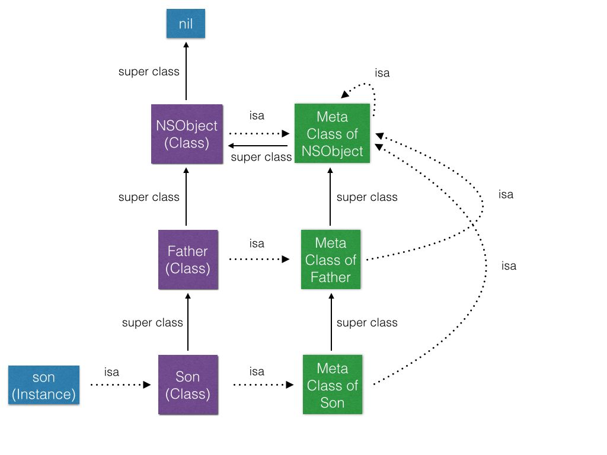
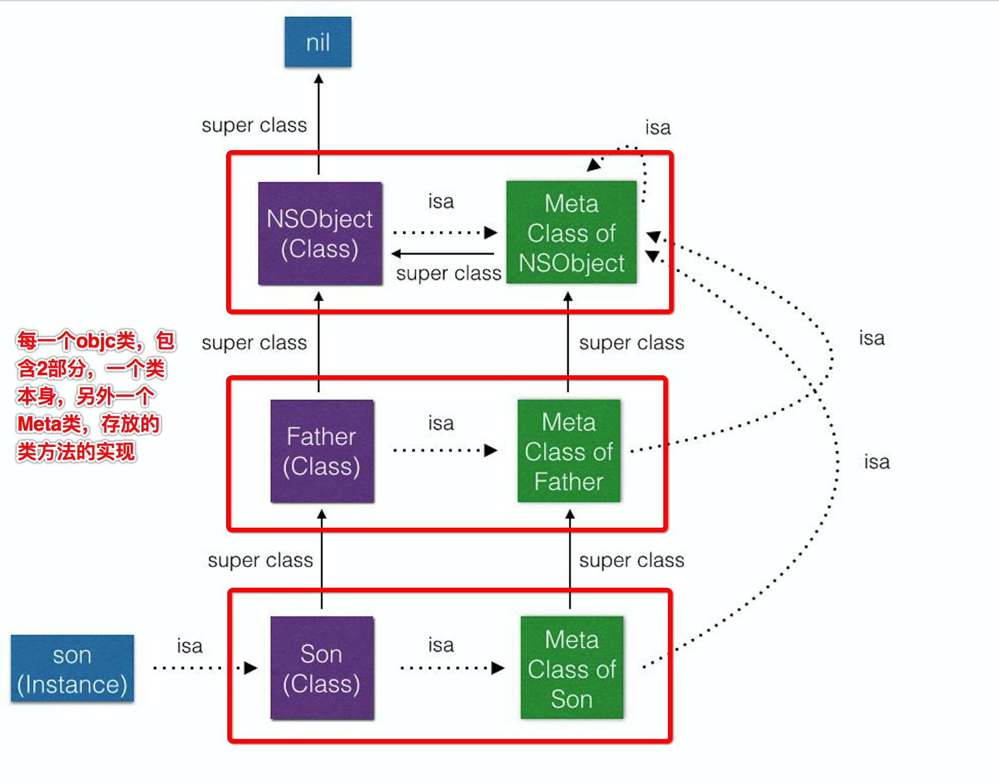
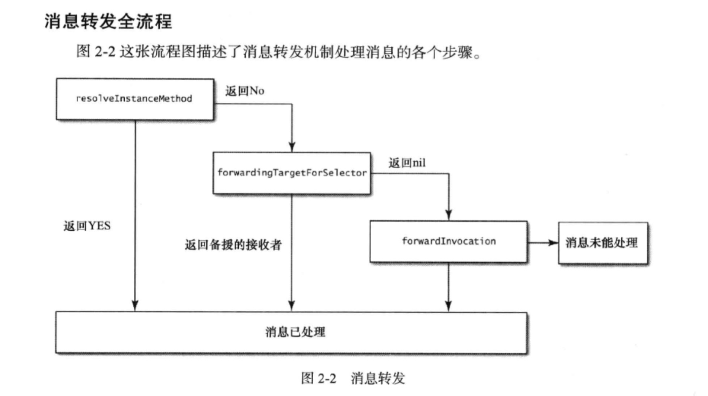
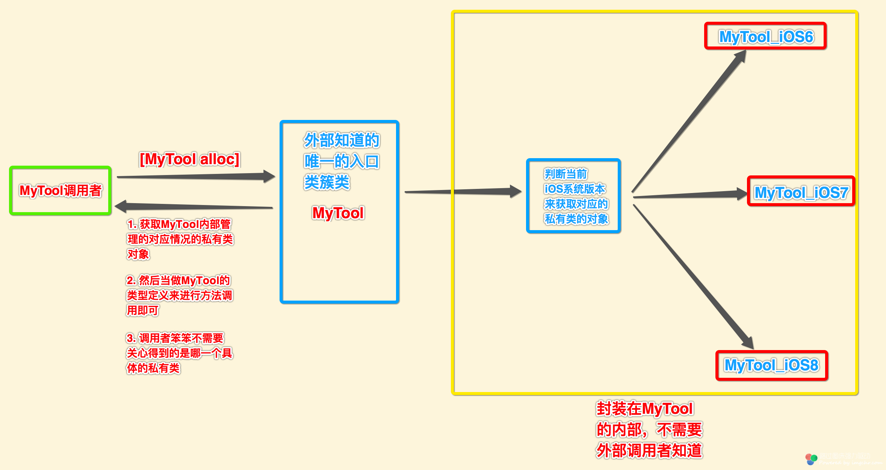
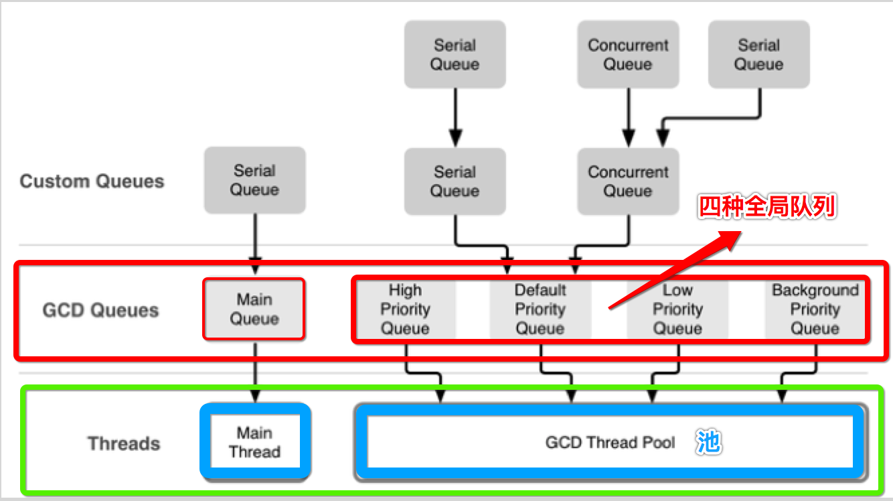
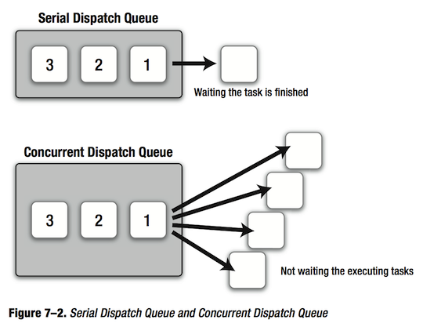
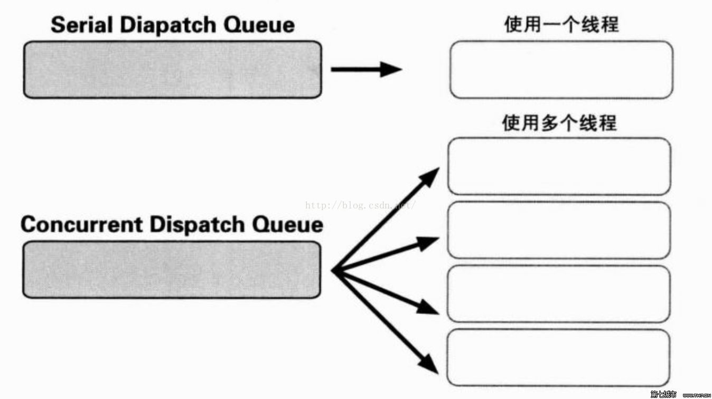
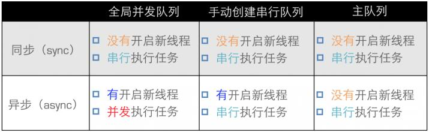
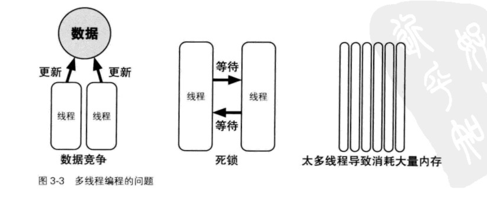
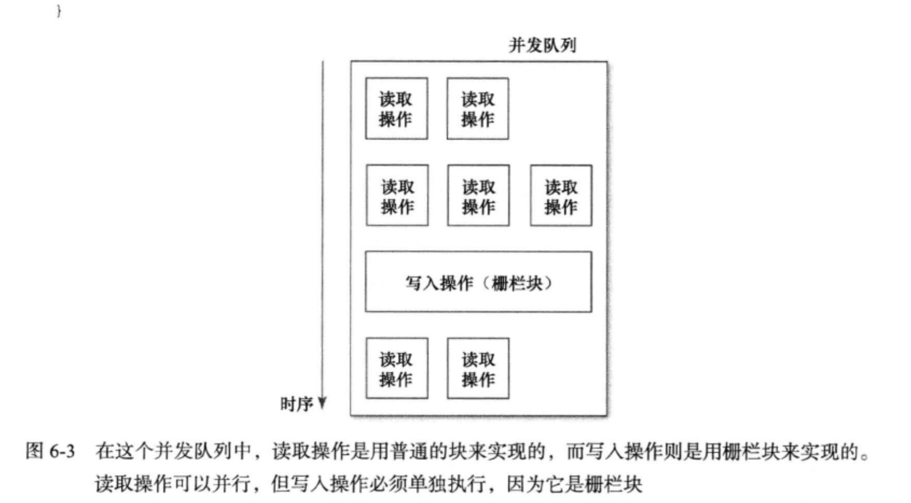

## 最好不要在load方法中写过多耗时的代码

因为App启动时，会等待所有objc类的load方法实现全部执行完，才会走后面的代码逻辑。

## YYMemoryCache中在子线程释放废弃对象的`三部曲`

```objc
- (void)removeAll {
    _totalCost = 0;
    _totalCount = 0;
    _head = nil;
    _tail = nil;
    
    if (CFDictionaryGetCount(_nodeMap) > 0) {
        
        //第一步、增加一个局部指向，dic.retainCount = 2
        CFMutableDictionaryRef holder = _nodeMap;
        
        //第二步、让之前的指针指向新创建的对象，dic.retainCount = 1
        _nodeMap = CFDictionaryCreateMutable(CFAllocatorGetDefault(), 0, &kCFTypeDictionaryKeyCallBacks, &kCFTypeDictionaryValueCallBacks);
        
        /**
         *  所有的node缓存节点内存释放与废弃，包含两种逻辑:
         *  - (1) 异步释放与废弃
         *      - 主线程完成
         *      - 子线程完成
         *  - (2) 同步释放与废弃
         *      - 当前创建node对象的所在线程（node对象的创建基本上都处于主线程）
         */
        
        //第三步、让此时retainCount==1的dic对象的释放废弃流程异步走到子线程中完成
        if (_releaseAsynchronously) {
            if (_releaseOnMainThread && !pthread_main_np()) {
                dispatch_async(dispatch_get_main_queue(), ^{
                    CFRelease(holder);//最终在主线程， dic.retainCount = 0
                });
            } else {
                dispatch_queue_t queue = _releaseOnMainThread ? dispatch_get_main_queue() : XZHMemoryCacheGetReleaseQueue();
                dispatch_async(queue, ^{
                    CFRelease(holder);//最终在子线程，dic.retainCount = 0
                });
            }
        } else {
            CFRelease(holder);//最终在执行removeAll所在线程，dic.retainCount = 0
        }
    }
}
```

通常是在子线程创建大体积对象，然后回调主线程使用。或者将主线程上不再使用的对象，异步放到子线程完成释放废弃。

- (1) 主线程创建对象 >>> 子线程异步释放与废弃
- (1) 子线程创建对象（读取文件为对象） >>> 主线程使用完毕 >>> 主线程异步释放与废弃

(1)、(2)的做法都是正确的。因为:

```
一个对象 >>> 一个内存块。
一个线程 >>> 一个代码执行路径。
```

那么任意的代码执行路径，都能够访问到某一块内存块，所以任意的线程是能够操作内存中任意的内存块数据。

但是`(2)`不太合常理，会影响主线程的执行效率，所以不推荐。


## KVO的大致实现总结

- (1) 当一个对象的属性添加了属性观察者之后，这个`对象的 isa指针`会被修改

- (2) 由runtime在运行时创建出一个对象所属类的一个子类，名字的格式是`NSKVONotifying_原始类名`

- (3) 重写原来父类中被观察属性property的setter方法实现

```objc
- (void)setType:(NSSting *)type {

	//1. 调用父类Cat设置属性值的方法实现
	[super setType:type];
	
	//2. 通知Cat对象的观察者执行回调（从断点效果看是同步执行的）
	[cat对象的观察者 observeValueForKeyPath:@"type"  ofObject:self  change:@{}  context:nil];
}
```

- (4) 对象的 isa指针，由runtime系统替换指向为第二步中创建的中间类`NSKVONotifying_原始类名`

- (5) 当对象的被观察属性值发生改变时（中间类的setter方法实现被调用），就会回调执行观察者的`observeValueForKeyPath: ofObject:change:context:`方法实现。并且是同步调用的。

- (6) 如下两个方法的返回的objc_class结构体实例是`不同`的

```
object_getClass(被观察者对象) >>> 返回的是替换后的`中间类`
```

```
[被观察对象 class] >>> 仍然然会之前的`原始类`
```

- (7) 当对象移除属性观察者之后，该`对象的isa指针`又会`恢复`指向为`原始类`


##  `objc_msgSend()` 函数类型转换的格式

```
((void (*)(id, SEL)) (void *) objc_msgSend)(obj, sel1);
```

在`c/c++`下，函数指针强转的格式：

```c
#include <iostream>
using namespace std;

//1. 
void work(void *self, char *sel) {
    
}

//2.
int work(void *self, char *sel ,int x) {
    return 1;
}

//3.
bool work(void *self, char *sel ,int x, int y) {
    return true;
}

//4.
string work(void *self, char *sel ,int x, int y, int z) {
        return string("Hello world~!!");
}
```

如上4个c++重载函数的函数指针类型如下：

```c
返回值类型 (*类型名字)(函数的参数列表)

//1. 
void    (*funcP1)(void *self, char *sel);

//2.
int     (*funcP2)(void *self, char *sel ,int x);

//3.
bool    (*funcP3)(void *self, char *sel ,int x, int y);

//4.
string  (*funcP4)(void *self, char *sel ,int x, int y, int z);
```

通过一个函数的指针变量，调用指向的函数:

```c
void test() {
    
    void *ptr = NULL;
    char sel[] = "sel";
    
    // (返回值类型 (*)(函数的参数列表)函数指针变量)(传递给方法的形参列表)；
    
    //1.
    ((void (*)(void *, char *))work)(ptr, sel);
    
    //2.
    int ret1 = ((int (*)(void *, char *, int))work)(ptr, sel, 19);
    
    //3.
    bool ret2 = ((bool (*)(void *, char *, int, int))work)(ptr, sel, 19, 20);
    
    //4.
    string ret3 = ((string (*)(void *, char *, int, int, int))work)(ptr, sel, 19, 20, 21);
    
}
```

## sendAction 发送UIEvent事件

- UIApplication

```c
sendAction:to:from:forEvent:
```

- UIControl

```c
sendAction:to:forEvent:
```

可以通过替换SEL指向的IMP，来拦截这两个负责发送UI事件的方法实现，来做一些额外的处理。

## 当遇到`多种选择条件`时，要尽量使用`查表`法实现

比如 switch/case，C Array，如果查表条件是对象，则可以用 NSDictionary 来实现。

比如，如下很多的`if-elseif`的判断语句:

```objc
NSString *name = @"XIONG";
    
if ([name isEqualToString:@"XIAOMING"]) {
    NSLog(@"task 1");
} else if ([name isEqualToString:@"LINING"]) {
    NSLog(@"task 2");
} else if ([name isEqualToString:@"MAHANG"]) {
    NSLog(@"task 3");
} else if ([name isEqualToString:@"YHAHA"]) {
    NSLog(@"task 4");
}
```

使用`NSDictionary+Block`来封装`条件 : 执行路径`:

```objc
NSDictionary *map = @{
                      @"XIONG1" : ^() {NSLog(@"task 1");},
                      @"XIONG2" : ^() {NSLog(@"task 2");},
                      @"XIONG3" : ^() {NSLog(@"task 3");},
                      @"XIONG4" : ^() {NSLog(@"task 4");},
                      };

void (^block)(void) = [map objectForKey:name];
block();
```

查表属于hash算法，在`非常多的if-elseif`判断语句时，效率会提升很多的。

但是，如果`key值`都很相似，这个时候就会造成每一次都是从hash表从头到尾遍历冲突，找到下一个，这样效率也很差的，比如:

```objc
NSDictionary *map = @{
                      @"nil" : @1,
                      @"nIl" : @1,
                      @"niL" : @1,
                      @"Nil" : @1,
                      @"NIL" : @1,
                      @"NIl" : @1,
                      };
```

所有的key值都太相似了，那么这种情况下，给一个key值查表时，几乎都是循环挨个遍历。

## objc对象、objc类、meta类、super 之间`isa`指针与`super_class`指针的指向关系





## 我们编写的NSObject类，在程序运行时加载的过程

```c
//1. 创建一个运行时识别的Class
objc_allocateClassPair(Class superclass, 
					   const char *name, 
					   size_t extraBytes);

//2. 添加实例变量
BOOL class_addIvar(Class cls, 
				   const char *name, 
				   size_t size, 
				   uint8_t alignment,
				    const char *types);

//3. 添加实例方法
BOOL class_addMethod(Class cls, 
					 SEL name, 
					 IMP imp, 
					 const char *types);
					 
//4. 添加实现的协议
BOOL class_addProtocol(Class cls, Protocol *protocol);

//5. 将处理完毕的Class注册到运行时系统，之后就无法再对其修改Ivar
void objc_registerClassPair(Class cls);
```

当执行完最后一步`objc_registerClassPair(Class cls)`，就会进行Ivar的内存布局计算了，之后就无法再改变了。

所以这就是为什么之前给Cat类添加Ivar不成功的原因。

## `直接操作Ivar > getter/setter > KVC`

Key-Value Coding 使用起来非常方便，但性能上要差于直接调用 Getter/Setter，所以如果能避免 KVC 而用 Getter/Setter 代替，性能会有较大提升。

KVC首先根据`setValue:forKey:`传入的key，查找到对应的`Ivar`，这个过程就已经有一点复杂了。

并且，KVC对于基本数据类型（int、float、double、long、NSInteger..）都会自动封装为NSNumber，而这个对于直接调用getter/setter时，是不必要的步骤。


通过`调用getter/setter`的方式进行Ivar值存取时，虽然是比KVC稍微好一点，但仍然需要走`objc的消息传递`的过程。

但是直接通过获取得到Iavr，直接对Ivar进行值的存取会更快:

```objc
@interface Dog : NSObject
@property (nonatomic, copy) NSString *name;
@end
@implementation Dog
@end
```

```objc
- (void)test {
    
    // Ivar的名字默认都是以为下划线开始的，eg： _name、_age ...
    Ivar ivar = class_getInstanceVariable([Dog class], "_name");
    
    Dog *dog = [Dog new];
    object_setIvar(dog, ivar, @"我是你妈");
    
    NSLog(@"name = %@", dog.name);

}
```

除了第一步查找Ivar之外，后面都是直接绕过了objc的消息传递过程，直接对Ivar进行存取。

## 对 `NSArray/NSSet/NSDictionary` 容器对象进行遍历的时候，转为CoreFoundation容器对象，再进行遍历，效率会更高。这也是struct作为Context的一个应用场景。

通常对于Foundation的写法:

```objc
//1.
NSDictionary *map = @{
                      @"key1" : @"value1",
                      @"key2" : @"value2",
                      @"key3" : @"value3",
                      @"key4" : @"value3",
                      };

//2. 每一次遍历都传入进行使用的公共数据
NSMutableString *info = [[NSMutableString alloc] init];

//3. 遍历容器，取出key、value、保存到公共数据中
[map enumerateKeysAndObjectsUsingBlock:^(NSString*  _Nonnull key, NSString*  _Nonnull obj, BOOL * _Nonnull stop)
{
    [info appendFormat:@"%@=%@", key, obj];
}];

NSLog(@"info = %@", info);
```

转换为CoreFoundation的写法，分为三部曲:

```c
// 定义每一次CF遍历回调c函数中使用的公共内存数据Context
struct Context {
    void *info;    //注意：c struct中不能定义objc对象类型
};
```

```c
// 每一次CF遍历回调的c函数实现
void XZHCFDictionaryApplierFunction(const void *key, const void *value, void *context) {
    //1.
    struct Context *ctx = (struct Context *)context;
    
    //2.
    NSMutableString *info = (__bridge NSMutableString*)(ctx->info);
    
    //3.
    NSString *key_ = (__bridge NSString*)(key);
    NSString *value_ = (__bridge NSString*)(value);
    
    //4.
    [info appendFormat:@"%@=%@", key_, value_];
}
```

```objc
// objc对象中转换为CF容器遍历
@implementation ViewController

- (void)test {
    
    //1.
    NSDictionary *map = @{
                          @"key1" : @"value1",
                          @"key2" : @"value2",
                          @"key3" : @"value3",
                          @"key4" : @"value3",
                          };

    //2. 每一次遍历都传入进行使用的公共数据
    NSMutableString *info = [[NSMutableString alloc] init];
    
    
    //3. 创建一个栈Context实例
    struct Context ctx = {0};
    
    //4. Context实例，包装每一次遍历函数中都要操作的objc对象数据
    ctx.info = (__bridge void*)(info);

    //5. 遍历容器，取出key、value、保存到公共数据中
    CFDictionaryApplyFunction((CFDictionaryRef)map , XZHCFDictionaryApplierFunction, &ctx);

    //6.
    NSLog(@"info = %@", info);
}

@end
```

效果与之前Foundation的一致，但是可以看到，使用CF容器遍历时，需要进行编写用于每次传入`CFDictionaryApplyFunction()`中回调c函数的一个`Context`结构体，并且需要对该Context结构体实例进行不断的存取。

但是总体CF容器遍历的效率绝对比Foundation容器遍历高，因为省去了objc消息传递等很多步骤，直接就是c函数调用完成的。

## struct的一些妙用

### struct应用场景2、作为多个参数的打包器Context


分为：方法获取参数集合、方法回传参数集合

```c
typedef struct Context {
    int     arg1;
    char    *arg2;
    float   arg3;
    void    *arg4;
}Context;
```

```c
void func6(Context *ctx) {
    
    //1. 从Context实例获取所有的参数
    int     arg1 = ctx->arg1;
    char    *arg2 = ctx->arg2;
    float   arg3 = ctx->arg3;
    void    *arg4 = ctx->arg4;
    
    //2. 操作所有的参数处理
}

void func7(int x, Context *ctx) {
    char a[] = "hahaha";
    
    // 将处理后的参数，设置到ctx回传出去
    ctx->arg1 = 1;
    ctx->arg2 = a;
    ctx->arg3 = 19.23;
    ctx->arg4 = (void*)"haha";
    
}
```

### struct应用场景3、位段结构体

格式

```c
struct __touchDelegate {
    
    //格式:
    变量类型 成员名 : 分配的长度;
    
    //例子: 通常分配一个二进制位就可以了，表示0与1即可
    unsigned int touchBegin : 1;
};
```

objc中的delegate的定义

```objc
@protocol TouchDelegate : NSObject

- (void)touchBegin;
- (void)touchMoved;
- (void)touchEnd;

@end
```

对应的位段结构体如下

```c
struct __touchDelegate {
    unsigned int touchBegin : 1;
    unsigned int touchMoved : 1;
    unsigned int touchEnd   : 1;
};
```

在设置delegate时，填充这个位段结构体实例


```objc
- (void)setDelegate:(id<TouchDelegate>)delegate {
    _delegate = delegate;
    
    if ([delegate respondsToSelector:@selector(touchBegin)]) {
        __touchDelegate.touchBegin = 1;
    }
    
    if ([delegate respondsToSelector:@selector(touchMoved)]) {
        __touchDelegate.touchMoved = 1;
    }
    
    if ([delegate respondsToSelector:@selector(touchEnd)]) {
        __touchDelegate.touchEnd = 1;
    }
}
```

后后面只需要根据位段结构体实例的对应成员变量值是0还是1，就可以判断是否实现了协议方法。


## struct实例，去持有 Foundation对象，当struct实例废弃时，要让Foundation对象在子线程上异步释放废弃

### 核心主要牵涉三个用于`c实例`与`objc对象`进行转换的东西

一、`(__bridge_retained CoreFoundation实例)Foundation对象`

- (1) Foundation对象 >>> CoreFoundation实例
- (2) `[Foundation对象 retain]`

二、`(__bridge_transfer Foundation对象)CoreFoundation实例`

- (1) CoreFoundation实例 >>> Foundation对象 
- (2) `[Foundation对象 release]`

三、`__bridge` 

- (1) Foundation对象 >>> CoreFoundation实例
- (2) CoreFoundation实例 >>> Foundation对象 
- (3) 不会执行任何的`retain/release`效果，仅仅只是类型的转换

### 下面demo测试

Foundation 类

```objc
@interface Dog : NSObject
@property (nonatomic, copy) NSString *name;
@end
@implementation Dog
- (void)dealloc {
    NSLog(@"废弃Dog对象，name = %@ on thread = %@", _name, [NSThread currentThread]);
}
@end
```

struct实例 使用 `void*` 万能指针类型持有 Foundation对象

```c
typedef struct DogsContext {
    void    *dogs;//持有oc数组对象
}DogsContext;
```

ViewController测试代码

```objc
static DogsContext *_dogsCtx = NULL;

@implementation ViewController

// 测试结构体实例持有oc对象
- (void)testARCBridge1 {
    
    //1. c结构体实例
    _dogsCtx = malloc(sizeof(DogsContext));
    _dogsCtx->dogs = NULL;
    
    //2. 创建测试的oc数组对象
    NSMutableArray *dogs = [NSMutableArray new];
    for (int i = 0; i < 3; i++) {
        Dog *dog = [Dog new];
        dog.name = [NSString stringWithFormat:@"name_%d", (i + 1)];
        NSLog(@"创建Dog对象，name = %@", dog.name);
        [dogs addObject:dog];
    }
    
    //3. struct实例 持有 NSFoundation对象，并对oc对象进行retain，防止oc对象被废弃
    _dogsCtx->dogs = (__bridge_retained void*)dogs;
}

// 测试从结构体实例中取出oc对象使用，然后不再需要的时候全部一起废弃
- (void)testARCBridge2 {
    
    //1. 先取出c struct实例持有的 NSFoundation对象使用，不进行任何retain/release
    NSMutableArray *array1 = (__bridge NSMutableArray*)_dogsCtx->dogs;
    for (Dog *dog in array1) {
        NSLog(@"使用Dog对象，name = %@", dog.name);
    }
    
    //2. 释放struct实例持有的NSMutableArray数组，继而释放掉了NSMutableArray数组持有的所有的Dogs对象
    //2.1 对oc数组对象进行release
    NSMutableArray *array2 = (__bridge_transfer NSMutableArray*)_dogsCtx->dogs;
    //2.2 解决结构体实例指向oc数组对象，并废弃结构体实例
    _dogsCtx->dogs = NULL;
    free(_dogsCtx);
    _dogsCtx = NULL;
    //2.3 子线程异步释放废弃oc数组内的其他子对象
    dispatch_async(dispatch_get_global_queue(0, 0), ^{
        [array2 class];
    });
}

- (void)touchesBegan:(NSSet<UITouch *> *)touches withEvent:(UIEvent *)event {

        [self testARCBridge1];
    [self testARCBridge2];
    
    NSLog(@"");
}

@end
```

输出信息

```
2017-02-08 23:54:34.433 Test[1262:71331] 创建Dog对象，name = name_1
2017-02-08 23:54:34.434 Test[1262:71331] 创建Dog对象，name = name_2
2017-02-08 23:54:34.434 Test[1262:71331] 创建Dog对象，name = name_3

2017-02-08 23:54:34.434 Test[1262:71331] 使用Dog对象，name = name_1
2017-02-08 23:54:34.434 Test[1262:71331] 使用Dog对象，name = name_2
2017-02-08 23:54:34.434 Test[1262:71331] 使用Dog对象，name = name_3

2017-02-08 23:54:34.435 Test[1262:71700] 废弃Dog对象，name = name_1 on thread = <NSThread: 0x7ff0c8e68a50>{number = 2, name = (null)}
2017-02-08 23:54:34.435 Test[1262:71700] 废弃Dog对象，name = name_2 on thread = <NSThread: 0x7ff0c8e68a50>{number = 2, name = (null)}
2017-02-08 23:54:34.435 Test[1262:71700] 废弃Dog对象，name = name_3 on thread = <NSThread: 0x7ff0c8e68a50>{number = 2, name = (null)}
```


## objc对象的成员变量的内存布局

```
objc对象的成员变量的内存布局.md
```

## 将一些不太重要的代码放在 `idle（空闲）` 时去执行

```objc
- (void)idleNotificationMethod { 
    // do something here 
} 
 
- (void)registerForIdleNotification  
{ 
	//1. 关注通知 IdleNotification
    [[NSNotificationCenter defaultCenter] addObserver:self 
        selector:@selector(idleNotificationMethod) 
        name:@"IdleNotification" 
        object:nil]; 
        
    //2. 构建通知
    NSNotification *notification = [NSNotification 
        notificationWithName:@"IdleNotification" object:nil]; 

	//3. 异步发送通知，并使用空闲模式
    [[NSNotificationQueue defaultQueue] enqueueNotification:notification 
    postingStyle:NSPostWhenIdle]; 
}  
```

## 在自定义线程上使用释放池

```objc
+ (NSThread *)networkRequestThread {
	static NSThread *_networkRequestThread = nil;
	static dispatch_once_t oncePredicate;
	dispatch_once(&oncePredicate, ^{
	    
		//1. 创建单例NSThread对象
		_networkRequestThread = [[NSThread alloc] initWithTarget:self selector:@selector(networkRequestThreadEntryPoint:) object:nil];
		
		//2. 开启线程对象
		[_networkRequestThread start];
	});

	return _networkRequestThread;
}

///NSThread入口函数
+ (void)networkRequestThreadEntryPoint:(id)__unused object {

	// 使用释放池进行包裹
	@autoreleasepool {
		[[NSThread currentThread] setName:@"AFNetworking"];
		NSRunLoop *runLoop = [NSRunLoop currentRunLoop];
		[runLoop addPort:[NSMachPort port] forMode:NSDefaultRunLoopMode];
		[runLoop run];
	}
}
```

## 在线程的runloop添加2个Observer，用来给线程永远保持一个最新鲜的释放池

```c
static void XZHCFRunLoopObserverCallBack(CFRunLoopObserverRef observer, CFRunLoopActivity activity, void *context)
{
	// 根据当前runloop的状态进行不同的操作
    switch (activity) {
            
        //状态一、runloop即将进入
        case kCFRunLoopEntry: {
            XZHAutoreleasePoolPush();// 直接创建新的释放池
        }
            break;
            
        //状态二、runloop即将休眠
        case kCFRunLoopBeforeWaiting: {
            XZHAutoreleasePoolPop();// 先废弃老的释放池
            XZHAutoreleasePoolPush();// 再创建新的释放池
        }
            break;
            
        //状态三、runloop即将退出
        case kCFRunLoopExit: {
            XZHAutoreleasePoolPop();// 直接释放老的释放池
        }
            break;
            
        default:
            break;
    }
}
```

从上面的逻辑可以看出，主要是三种状态：

- (1) runloop即将进入，也就是runloop的第一次初始化的时候
- (2) runloop即将睡眠，就是处理完当前所有的source了，已经没有其他事情了
- (3) runloop即将退出

## 对象关联时所有内存管理策略

| 关联对象指定的内存策略 | 等效的OC对象内存管理修饰符  | 
| :-------------: |:-------------:| 
| `OBJC_ASSOCIATION_ASSIGN` | atomic + assign |
| `OBJC_ASSOCIATION_RETAIN_NONATOMIC` | nonatimic + retain |
| `OBJC_ASSOCIATION_COPY_NONATOMIC` | nonatimic + copy |
| `OBJC_ASSOCIATION_RETAIN` | atomic + retain |
| `OBJC_ASSOCIATION_COPY` | atomic + copy |

没有指定`nonatomic`，默认就是`atomic`原子属性同步多线程。

## `IMP Caching`: 使用 `methodForSelector:` 获取objc方法 IMP，然后缓存起来。以后每次调用该oc函数时，直接使用IMP

首先，有一个测试类:

```objc
@interface Person : NSObject
+ (void)logName1:(NSString *)name;
- (void)logName2:(NSString *)name;
@end
@implementation Person
+ (void)logName1:(NSString *)name {
    NSLog(@"log1 name = %@", name);
}
- (void)logName2:(NSString *)name {
    NSLog(@"log2 name = %@", name);
}
@end
```

然后ViewController测试IMP Caching:

```c
#import <objc/runtime.h>

static id PersonClass = nil;
static SEL PersonSEL1;
static SEL PersonSEL2;
static IMP PersonIMP1;
static IMP PersonIMP2;

@implementation ViewController

+ (void)initialize {
    PersonClass = [Person class];
   
    PersonSEL1 = @selector(logName1:);
    PersonSEL2 = @selector(logName2:);
    
    //获取类方法实现
    PersonIMP1 = [PersonClass methodForSelector:PersonSEL1];
    
    //获取对象方法实现
    PersonIMP2 = method_getImplementation(class_getInstanceMethod(PersonClass, PersonSEL2));
}

- (void)touchesBegan:(NSSet<UITouch *> *)touches withEvent:(UIEvent *)event {

    //1. 调用类方法实现
    ((void (*)(id, SEL, NSString*)) (void *) PersonIMP1)(PersonClass, PersonSEL1, @"我是参数");
    
    //2. 调用对象方法实现
    ((void (*)(id, SEL, NSString*)) (void *) PersonIMP2)([Person new], PersonSEL2, @"我是参数");
    
    NSLog(@"");
}

@end
```

输出结果

```
2017-02-08 22:47:46.586 Test[805:25490] log1 name = 我是参数
2017-02-08 22:47:46.587 Test[805:25490] log2 name = 我是参数
```

## objc消息转发阶段总结



##  `_objc_msgForward` iOS系统消息转发c函数指针

还有与之差不多意思的:

```c
_objc_msgForward_stret
```

jspatch恰恰就是利用的这个`_objc_msgForward`c方法实现，达到交换任意Method的SEL指向的IMP。

当一个oc类中，找不到某一个SEL对应的IMP时，会进入到系统的消息转发函数。

下面测试下，`_objc_msgForward`到底是如何转发消息的？

首先，有如下测试类:

```objc
@interface Person : NSObject
+ (void)logName1:(NSString *)name;
- (void)logName2:(NSString *)name;
@end
@implementation Person
+ (void)logName1:(NSString *)name {
    NSLog(@"log1 name = %@", name);
}
- (void)logName2:(NSString *)name {
    NSLog(@"log2 name = %@", name);
}
@end
```

ViewController中随便执行一个Perosn对象不存在实现的SEL消息:

```objc
@implementation ViewController

- (void)touchesBegan:(NSSet<UITouch *> *)touches withEvent:(UIEvent *)event {

    // 此处打一个断点，然后执行下面的lldb调试命令后，再往下执行代码
    static Person *person;
    person = [Person new];
    [person performSelector:@selector(hahahaaha)];
    
    NSLog(@"");
}

@end
```

断点后，在lldb中输入如下调试命令，会打印出所有运行时发送的消息:

```c
(lldb) call (void)instrumentObjcMessageSends(YES)
```

程序崩溃后，进入Mac电脑系统如下目录:

```c
cd /tmp/
```

找到该目录下类似如下结构的文件，然后打开

```
msgSends-901
```

打开文件后，只看与`Person`相关的信息大概为如下:

```objc
+ Person NSObject initialize
+ Person NSObject new
- Person NSObject init
- Person NSObject performSelector:
+ Person NSObject resolveInstanceMethod:
+ Person NSObject resolveInstanceMethod:
- Person NSObject forwardingTargetForSelector:
- Person NSObject forwardingTargetForSelector:
- Person NSObject methodSignatureForSelector:
- Person NSObject methodSignatureForSelector:
- Person NSObject class
- Person NSObject doesNotRecognizeSelector:
- Person NSObject doesNotRecognizeSelector:
- Person NSObject class
```

从`Person NSObject performSelector:`开始执行一个不存在实现SEL消息后，依次开始执行:

- (1) `resolveInstanceMethod:`
- (2) `forwardingTargetForSelector:`
- (3) `methodSignatureForSelector:`

所以，`_objc_msgForward`这个指针指向的c函数的作用，就是进入到消息转发阶段，从阶段1到阶段2，如果最后阶段仍然无法处理消息，就产生异常让程序退出。

## 限制无限去创建 gcd dispatch queue

YYDispatchQueuePool的核心几点:

- (1) iOS8之前使用Priority，iOS8及之后使用QualityOfService，来操作`dispatch_queue_t`

- (2) 根据 Priority或iOS8及之后使用QualityOfService，不同的各种等级，分别创建一个Context内存块

- (3) 每一个Context内存块，保存`[NSProcessInfo processInfo].activeProcessorCount`个 dispatch serial queue实例

- (4) 根据对应的等级，从对应的Context中，随机取出一个dispatch serial queue实例，进行任务调度

- (5) 一个`dispatch serial queue实例`，就是`一个`底层线程

- (6) 一个`dispatch concurrent queue实例`，就是`n个`底层线程

这样避免无限制的创建dispatch queue实例，导致底层线程也会无限制的创建，没有办法复用。

并且每一种Context下，预先缓存`当前CPU硬件激活的核心数`个dispatch queue实例，可以让CPU在该Context等级下，满负荷运行，让CPU充分利用。

而不会因为线程太多，导致CPU在多线程之间切换、竞争消耗无畏的资源。

### 注意如果直接对NSThread进行缓存，一定要做如下几件事

- (1) 获取NSThread对象的RunLoop（完成RunLoop的创建与绑定）
- (2) 给RunLoop添加RunLoopSource监听的事件源（随便加一个NSMachPort）
- (3) 让NSThread的`-[NSRunLoop run]`

这样，这个NSThread对象的状态，才会一直处于执行状态，即使`isExecuting == YES`，这样也才能让这个NSThread对象，永远的随时随刻接收任务执行。

但是如果直接对`dispatch_queue_t`实例，进行缓存的话，是不需要我们手动做上面的一些事情的，我估计是GCD底层线程池已经做了处理。

## `@package`块声明ivar

让一些Ivar只想在`静态类库`或`framework`中的类对象中的代码可以访问。


## 主线程上常见比较耗时的代码类型:

- (1) Layout 布局计算
	- 计算文本内容的 宽度计算、高度计算
	- UI对象的 frmae计算、frmae设置、frmae调整

- (2) Rendering 显示数据渲染
	- 文本内容的渲染
	- 图片的解码
	- 图形的绘制

- (3) UIKit Obejcts UI对象
	- UI对象的属性值调整
	- UI对象的创建
	- UI对象的销毁（废弃）


## `hitTest:withEvent:` 与 `pointInside:withEvent:`

### 关于`-[UIView hitTest:withEvent:]`的源码大致实现

```objc
- (UIView *)hitTest:(CGPoint)point withEvent:(UIEvent *)event
{
    // 1. 判断自己是否能够接收触摸事件（是否打开事件交互、是否隐藏、是否透明）
    if (self.userInteractionEnabled == NO || self.hidden == YES || self.alpha <= 0.01) return nil;
    
    // 2. 调用 pointInside:withEvent:， 判断触摸点在不在自己范围内（frame）
    if (![self pointInside:point withEvent:event]) return nil;
    
    // 3. 从`上到下`（最上面开始）遍历自己的所有子控件，看是否有子控件更适合响应此事件
    int count = self.subviews.count;
    for (int i = count - 1; i >= 0; i--) {
        UIView *childView = self.subviews[i];
        
        // 将产生事件的坐标，转换成当前相对subview自己坐标原点的坐标
        CGPoint childPoint = [self convertPoint:point toView:childView];
        
        // 又继续交给每一个subview去hitTest
        UIView *fitView = [childView hitTest:childPoint withEvent:event];
        
        // 如果childView的subviews存在能够处理事件的，就返回当前遍历的childView对象作为事件处理对象
        if (fitView) {
            return fitView;
        }
    }
    
    //4. 没有找到比自己更合适的view
    return self;
}
```

可以看到这个`hitTest:withEvent:`函数实现，主要就是测试这个UIView对象，到底能不能够处理这个UI触摸事件。

执行`hitTest:`的层次顺序如下:

```
- UIApplication
	- UIWindow
		- RootView
			- Subviews[n-1]
			- Subviews[n-2] 
			- ....
			- Subviews[0]
```

### 使用Category Associate 扩大UI的事件响应区域

```objc
#import <UIKit/UIKit.h>

@interface UIButton (EnlargeTouchArea)

/**
 *  设置按钮上下左右的扩展响应区域
 */
- (void)setEnlargeEdgeWithTop:(CGFloat)top
                        right:(CGFloat)right
                       bottom:(CGFloat)bottom
                         left:(CGFloat)left;

@end
```

```
#import "UIButton+EnlargeTouchArea.h"
#import <objc/runtime.h>

static void *kButtonUpKey = &kButtonUpKey;
static void *kButtonLeftKey = &kButtonLeftKey;
static void *kButtonDownKey = &kButtonDownKey;
static void *kButtonRightKey = &kButtonRightKey;

@implementation UIButton (EnlargeTouchArea)

- (void)setEnlargeEdgeWithTop:(CGFloat)top right:(CGFloat)right bottom:(CGFloat)bottom left:(CGFloat)left
{
    objc_setAssociatedObject(self, kButtonUpKey, @(top), OBJC_ASSOCIATION_ASSIGN);
    objc_setAssociatedObject(self, kButtonLeftKey, @(left), OBJC_ASSOCIATION_ASSIGN);
    objc_setAssociatedObject(self, kButtonDownKey, @(bottom), OBJC_ASSOCIATION_ASSIGN);
    objc_setAssociatedObject(self, kButtonRightKey, @(right), OBJC_ASSOCIATION_ASSIGN);
}

- (CGRect) enlargedRect
{
    NSNumber* topEdge = objc_getAssociatedObject(self, &kButtonUpKey);
    NSNumber* rightEdge = objc_getAssociatedObject(self, &kButtonRightKey);
    NSNumber* bottomEdge = objc_getAssociatedObject(self, &kButtonDownKey);
    NSNumber* leftEdge = objc_getAssociatedObject(self, &kButtonLeftKey);
    
    if (topEdge && rightEdge && bottomEdge && leftEdge)
    {
        // 上下左右分别扩大响应区域
        return CGRectMake(
                          self.bounds.origin.x - leftEdge.floatValue,
                          self.bounds.origin.y - topEdge.floatValue,
                          self.bounds.size.width + leftEdge.floatValue + rightEdge.floatValue,
                          self.bounds.size.height + topEdge.floatValue + bottomEdge.floatValue
                          );
    } else {
        return self.bounds;
    }
}

- (UIView *)hitTest:(CGPoint)point withEvent:(UIEvent *)event {
    
    // 扩大后的响应区域
    CGRect rect = [self enlargedRect];
    
    // 如果扩大的响应区域 == 当前自身的响应区域，直接执行父类的事件处理
    if (CGRectEqualToRect(rect, self.bounds))
    {
        return [super hitTest:point withEvent:event];
    }
    
    // 扩大的响应区域 > 当前自身的响应区域
    return CGRectContainsPoint(rect, point) ? self : nil;
}

@end
```

## 位移枚举 + Mask掩码

这种枚举适用于一个统一的枚举类型来定义，具备:

- (1) 多种情况
- (2) 每一种情况，又分为其他的小情况

一个简单的demo


```objc
typedef NS_OPTIONS(NSInteger, PersonState) {
	
	// 第一种类型: 占用1~8位的二进制位，掩码是 1111,1111
    PersonStateMask                     = 0xFF,//1-8位的掩码（十六进制数，一个数代表4位，F:1111，0:0000）
    PersonStateUnknown                  = 0,
    PersonStateAlive                    = 1,
    PersonStateWork                     = 2,
    PersonStateDead                     = 3,

	// 第二种类型: 占用9~16位的二进制位，掩码是 1111,1111,0000,0000   
    HouseStateMask                      = 0xFF00,//9-16位，左移8位
    HouseStateNone                      = 1 << 8,
    HouseStateSmall                     = 1 << 9,
    HouseStateBig                       = 1 << 10,
    
	// 第三种类型: 占用17~24位的二进制位，掩码是 1111,1111,0000,0000,0000,0000   
    CarStateMask                        = 0xFF0000,//17-24位，左移16位
    CarStateNone                        = 1 << 16,
    CarStateSmall                       = 1 << 17,
    CarStateBig                         = 1 << 18,
};
```

如下就是分别获取得到 1~8位、9~16位、17~24位 这三个区段的所谓的Mask掩码

```c
0xFF		>>> 1111,1111 >>> 获取低8位值
0xFF00 		>>> 1111,1111,0000,0000 >>> 获取9-16位值
0xFF0000  	>>> 1111,1111,0000,0000,0000,0000 >>> 获取17-24位值
```

使用当前的枚举混合值，通过与Mask掩码，进行`按位与`获取Mask掩码对应长度的值:

```c
(1) & 上 `FF` 获取低8位的值
(2) & 上 `FF00` 获取第9位到16位的值
(3) & 上 `FF0000` 获取第17位到24位的值
```

示例代码

```c
//1.
PersonState state = PersonStateUnknown;

//2.
state = PersonStateDead;

//3.
state = state | HouseStateBig;
NSLog(@"state = %ld", state);
NSLog(@"person state = %ld", state & PersonStateMask);
NSLog(@"house state = %ld", state & HouseStateMask);

//4.
state = state | CarStateBig;

//5. 
NSLog(@"state = %ld", state);
NSLog(@"person state = %ld", state & PersonStateMask);
NSLog(@"house state = %ld", state & HouseStateMask);
NSLog(@"car state = %ld", state & CarStateMask);
```

## `-[NSObject class]`、`+[NSObject class]`、`objc_getClass(<#const char *name#>)`的区别

### `-[NSObject class]`源码实现

```c
- (Class) class
{
  return object_getClass(self);
}
```

### `+[NSObject class]`源码实现

```c
+ (Class) class
{
  return self;
}
```

### `objc_getClass(<#const char *name#>)`源码实现

```c
Class object_getClass(id obj)
{
    if (obj) return obj->getIsa();//读取的是isa指针，所指向的objc_class实例
    else return Nil;
}
```

## Cache缓存数据、在多线程环境下使用的代码模板

```objc
@interface ClassMapper : NSObject
@end

@implementation ClassMapper
+ (instancetype)mapperWithClass:(Class)cls {
    if (Nil == cls) {return nil;}
    
    /**
     *  1. 单例模板控制缓存正确初始化、信号值为1的信号量初始化
     */
    static CFMutableDictionaryRef       _cache = NULL;
    static dispatch_semaphore_t         _semephore = NULL;
    static dispatch_once_t onceToken;
    dispatch_once(&onceToken, ^{
        _cache = CFDictionaryCreateMutable(kCFAllocatorDefault, 32, &kCFTypeDictionaryKeyCallBacks, &kCFTypeDictionaryValueCallBacks);
        _semephore = dispatch_semaphore_create(1);
    });
    
    /**
     *  2. 先查询缓存
     */
    const void *clsName =  (__bridge const void *)(NSStringFromClass(cls));
    dispatch_semaphore_wait(_semephore, DISPATCH_TIME_FOREVER);
    ClassMapper *clsMapper = CFDictionaryGetValue(_cache, clsName);
    dispatch_semaphore_signal(_semephore);
    
    /**
     *  3. 如果有缓存就直接返回，如果没有缓存则创建新的对象并完成缓存
     */
    if (!clsMapper) {
        clsMapper = [ClassMapper new];
        
        dispatch_semaphore_wait(_semephore, DISPATCH_TIME_FOREVER);
        CFDictionarySetValue(_cache, clsName, (__bridge const void *)(clsMapper));
        dispatch_semaphore_signal(_semephore);

    }

    return clsMapper;;
}
@end
```


## Category不会`覆盖`原始方法实现，以及多个Category重写相同的方法实现的调用顺序

### 主要涉及的问题

```
1. Category是否会覆盖原始Class中的Method？
2. 多个Category添加相同的Method，调用顺序是什么？
```

### 一、Category中重写原始类中已经存在的方法实现时

- (1) Category中重写的Method，肯定会排在原始类的Method的`最前面`

- (2) 每当从编译路径中读取到Category重写的Method，就会将这个重写的Method采用`头插法`插入到原始类的`method_list`的`第一个`位置

也就是说，越在后面编译的Category中重写的Method，却会出现在`method_list`的第一个位置
	
### 二、多个Category中，都重写了相同的方法实现时

会按照Category在编译路径中的顺序，将Method依次`头插`到原始类的`method_list`单链表中。

所以，也就是Category出现的越晚，重写的Method就会出现在第一个位置。

具体测试，搜索`Category覆盖原始类中的方法实现存在的问题.md`。

## 触发CPU与GPU的离屏渲染的场景

### CPU触发离屏渲染

- (1) 使用`CoreGraphics`库函数进行绘制图像

- (2) 重写`-[UIView drawRect]`方法实现中写的任何绘制代码
    - 甚至是`空方法实现`也会触发

### GPU触发离屏渲染

- (1) CALayer对象设置 shouldRasterize（光栅化）

- (2) CALayer对象设置 masks（遮罩）

- (3) CALayer对象设置 shadows（阴影）

- (4) CALayer对象设置 group opacity（不透明）

- (5) 所有`文字`的绘制（UILabel、UITextView...），包括`CoreText`绘制文字、`TextKit`绘制文字


尽量避免GPU离屏渲染，但是为了能够异步进行绘制，也有可能操作CPU离屏渲染。

### 但是最好这两种离屏渲染都不做，对于上面两种离屏渲染的针对性处理:

- (1) CPU的离屏渲染 >>> 尽量的使用`专用图层`（CATextLayer...）
- (2) GPU的离屏渲染 >>> 尽量`提前在子线程上异步`完成文本、图形、图像的`渲染`

参见`CoreText三、CoreText基础、使用、优化.md`。


## 最好不要重写`-[UIView drawRect:]`来完成文本、图形的绘制，而是使用`专用图层`来专门完成绘制

### 首先清楚，CPU与GPU的强项与弱势：

- (1) CPU、对数据的计算处理相当快，但是对于图像的渲染很差
- (2) GPU、有很多核心来同时做图像的渲染，所以很快。但是对于数据的计算处理，是很慢的


所以，一定要充分利用GPU与CPU的强项：

```
CPU >>> 大量进行数据计算，少进行图像渲染
GPU >>> 大量进行图像渲染，少进行数据计算
```

- (1) `OpenGL`绘制图像，会交给`GPU`完成渲染
- (2) `CoreGraphics`绘制图像，会交给`CPU`完成渲染

所以，最好让CPU只做一些`数据计算`，而CPU只会`图像渲染`，这样整体性能会提升很多。

### 为什么不要重写`drawRect:` 

- (1) 只要重写`drawRect:`，就会给layer创建一个`空的宿主图像`而浪费内存

- (2) `CoreGraphics`的图像绘制，会触发`CPU的离屏渲染`，而CPU的`图像渲染`能力是很差的，会影响CPU的执行效率

- (3) `专用图层`把图像渲染代码使用OpenGL操作`GPU`来完成图像的渲染，内存优化

下面是使用专用图层来绘制自定义路径的代码模板，`代替`使用重写`drawRect:`

```objc
@implementation XingNengVC {
    UIView  *_bottomView;
}

- (void)viewDidLoad {
    [super viewDidLoad];
    
    //1. 创建UIView容器
    _bottomView = [[UIView alloc] initWithFrame:CGRectMake(0, 0, 300, 200)];
    [self.view addSubview:_bottomView];
    
    //2. 创建具体绘制图像的专用图层
    CAShapeLayer *layer = [CAShapeLayer layer];
    layer.frame = _bottomView.bounds;
    
    //3. 设置要绘制的图像路径
    UIBezierPath *path = [[UIBezierPath alloc] init];
    [path moveToPoint:CGPointMake(175, 100)];
    [path addArcWithCenter:CGPointMake(150, 100) radius:25 startAngle:0 endAngle:2*M_PI clockwise:YES];
    [path moveToPoint:CGPointMake(150, 125)];
    [path addLineToPoint:CGPointMake(150, 175)];
    [path addLineToPoint:CGPointMake(125, 225)];
    [path moveToPoint:CGPointMake(150, 175)];
    [path addLineToPoint:CGPointMake(175, 225)];
    [path moveToPoint:CGPointMake(100, 150)];
    [path addLineToPoint:CGPointMake(200, 150)];
    
    //4. 将要绘制的路径设置给layer
    layer.path = path.CGPath;
    
    //3.
    [_bottomView.layer addSublayer:layer];
}

@end
```

## objc对象的`释放`与`废弃`，是两个`不同的阶段`

### 释放

应该是释放对象的`持有`，即对objc对象发送`retain\release\autorelase`等消息，修改objc对象的`retainCount`值，但是对象的内存一直都还存在。

释放持有的操作，是`同步`的。

### 废弃

当某个`空闲`时间，系统才会将内存的数据全部擦除干净，然后将这块内存`合并为系统未使用的内存`中。而此时如果程序继续访问该内存块，就会造成程序崩溃。

内存的彻底`废弃`操作，是`异步`的，也就是说有一定的`延迟`。


### 执行了`-[NSObject dealloc]`，并不是说对象所在内存就被`废弃`了。只是对于常理来说，这个对象已经`标记`为即将废弃，程序中也不要再继续使用了。


```objc
- (void)testMRC {

    _mrc = [[MRCTest alloc] init];
    NSLog(@"[_mrc retainCount] = %lu", [_mrc retainCount]);
    
    MRCTest *tmp1 = [_mrc retain];
    NSLog(@"[_mrc retainCount] = %lu", [_mrc retainCount]);
    
    [_mrc release];
    NSLog(@"[_mrc retainCount] = %lu", [_mrc retainCount]);
    
    [tmp1 release];
    NSLog(@"[_mrc retainCount] = %lu", [_mrc retainCount]);
    
    //【重要】尝试多次输出retainCount
    for (NSInteger i = 0; i < 10; i++) {
        NSLog(@"[_mrc retainCount] = %lu", [_mrc retainCount]);//【重要】循环执行几次之后，崩溃到此行
    }
}
```

运行之后，结果崩溃到for循环中的第二次或第三次循环，`程序崩溃`报错如下:

```
thread 1:EXC_BAD_ACCESS .... 
```

释放掉对象之后，指向该对象的指针，仍然会保留在局部方法块的所在栈中，仍然是可以在短暂的时间内继续通过指针访问到对象。但是超过一定时间后，对象才会被彻底废弃掉，这个时候如果还去使用这个指针就会造成程序崩溃。

那这样是说最终对象的内存废弃过程，是一个`异步`执行的吗？或者说有一定的`延迟时间`吗？

是`延迟`的，因为最终对象内存会被擦除掉，并与系统内存合并到一起，所以这个过程确实是一个异步的。

## 属性修饰符与对象所有权修饰符的关系

| 属性声明时的修饰符 | 对象所有权修饰符 | 
| :-------------: |:-------------:| 
| assign | `__unsafe_unretained` | 
| copy | `__strong`（首先是拷贝原始对象得到一个新的对象，然后再强引用新的对象，释放老的对象） | 
| retain | `__strong` | 
| strong | `__strong` | 
| `unsafe_unretained` | `__unsafe_unretained` | 
| weak | `__weak` | 


### 对于属性提供的额外几种
	
- copy 

其实和strong/retain很相似的，`只是多一步拷贝`的操作，对于copy修饰的属性setter方法实际上做了如下三件事:

```
- (1) id newObj = [oldObj copy];
- (2) [oldObj release];
- (3) [newObj retain];
```

- assign:
	- 一般使用一些基本数据类型的属性变量（int、float、bool...）
	- 类似`__unsafe_unretaind`

## `__strong` 修饰对象的指针变量

- (1) 会自动添加对象的`retain\release`的消息代码

- (2) 持有与释放的原则
	- 自己生成的对象，自己持有
	- 非自己生成的对象，我也能持有
	- 不再需要自己持有的对象时进行释放
	- 非自己持有的对象无法释放

##  `__unsafe_unretained` 

### 内存管理原则

- (1) `unsafe` 不安全，这点是与`weak`不同点，既不会自动赋值nil
- (2) `unretained` 不会产生`强引用`持有，这是与`weak`的相同点
- (3) **直接使用对象的地址，不管对象是否已经被废弃，都直接访问地址**

所以，如果被访问的地址已经被废弃，可能造成崩溃。

### 使用`__unsafe_unretained`来修饰指向`必定不会被废弃`的对象的指针变量，不会由ARC系统附加做`retain/release`的处理，提高了运行速度

- (1) 使用`__weak`修饰的指针变量指向的对象时，会将被指向的对象，自动注册到自动释放池，防止使用的时候被废弃，但是影响了代码执行效率

- (2) 如果一个对象确定是不会被废弃，或者调用完成之前不会被废弃，就使用`__unsafe_unretained`来修饰指针变量

- (3) `__unsafe_unretained`就是简单的拷贝`地址`，不进行任何的`对象内存管理`，即不修改retainCount

## `__autoreleasing`

分析下`+[NSMutableArray array]`返回值对象处理:

```objc
+ (id)array {

	//1. 生成一个数组对象
	id obj = objc_msgSend(NSMutableArray, @selector(alloc));
	
	//2. 执行对象的初始化init方法
	obj = objc_msgSend(obj, @selector(init));
	
	//3. 返回一个autorelease的返回值
	return objc_autoreleaseReturnValue(obj);
}
```

## 使用`__weak`指针指向的对象时，会自动将对象注册到一个自动释放池，防止提早废弃

那么为什么要这样的了？因为`__weak`变量:

- (1) 支持有对象的一个`弱引用`
- (2) 不能保证访问该对象的整个过程中，对象一定不会被废弃

所以，通过将弱引用的对象，注册到autoreleasePool中，从而保证整个操作过程（autoreleasePool结束之前），弱引用对象都不会被废弃。

但是这样，会造成一些代码执行效率的降低。

如果确认某个对象，在使用期间肯定不会被废弃，那么直接使用`__unsafe_unretained`，直接使用`对象的地址`，而不会对对象进行任何的`retian/release/autorelease`。

## 使用`__strong`强持有方法的返回值对象时，与`__weak`是有区别的

### 有一对重要的函数，用于返回值对象的内存管理优化

第一个、

```c
id objc_autoreleaseReturnValue(id obj);
```

第二个、

```c
id objc_retainAutoreleasedReturnValue(id obj);
```

### 对于`+[NSMutableArray array]`最终的c实现代码为如下:

```objc
@implementation NSMutableArray

+ (id)array {

	//1. 生成一个数组对象
	id obj = objc_msgSend(NSMutableArray, @selector(alloc));
	
	//2. 执行对象的初始化init方法
	obj = objc_msgSend(obj, @selector(init));
	
	//3. 【重点】
	return objc_autoreleaseReturnValue(obj);
}

@end
```

### 对于其他类对象中，使用`__strong`持有该方法的返回值对象的objc代码

```objc
@implementation ViewController 
 
- (void) test  {
	
	id __strong obj = [NSMutableArray array];
}
 
@emd
```

最终被编译成为的c代码大致如下:

```c
void test(id target, SEL sel) {
	
	//1. 调用方法获取返回值对象
	id obj = objc_msgSend(NSMutableArray, @selector(array));

	//2. 【重点】 
	objc_retainAutoreleasedReturnValue(obj);

	//3.
	objc_release(obj);
}
```
	
### `objc_autoreleaseReturnValue(id obj)` 出现在返回一个返回值的函数代码中

```c
id  objc_autoreleaseReturnValue(id obj)
{
	// 1. 如果调用函数的一方，在获取到返回值后，使用了 objc_retainAutoreleasedReturnValue(obj)
	// 就走如下if语句，
	// 首先、对该返回值对象做一个标记
	// 最后、直接返回这个返回值对象
    if (callerAcceptsFastAutorelease(__builtin_return_address(0))) {//判断调用方法，是否使用了 objc_retainAutoreleasedReturnValue(obj)
        tls_set_direct(AUTORELEASE_POOL_RECLAIM_KEY, obj);//对该返回值对象做一个标记
        return obj;
    }

    //2. 相反如果在获取到返回值后，没有使用 objc_retainAutoreleasedReturnValue(obj)
    // 则将对象注册到一个释放池中，然后再返回
    return objc_autorelease(obj);
}
```

### `objc_retainAutoreleasedReturnValue()` 出现在调用某个函数获取一个objc返回值对象的代码的`紧接着的下面一行`

比如:

```c
void test(id target, SEL sel) {
	
	//1. 调用方法获取返回值对象
	id obj = objc_msgSend(NSMutableArray, @selector(array));

	//2. 【重点】 
	objc_retainAutoreleasedReturnValue(obj);

	//3.
	objc_release(obj);
}
```

看`objc_retainAutoreleasedReturnValue(obj);`做了啥:

```c
id objc_retainAutoreleasedReturnValue(id obj)
{

	//1. 判断传入的对象，是否是需要做内存优化。如果需要走如下if语句:
	// 首先、根据标记从缓存中取出返回值对象
	// 然后、取消这个对象的返回值内存优化标记
	// 最后、返回这个对象
    if (obj == tls_get_direct(AUTORELEASE_POOL_RECLAIM_KEY)) {
        tls_set_direct(AUTORELEASE_POOL_RECLAIM_KEY, 0);
        return obj;
    }

    //2. 而如果没有被标记做返回值优化的对象
    // 会被retain一次，增加其retainCount
    return objc_retain(obj);
}
```

基本上就可以看明白`objc_autoreleaseReturnValue(id obj)`与`objc_retainAutoreleasedReturnValue(id obj)`这一对函数，在返回值为objc对象时，做的优化了。

两个函数配合起来，`禁止`返回值objc对象被注册到`autorelease pool`的多余过程。		

## objc对象弱引用实现

- (1) NSValue
- (2) block + `__weak`
- (3) NSProxy或NSObject的消息转发

具体参考`几种弱引用实现方法.md`.


## FMDatabaseQueue解决`dispatch_sync(queue, ^(){});`可能导致多线程死锁

### 主要是如下两个相关函数的使用:

给queue绑定一个标记值

```c
dispatch_queue_set_specific(dispatch_queue_t queue, 
							const void *key,
							void *context, dispatch_function_t destructor);
```	

取出queue绑定的标记值

```c
void * dispatch_get_specific(const void *key);
```

有点类似runtime中的 `objc_setAssociatedObject()`与`objc_getAssociatedObject()`，动态绑定一个对象。

那么在使用`dispatch_sync(){queue, block}`之前，取出queue绑定的标记值，看是否与当前即将要执行`dispatch_sync`任务的的queue绑定的标记值，是否是一样的。

- (1) 如果一样，说明当前即将执行`dispatch_sync`任务的的queue，就是之前的queue
- (2) 如果不一样，说明是不一样的queue

### 当queue时`串行`队列时，造成`dispatch_sync(){}`线程死锁的模板如下:

```objc
假设下面都是使用同一个queue（串行队列才会有问题）

- (void)test1 {
	dispatch_async(queue, ^() {
		[self test2];//让test2处于queue分配的线程
	});
}

- (void)test2 {
	// 当前方法执行已经处于串行queue分配的唯一线程上了

	dispatch_sync(queue, ^() {
		NSLog(@"hello world!");
	});
}
```

### FMDB的具体写法

唯一key定义

```objc
static const void * const kDispatchQueueSpecificKey = &kDispatchQueueSpecificKey;
```

创建一个串行队列来执行数据库的所有操作

```objc
_queue = dispatch_queue_create([[NSString stringWithFormat:@"fmdb.%@", self] UTF8String], NULL);
```

通过key唯一标记，将`当前FMDBDataBaseQueue对象`，绑定给queue

```objc
dispatch_queue_set_specific(_queue, kDispatchQueueSpecificKey, (__bridge void *)self, NULL);
```

在`inDatabase:`方法中即将执行`dispatch_sync(quue, block);`之前，取出queue绑定的标记值，看是否等于`当前FMDBDataBaseQueue对象`。如果相等说明是同一个`串行queue`，就不能执行`dispatch_sync(quue, block);`，否则会出现线程的死锁。

```objc
- (void)inDatabase:(void (^)(FMDatabase *db))block {

	//1. 取出queue绑定的标记值
    FMDatabaseQueue *currentSyncQueue = (__bridge id)dispatch_get_specific(kDispatchQueueSpecificKey);
    
    //2. 标记值必须不能等于当前的FMDBDataBaseQueue对象。
    // 否则让程序崩溃退出
    assert(currentSyncQueue != self && "inDatabase: was called reentrantly on the same queue, which would lead to a deadlock");
    
    //3. 后面是dispatch_sync()的代码.....
    //.......
}
```

### 下面是一个通过定义`c struct`，来代替前面的`FMDBDataBaseQueue对象`作为标记值的例子

Context结构体定义

```c
typedef struct NetworkMetaDataDispatchQueueContext {
    char reversed;
}NetworkMetaDataDispatchQueueContext;
```

定义一个全局存在的结构体实例，用来判断是否一致

```c
static NetworkMetaDataDispatchQueueContext _context;
```

唯一key定义

```objc
static const void * const kNetworkCacheMetaDispatchQueueSpecificKey = &kNetworkCacheMetaDispatchQueueSpecificKey;
```

使用唯一key，给queue绑定全局静态的Context实例

```objc
dispatch_queue_t queue = queue = dispatch_queue_create("queue.xzhnrtwork.incomplet.data.write", attr);
dispatch_queue_set_specific(queue, kNetworkCacheMetaDispatchQueueSpecificKey, (void*)(&_context), NULL);
```

执行`dispatch_sync(queu, block);`之前，取出queue绑定的context，判断是否全全局context一致，避免处于同一线程，使用dispatch_sync()导致线程发生死锁

```objc
- (void)doWork {

	//1.
	if ((void*)(&_context) == dispatch_get_specific(kNetworkCacheMetaDispatchQueueSpecificKey)) {
		return;
	}
	
	//2. 
	dispatch_sync(queue, ^() {
		...........
	});
}
```

## 借助`NSProxy`实现动态代理，以及`消息转发阶段1`机制来模拟`多继承`

### 有三个抽象接口

```objc
@protocol SayChinese <NSObject>
- (void)sayChinese;
@end
```

```objc
@protocol SayEnglish <NSObject>
- (void)sayEnglish;
@end
```

```objc
@protocol SayFranch <NSObject>
- (void)sayFranch;
@end
```

### 内部拥有三个具体实现类，但是我希望不对外暴露实现，只是我内部知道具体实现

```objc
@interface __SayChineseImpl : NSObject <SayChinese>
@end

@implementation __SayChineseImpl
- (void)sayChinese {
    NSLog(@"说中国话");
}
@end
```

```objc
@interface __SayEnglishImpl : NSObject <SayEnglish>
@end

@implementation __SayEnglishImpl
- (void)sayEnglish {
    NSLog(@"说英语话");
}
@end
```

```objc
@interface __SayFranchImpl : NSObject <SayFranch>
@end

@implementation __SayFranchImpl
- (void)sayFranch {
    NSLog(@"说法国话");
}
@end
```

注意，这些实现类是私有的，不向外暴露的。

### 向外暴露`一个类`，来操作上面三个类所有方法实现，即多继承的效果

```objc
/**
 *  模拟继承多种语言
 */
@interface SpeckManager : NSObject <SayChinese, SayEnglish, SayFranch>

@end

@implementation SpeckManager {
    id<SayChinese> _sayC;
    id<SayEnglish> _sayE;
    id<SayFranch> _sayF;
}

- (instancetype)init
{
    self = [super init];
    if (self) {
        _sayC = [__SayChineseImpl new];
        _sayE = [__SayEnglishImpl new];
        _sayF = [__SayFranchImpl new];
    }
    return self;
}

- (id)forwardingTargetForSelector:(SEL)aSelector {
    
    if (aSelector == @selector(sayChinese)) {
        return _sayC;
    }
    
    if (aSelector == @selector(sayEnglish)) {
        return _sayE;
    }
    
    if (aSelector == @selector(sayFranch)) {
        return _sayF;
    }
    
    return [super forwardingTargetForSelector:aSelector];
}

@end
```

最近看NSProxy已经注释掉了`forwardingTargetForSelector:`，所以可以通过:

- (1) `methodSignatureForSelector:` + `forwardInvocation:`
- (2) 继承自NSObject完成`forwardingTargetForSelector:`

## type encodings 数据类型的系统存放的字符值

### `objc_property_attribute_t.name[0]` 的type encodings

一个使用`@property`定义的属性正串编码中的，`第一个字符`:

```c
 static const char XZHPropertyAttributeBegin = 'T';//T@\"NSString\",C,N,V_name，作为属性编码的开始符，不作为属性权限修饰符
static const char XZHPropertyAttributeIvarName = 'V';//V_name，表示Ivar的名字，不作为属性权限修饰符
static const char XZHPropertyAttributeCopy = 'C';
static const char XZHPropertyAttributeCustomGetter = 'G';
static const char XZHPropertyAttributeCustomSetter = 'S';
static const char XZHPropertyAttributeDynamic = 'D';
static const char XZHPropertyAttributeEligibleForGarbageCollection = 'P';
static const char XZHPropertyAttributeNonAtomic = 'N';
static const char XZHPropertyAttributeOldStyle = 't';
static const char XZHPropertyAttributeReadOnly = 'R';
static const char XZHPropertyAttributeRetain = '&';
static const char XZHPropertyAttributeWeak = 'W';
```

### `objc_ivar` 的type encodings

```c
static const char XZHIvarTypeUnKnown = _C_UNDEF;//?
static const char XZHIvarTypeObject = _C_ID;//@
static const char XZHIvarTypeClass = _C_CLASS;//#
static const char XZHIvarTypeSEL = _C_SEL;//:
static const char XZHIvarTypeChar = _C_CHR;//c
static const char XZHIvarTypeUnsignedChar = _C_UCHR;//C
static const char XZHIvarTypeInt = _C_INT;//i
static const char XZHIvarTypeUnsignedInt = _C_UINT;//I
static const char XZHIvarTypeShort = _C_SHT;//s
static const char XZHIvarTypeUnsignedShort = _C_USHT;//S
static const char XZHIvarTypeLong = _C_LNG;//l
static const char XZHIvarTypeUnsignedLong = _C_ULNG;//L
static const char XZHIvarTypeLongLong = 'q';
static const char XZHIvarTypeUnsignedLongLong = 'Q';
static const char XZHIvarTypeFloat = _C_FLT;//f
static const char XZHIvarTypeDouble = _C_DBL;//d
static const char XZHIvarTypeLongDouble = 'D';
static const char XZHIvarTypeBOOL = 'B';
static const char XZHIvarTypeVoid = _C_VOID;//v
static const char XZHIvarTypeCPointer = _C_PTR;//^
static const char XZHIvarTypeCString = _C_CHARPTR;//*
static const char XZHIvarTypeCArray = _C_ARY_B;//[
static const char XZHIvarTypeCArrayEnd = _C_ARY_E;//]
static const char XZHIvarTypeCStruct = _C_STRUCT_B;//{
static const char XZHIvarTypeCStructEnd = _C_STRUCT_E;//}
static const char XZHIvarTypeCUnion = _C_UNION_B;//(
static const char XZHIvarTypeCUnionEnd = _C_UNION_E;//)
static const char XZHIvarTypeCBitFields = _C_BFLD;//b
```

### `runtime.h`中定义出的type encoding字符

```c
#define _C_ID       '@'
#define _C_CLASS    '#'
#define _C_SEL      ':'
#define _C_CHR      'c'
#define _C_UCHR     'C'
#define _C_SHT      's'
#define _C_USHT     'S'
#define _C_INT      'i'
#define _C_UINT     'I'
#define _C_LNG      'l'
#define _C_ULNG     'L'
#define _C_LNG_LNG  'q'
#define _C_ULNG_LNG 'Q'
#define _C_FLT      'f'
#define _C_DBL      'd'
#define _C_BFLD     'b'
#define _C_BOOL     'B'
#define _C_VOID     'v'
#define _C_UNDEF    '?'
#define _C_PTR      '^'
#define _C_CHARPTR  '*'
#define _C_ATOM     '%'
#define _C_ARY_B    '['
#define _C_ARY_E    ']'
#define _C_UNION_B  '('
#define _C_UNION_E  ')'
#define _C_STRUCT_B '{'
#define _C_STRUCT_E '}'
#define _C_VECTOR   '!'
#define _C_CONST    'r'
```

注意，`'A'`是一个字符，`"A"`才是一个字符串。

## objc对象的等同性判断写法模板

重写NSObject的实例方法

- (1) isEqual:
- (2) hash


```objc
@implementation Person

- (instancetype)initWithPid:(NSString *)pid Age:(NSInteger)age Name:(NSString *)name {
    self = [super init];
    if (self) {
        _pid = [pid copy];
        _name = [name copy];
        _age = age;
    }
    return self;
}

- (BOOL)isEqualToPerson:(Person *)person {
    
    //1. 如果这是两个相同对象，直接就等价了
    if (self == person) return YES;
    
    //2. 依次比较对象内部的子数据项
    if (_age != person.age) return NO;
    if (![_name isEqualToString:person.name]) return NO;
    if (![_pid isEqualToString:person.pid]) return NO;
    
    //3. 默认返回YES，表示对象等价
    return YES;
}

- (BOOL)isEqual:(id)object {
    
    //1. 比较对象的类型是否一致
    if ([self class] == [object class]) {
        //2.2 其他对象指针比较、对象子数据项比较交给isEqualToPerson:
        return [self isEqualToPerson:(Person *)object];
    } else {
        //2.1 不是同一个类型的对象
        return [super isEqual:object];
    }
}

- (NSUInteger)hash {
    NSInteger ageHash = _age;
    NSUInteger nameHash = [_name hash];
    NSUInteger pidHash = [_pid hash];
    return ageHash ^ nameHash ^ pidHash;
}

@end
```

## 几种获取Class的系统方法实现源码

### `-[NSObject class]`

```objc
- (Class) class
{
  return object_getClass(self);
}
```

### `+[NSObject class]`

```objc
+ (Class) class
{
  return self;
}
```

### `object_getClass(id obj)`

```c
Class object_getClass(id obj)
{
    if (obj) return obj->getIsa();
    else return Nil;
}
```

## NSAarray与NSMuatbleArray在alloc、init时的类型是不同的

> NSArray、NSMutableArray中的类簇应用.md

```objc
- (void)testArrayAllocInit {
    
    id obj1 = [NSArray alloc];
    id obj2 = [NSMutableArray alloc];
    
    id obj3 = [obj1 init];
    //id obj4 = [obj1 initWithCapacity:16];//崩溃，因为obj1不是 __NSArrayM
    id obj5 = [obj1 initWithObjects:@"1", nil];
    
    id obj6 = [obj2 init];
    id obj7 = [obj2 initWithCapacity:16];
    id obj8 = [obj2 initWithObjects:@"1", nil];
    
    NSLog(@"");
}
```

输出如下

```
(__NSPlaceholderArray *) obj1 = 0x00007ff79bc04b20
(__NSPlaceholderArray *) obj2 = 0x00007ff79bc06d00
(__NSArray0 *) obj3 = 0x00007ff79bc02eb0
(__NSArrayI *) obj5 = 0x00007ff79be0fb60 @"1 object"
(__NSArrayM *) obj6 = 0x00007ff79be1e350 @"0 objects"
(__NSArrayM *) obj7 = 0x00007ff79be1e380 @"0 objects"
(__NSArrayM *) obj8 = 0x00007ff79be22db0 @"1 object"
```

可以得到：

- (1) 最终使用的并不是NSArray、NSMuatbleArray，而是内部的一些带有`__`的私有类

- (2) `[NSArray alloc]`与`[NSMuatbleArray alloc]`得到都是`__NSPlaceholderArray`

- (3) `[[NSArray alloc] init]`得到的是`__NSArray0`

- (4) `[[NSArray alloc] initWithObjects:@"1", nil]`得到的是`__NSArrayI`

- (5) `NSMuatbleArray`任何的init函数，得到的都是`__NSArrayM`

可以肯定的是，这些内部的私有类，都是NSArray或NSMuatbleArray的`子类`。

```objc
- (void)testArrayAllocInit2 {
    id obj1 = [NSArray alloc];
    id obj2 = [NSMutableArray alloc];
    id obj3 = @[@"1"];
    id obj4 = [obj3 mutableCopy];
    id obj5 = @[];

    Class cls1 = class_getSuperclass([obj1 class]);
    Class cls2 = class_getSuperclass([obj2 class]);
    Class cls3 = class_getSuperclass([obj3 class]);
    Class cls4 = class_getSuperclass([obj4 class]);
    Class cls5 = class_getSuperclass([obj5 class]);
    
    NSLog(@"");
}
```

输出如下

```
(__NSPlaceholderArray *) obj1 = 0x00007fcf8b506cb0
(__NSPlaceholderArray *) obj2 = 0x00007fcf8b5030f0
(__NSArrayI *) obj3 = 0x00007fcf8b41a940 @"1 object"
(__NSArrayM *) obj4 = 0x00007fcf8b41a980 @"1 object"
(__NSArray0 *) obj5 = 0x00007fcf8b5045e0

(Class) cls1 = NSMutableArray
(Class) cls2 = NSMutableArray
(Class) cls3 = NSArray
(Class) cls4 = NSMutableArray
(Class) cls5 = NSArray
```

根据输出可以得到这几种Array的继承结构：

```
- NSArray
	- NSMutableArray
		- __NSPlaceholderArray
		- __NSArrayM
	- __NSArrayI
	- __NSArray0
```

所以类簇最终实现方式以`继承`的方式可能是比较好的一种设计方法。

###  那`-[__NSPlaceholderArray init]`是如何判断到底是生成NSArray还是NSMutableArray的子类对象了?

看了下`《iOS高级内存管理编程指南》`中关于类对象类簇的部分内容，得到如下的伪代码实现:

- (1) `__NSPlacehodlerArray`全局使用一个`单例对象 A`，来记录`[NSArray alloc]`的操作

```c
static __NSPlacehodlerArray *GetPlaceholderForNSArray() {
    static __NSPlacehodlerArray *instanceForNSArray;
    if (!instanceForNSArray) {
        instanceForNSArray = [__NSPlacehodlerArray alloc];
    }
    return instanceForNSArray;
}
```

- (2) `__NSPlacehodlerArray`全局使用一个`单例对象 B`，来记录`[NSMutableArray alloc]`的操作

```c
static __NSPlacehodlerArray *GetPlaceholderForNSMutableArray() {
    static __NSPlacehodlerArray *instanceForNSMutableArray;
    if (!instanceForNSMutableArray) {
        instanceForNSMutableArray = [__NSPlacehodlerArray alloc];
    }
    return instanceForNSMutableArray;
}
```

- (3) NSArray的alloc方法实现

```objc
+ (id)alloc
{
    if (self == [NSArray class]) {
        return GetPlaceholderForNSArray();//获取单例A
    }
}
```

- (4) NSMutableArray的alloc方法实现

```objc
+ (id)alloc
{
    if (self == [NSMutableArray class]) {
        return GetPlaceholderForNSMutableArray();//获取单例B
    }
}
```

- (5) `-[__NSPlacehodlerArray init]`方法实现

```objc
- (id)init
{	
    if (self == GetPlaceholderForNSArray()) {//单例A
    	/**
    	 *	重新创建一个__NSArrayI对象返回
    	 */
        self = [[__NSArrayI alloc] init];
    }
    else if (self == GetPlaceholderForNSMutableArray()) {//单例B
    	/**
    	 *	重新创建一个__NSArrayM对象返回
    	 */
        self = [[__NSArrayM alloc] init];
    }
    return self;
}
```


### 新增内部私有实现类的规则

- (1) 新增的实现类，必须继承自抽象父类
- (2) 子类必须实现所有必须的的方法，其他可以新增自己的方法实现

### 对于类簇类进行比较注意

- (1) 不能使用`[obj1 class] == [obj2 class]`，因为永远都不可能相等
- (2) 必须使用`[obj1 isKindOf:[obj2 class]]`，沿着父类一直比较

```objc
- (void)compare {
    id array = @[@"111", @"222", @"3333", @"4444"];
    
    // 错误比较
    if ([array class] == [NSArray class]) {
       NSLog(@"属于数组");// 其实永远都不会执行
    }
    
    // 正确比较
    if ([array isKindOfClass:[NSArray class]]) {
        NSLog(@"属于数组");
    }
}
```

但是如果是针对我们自己编写的一些基本类，并非是类簇的情况下，可以采用上述两种方法进行比较类型，可以使用如下这几种都可以

```objc
- (void)compare {

    Person *person = [Person new];
    
    /**
     *  因为一个NSObejct类在运行时对应的objc_class结构体实例是一个 全局存在的单例
     */
    if ([person class] == [Person class]) {
        NSLog(@"属于Person类");
    }
    
    if ([person isKindOfClass:[Person class]]) {
        NSLog(@"属于Person类");
    }
    
    if (object_getClass(person) == [Person class]) {
        NSLog(@"属于Person类");
    }
    
    if (object_getClass(person) == objc_getClass("Person")) {
        NSLog(@"属于Person类");
    }
}
```


## 使用`类簇`在不同的iOS系统版本下，对一些不同系统版本的系统函数进行适配

### 暴露给客户的统一入口类.h（类簇类）

```objc
#import <Foundation/Foundation.h>

@interface MyTool : NSObject

// 客户只需要关心调用这个方法即可
- (void)doWork;

@end
```

### 入口类.m中，管理各种iOS系统版本下的实现类，并判断当前系统版本，返回对应的实现类对象


```objc
#import "MyTool.h"

// 其他私有的不同系统版本的实现子类
#import "MyTool_iOS6.h"
#import "MyTool_iOS7.h"
#import "MyTool_iOS8.h"

@implementation MyTool

// 判断当前系统版本，选择对应系统版本下的实现类
+ (instancetype)alloc {
    if (self == [MyTool class]) {
        if (floor(NSFoundationVersionNumber) <= NSFoundationVersionNumber_iOS_6_1) {
            //iOS6
            return [MyTool_iOS6 alloc];
        } else if (floor(NSFoundationVersionNumber) > NSFoundationVersionNumber_iOS_6_1 && floor(NSFoundationVersionNumber) < NSFoundationVersionNumber_iOS_8_0) {
            //iOS7
            return [MyTool_iOS7 alloc];
        } else if (floor(NSFoundationVersionNumber) > NSFoundationVersionNumber_iOS_7_1){
            //iOS8及以上
            return [MyTool_iOS8 alloc];
        }
    }
    return [super alloc];
}

- (void)doWork { /* 空实现，由具体子类去实现 */ }

@end
```

### 入口类内部依赖的不同系统下的实现类

- iOS6下的实现类

```objc
#import "MyTool.h"

@interface MyTool_iOS6 : MyTool

@end
```

```objc
#import "MyTool_iOS6.h"

@implementation MyTool_iOS6

- (void)doWork {
    NSLog(@"iOS6 work");
}

@end
```

- iOS7的实现类

```objc
#import "MyTool.h"

@interface MyTool_iOS7 : MyTool

@end
```

```objc
#import "MyTool_iOS7.h"

@implementation MyTool_iOS7

- (void)doWork {
    NSLog(@"iOS7 work");
}

@end
```

- iOS8及以上的实现类

```objc
#import "MyTool.h"

@interface MyTool_iOS8 : MyTool

@end
```

```objc
#import "MyTool_iOS8.h"

@implementation MyTool_iOS8

- (void)doWork {
    NSLog(@"iOS8 work");
}

@end
```

### 最后是客户只需要找到入口类MyTool即可，而不需要知道如上的具体版本下的某一个实现类.

```objc
- (void)test3 {
	
	//1. 
    MyTool *tool = [[MyTool alloc] init];
    
    //2. 
    [tool doWork];
}
```

### 图示小结




## 重写`-[UIView setFrame:]`方法，让系统计算完成的frame再进行二次调整

```objc
- (void)setFrame:(CGRect)frame {
    
    //1. 对系统计算完成传入的frame进行内部调整
    CGRect rect = frame;
    rect.size.width += 100;//对宽度调整增加100
    
    //2. 最后让系统设置我们修改过的frame
    [super setFrame:rect];
}
```

也可以重写`layoutSubviews`完成frame计算、设置。

## `__has_include(库/头文件.h)`判断是否导入某个静态库

```
#import "xxx.h" 是从当前工程的编译路径中查找xxx.h
#import <xxx/xxx.h> 从xxx静态库中查找xxx.h
```

```c
#if __has_include(<sqlite3.h>)
//从库中查找 .h
#import <sqlite3.h>
#else
//从编译路径中查找 .h
#import "sqlite3.h"
#endif
```

YYModel.h中的写法


```objc
//是否有 __has_include 这个宏
#ifdef __has_include 

#if __has_include(<YYModel/YYModel.h>)
	//如果存在YYModel库，从库查找.h
	FOUNDATION_EXPORT double YYModelVersionNumber;
	FOUNDATION_EXPORT const unsigned char YYModelVersionString[];
	#import <YYModel/NSObject+YYModel.h>
#else
	//不存在YYModel库，从项目编译路径查找.h
	#import "NSObject+YYModel.h"
#endif

#endif
```

## UIColor转UIImage并且圆角化处理

使用`UIBezierPath`圆角

```objc
@implementation UIImage (XZHAddtions)

- (UIImage *)makeCircularImageWithSize:(CGSize)size
{
	// 1. 图片占据矩形区域的大小
	CGRect circleRect = (CGRect) {CGPointZero, size};
  
 	//2. 开启一个绘图画布
	UIGraphicsBeginImageContextWithOptions(circleRect.size, NO, 0);
  
	//3. 创建圆形的路径
	UIBezierPath *circle = [UIBezierPath bezierPathWithRoundedRect:circleRect cornerRadius:circleRect.size.width/2];
  
  	//4.  剪裁路径之外的区域
	[circle addClip];
  
	//5. 将Image绘制到路径中
  	[self drawInRect:circleRect];
  
	//6. 路径边界样式
#if StrokeRoundedImages
  	circle.lineWidth = 1;
	[[UIColor darkGrayColor] set];
	[circle stroke];
#endif
  
  	//7. 从画布中获取渲染得到的图像
	UIImage *roundedImage = UIGraphicsGetImageFromCurrentImageContext();
  
	//8. 结束画布
	UIGraphicsEndImageContext();
  
  	//9. 返回渲染得到的Image
	return roundedImage;
}

@end
```

还可以通过使用CoreGraphics定义`CGPathRef`完成，代码稍微复杂点。

## 不同类型的`dispatch_queue_t`、`main thread`、`thread pool`他们之间的联系与区别



## 一个`dispatch_queue_t`对应多个个`thread`？





### 串行队列

- (1) async、创建且只创建`1个`子线程
- (2) sync、不使用子线程，而是使用当前线程执行，并且**同步等待**当前线程**执行完毕**，`可以立马拿到返回值`，才会让其他线程进入执行，注意可能会发生线程死锁


### 并发队列

- (1) async、创建`n个`线程，会复用线程，多少个由GCD底层决定
- (2) sync、同上

### 对二种队列分别sync、async的总结



### 创建`dispatch_queue_t`，也就等同于创建`thread`，那么线程多的影响



## 使用GCD来完成多线程同步的模板

### 主要的三点

- (1) 使用 `concurrent queue` 并发队列
- (2) 对于`读取` >>> `dispatch async`
- (3) 对于`写` >>> ``dispatch barrier async`

### 代码模板

```objc
//1. 并发队列
dispatch_queue_t concurrentDiapatchQueue=dispatch_queue_create("com.test.queue", DISPATCH_QUEUE_CONCURRENT);
	
//2. 并发无序的任务
dispatch_async(concurrentDiapatchQueue, ^{NSLog(@"1 - thread: %@", [NSThread currentThread]);});
dispatch_async(concurrentDiapatchQueue, ^{NSLog(@"2 - thread: %@", [NSThread currentThread]);});
dispatch_async(concurrentDiapatchQueue, ^{NSLog(@"3 - thread: %@", [NSThread currentThread]);});
dispatch_async(concurrentDiapatchQueue, ^{NSLog(@"4 - thread: %@", [NSThread currentThread]);});
	
//3. 需要等待按照循序执行的任务
dispatch_barrier_async(concurrentDiapatchQueue, ^{
    sleep(5); NSLog(@"停止5秒我是同步执行 - thread: %@", [NSThread currentThread]);
});
	
//4. 并发无序的任务
dispatch_async(concurrentDiapatchQueue, ^{NSLog(@"6 - thread: %@", [NSThread currentThread]);});
dispatch_async(concurrentDiapatchQueue, ^{NSLog(@"7 - thread: %@", [NSThread currentThread]);});
dispatch_async(concurrentDiapatchQueue, ^{NSLog(@"8 - thread: %@", [NSThread currentThread]);});
dispatch_async(concurrentDiapatchQueue, ^{NSLog(@"9 - thread: %@", [NSThread currentThread]);});
dispatch_async(concurrentDiapatchQueue, ^{NSLog(@"10 - thread: %@", [NSThread currentThread]);});
```



## 使用`dispatch_semephore_t`来让一段异步代码强制性的同步执行


信号值为1，可用来同步多线程。如果为n，可控制同时最大并发n个线程。


按照执行顺序1、2、3....标记代码的流程。

```objc
//1. 【注意】信号量初始化为0，并不是1
dispatch_semephore_t semephore = dispatch_semaphore_create(0);
	
NSString *name = nil;

//2. 开始异步任务
dispatch_async(dispatch_get_main_queue(), ^{

	//4. 模拟异步任务
    name  = [self.name copy];
    
    //5. 异步任务完成之后，发出信号通知线程往下走
    dispatch_semaphore_signal(semephore);
});
    
//3. 卡住主线程往下走，等待Block执行完毕再往下走
dispatch_semaphore_wait(semephore, DISPATCH_TIME_FOREVER);

//6. 一直等到信号值为1，才会走到下面的代码
NSLog(@"name = %@", name);
```

## 在`for/while`等循环中`加锁`时，需要使用`tryLock`，不能使用`lock`，否则可能会出现线程死锁

```objc
while (!finish) {

    //TODO: 防止在循环中使用pthread_mutex_lock()出现线程死锁，前面的锁没有解除，又继续加锁
    //pthread_mutex_trylock(): 尝试获取锁，获取成功之后才加锁，否则不执行加锁
    
    if (pthread_mutex_trylock(&_lock) == 0) {//获取锁成功，并执行加锁
    
        // 缓存数据读写
        //.....
        
        //解锁
        pthread_mutex_unlock(&_lock);
        
    } else {
    
        //获取锁失败，让线程休眠10秒后再执行解锁
        usleep(10 * 1000);
    }
    
    //解锁
    pthread_mutex_unlock(&_lock);
}
```


注意是执行`加锁`处理的才需要使用`tryLock`。

## 使用原子属性OSAtomic完成多线的排队等待执行

分为32位于64位，对整形变量，在多线程环境下，使用原子性，完成多线程的排队按照顺序的存取。

```c
OSAtomicAdd32(); 加上一个数
OSAtomicAdd32Barrier(); 加上一个数，并使用一个栅栏来防止多线程
OSAtomicIncrement32(); 变量自增
OSAtomicIncrement32Barrier(); 变量自增，并使用一个栅栏来防止多线程
OSAtomicDecrement32(); 变量自减
OSAtomicDecrement32Barrier(); 变量自减，并使用一个栅栏来防止多线程
```

常用也就这几个了。