## OCLint

只能够分析  C, C++ , Objective-C，更偏向于代码规范的检测，通常可发现如下几种问题：

- (1) Possible bugs – empty if/else/try/catch/finally statements

- (2) Unused code 未使用

- (3) Complicated code  复杂  

- (4) Redundant code 冗余

- (5) Code smells 垃圾

- (6) Bad practices 不好的习惯代码

但生产一个扫描报告解读，使用一个oclintReport.html页面去陈述扫描结果


## Infer

Infer  是 Facebook 开源的一个静态分析工具。Infer 可以分析 Objective-C， Java 或者 C 代码，也可以对整个构建的工程进行分析，报告潜在的问题。

不光只是代码分析的语言多，而且对每一种语言下分析的问题也多一些，比如：空指针、内存泄漏、资源未释放...等等。

但是好像没有看到可以像OCLint那样最后生成一个html页面比较直观的方法，看分析后的结构。


### 能够支持如下这几种构建的工程进行代码分析


Xcodebuild

> 注意: Infer 分析使用 xcodebuild 构建的应用时，只分析 .m 和 .c 文件，其他的文件，比如：.cpp，.cc，.mm 文件会被忽略。

```
infer — xcodebuild -target HelloWorldApp -configuration Debug -sdk iphonesimulator 
```


Gradle

```
infer -- gradle <gradle task, e.g. "build">
infer -- ./gradlew <gradle task, e.g. "build">
```

Buck

```
infer -- buck <buck target>
```

Maven

```
infer -- mvn <maven target>
```

Make

> 注意：项目中的 C++ 文件会被忽略。

```
infer -- make <make target>
```

也可以针对单个文件进行分析

```
infer -- javac Hello.java
infer -- clang -c Hello.m

....
```

### Infer bug types

Infer支持的bug分析的种类。

Bugs reported in Java

- Context leak
- Null dereference
- Resource leak
- Tainted value reaching sensitive function

Bugs reported in C and Objective-C

- Null dereference
- Memory leak
- Premature nil termination argument
- Resource leak

Bugs reported only in Objective-C

- Ivar not null checked
- Parameter not null checked
- Retain cycle

比如，如下各种检测出来的问题代码提示:

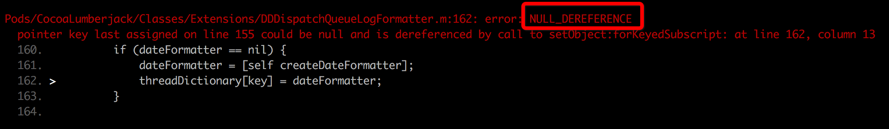

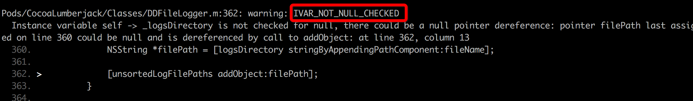

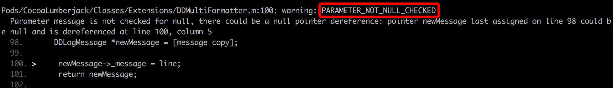

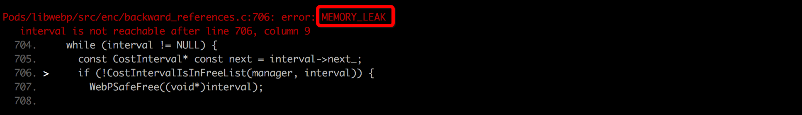


### Infer : Checkers

infer 的分析器执行复杂的程序间（interprocedural，专注整体）静态分析。

但当我们针对那些 linter 中常见的分析，不需要复杂的程序间的分析的时候，我们有一个称为 Infer:Checkers（Infer 校验器） 的框架。


Infer:Checkers 可以检测给定项目中`每个方法`的某个指定属性，虽然分析了整个项目，但是这种分析算是程序内的而不是程序间的。

通过选项 -a checkers 可以在分析时加入校验器(checkers)，如下：

```
infer -a checkers -- javac Test.java
```

### Infer : Linters

For iOS apps, we provide a linters framework. These are checks about the syntax of the program; it could be about a property, or about code inside one method, or that a class or method have certain properties. We provide a few checks and the framework is also easy to extend. Soon we will have a domain specific language (DSL) to make it even easier to write checks.


The linters are run by default when you run Infer. However, there is a way of `running only the linters`, which is faster than also `running Infer`. This is by adding the option -a linters to the analysis command as in this example:

```
infer -a linters -- clang -c Test.m
```

简单的说，就是一个可以单独运行，用来检测某个类、属性、方法是否符合语法规则。

默认情况下，跟着Infer启动检测。

### Infer : Eradicate

针对Java `@Nullable` 注解的一个检查器，是 Infer 静态分析工具套件中的一部分，目标是消除`空指针`异常。

使用如下:

```
infer -a eradicate -- javac Test.java
```


## Infer : Experimental Checkers

一些额外的检测工具：

#### Thread-safety:

- Languages: `Java`
- Maturity: Probably deployable

#### SIOF (static initialization order fiasco):

- Languages: `C++`
- Maturity: Probably deployable

#### Inferbo:

- Languages: `C (but should be easy to adapt to Objective-C/C++, and possibly Java.)`
- Maturity: Medium

Inferbo is a detector for out-of-bounds array accesses. You can read all about it in this blog post. It has been tuned for C, but we are planning to adapt it to other languages in the near future.

用来检测数组越界的问题。

#### Quandary

- Languages: `Java (but should be easy to adapt to Objective-C/C++/C)`
- Maturity: Medium

不是太明白啥意思...

### Infer 如何检测c/c++/objc/java语言代码？

不管是分析哪种语言，Infer 运行时，分为两个主要阶段：

- (1) 捕获阶段
- (2) 分析阶段

#### 阶段一、捕获阶段

Infer 捕获编译命令，将文件翻译成 Infer 内部的中间语言。

这种翻译和编译类似，Infer 从编译过程获取信息，并进行翻译。这就是我们调用 Infer 时带上一个编译命令的原因了，比如: `infer -- clang -c file.c, infer -- javac File.java`。

结果就是文件照常编译，同时被 Infer 翻译成中间语言，留作第二阶段处理。

特别注意的就是，如果没有文件被编译，那么也没有任何文件会被分析。
Infer 把中间文件存储在结果文件夹中，一般来说，这个文件夹会在运行 infer 的目录下创建，命名是 `infer-out/`。当然，你也可以通过 `-o ` 选项来自定义文件夹名字：

```
infer -o /tmp/out -- javac Test.java
```

#### 阶段二、分析阶段

在分析阶段，Infer 分析 `infer-out/` 下的所有文件。分析时，会单独分析每个方法和函数。

在分析一个函数的时候，如果发现错误，将会停止分析，但这不影响其他函数的继续分析。

所以你在检查问题的时候，修复输出的错误之后，需要继续运行 Infer 进行检查，知道确认所有问题都已经修复。

错误除了会显示在标准输出之外，还会输出到文件 `infer-out/bug.txt` 中，我们过滤这些问题，仅显示最有可能存在的。

在结果文件夹中（infer-out），同时还有一个 csv 文件 `report.csv`，这里包含了所有 Infer 产生的信息，包括：错误，警告和信息。

## xcodebuild命令基础概念

### Workspace

简单来说，Workspace就是一个容器，在该容器中可以存放多个你创建的Xcode Project， 以及其他的项目中需要使用到的文件。   

使用Workspace的好处有：

- 1),扩展项目的可视域，即可以在多个项目之间跳转，重构，一个项目可以使用另一个项目的输出。Workspace会负责各个Project之间提供各种相互依赖的关系;

- 2),多个项目之间共享Build目录。

### Project

指一个项目，该项目会负责管理生成一个或者多个软件产品的全部文件和配置，一个Project可以包含多个Target。


### Target

一个Target是指在一个Project中构建的一个产品，它包含了构建该产品的所有文件，以及如何构建该产品的配置。


### Scheme 

一个定义好构建过程的Target成为一个Scheme。可在Scheme中定义的Target的构建过程有：

```
Build/Run/Test/Profile/Analyze/Archive
```

### BuildSetting

配置产品的Build设置，比方说，使用哪个Architectures？使用哪个版本的SDK？。在Xcode Project中，有Project级别的Build Setting，也有Target级别的Build Setting。Build一个产品时一定是针对某个Target的，因此，XCode中总是优先选择Target的Build Setting，如果Target没有配置，则会使用Project的Build Setting。

## xcodebuild常用的几个配置项

### project name


### scheme name

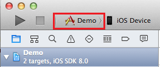

### profile name

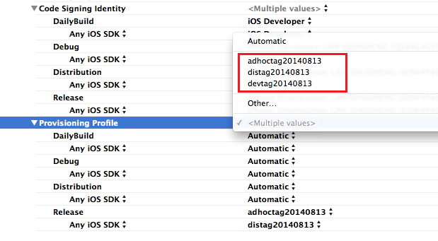

## xcodebuild命令行操作Xcode工程

### 进入到xcode工程目录下

```
...
```
 
### 第一步：清理

没有pods的

```
xcodebuild -target NVMBreakfastModuleDemo clean
```

如果有pods的

```
xcodebuild -workspace NVMBreakfastModule.xcworkspace -scheme NVMBreakfastModuleDemo clean
```

清理后会防止编译时遇到一些奇怪的问题

### 第二步：编译

注意，使用pod后工程目录下有两个文件：

- (1) xxx.xcworkspace
- (2) xxx.xcodeproj

xcworkspace是工作区文件，xcodeproj是工程文件，工作区文件包含工程文件。

对于(1)编译命令，没有xcworkspace文件，只有xcodeproj文件

```
xcodebuld -target targetname build
```

对于(2)编译命令，使用了pods后具有xcworkspace的工程

```
xcodebuild -scheme NVMBreakfastModuleDemo -workspace NVMBreakfastModule.xcworkspace build 
```


遇到的问题:

```
Xcode couldn't find a provisioning profile matching
```

确保开发者调试证书安装，以及provisioning profile也安装。


### 将build后的信息输出的一个文件

格式:

```
xcodebuild  －target selectedTargetName | tee xcodebuild.log
```

比如

```
xcodebuild -scheme NVMBreakfastModuleDemo -workspace NVMBreakfastModule.xcworkspace | tee xcodebuild.log
```

## iOS平台、Infer的安装与使用

### 安装brew

```
/usr/bin/ruby -e "$(curl -fsSL https://raw.githubusercontent.com/Homebrew/install/master/install)"
```

### Install Infer on Mac

Infer 是一个静态分析工具。Infer 可以分析 Objective-C， Java 或者 C 代码，报告潜在的问题。

```
brew install infer
```

If you get the following error…

```
Error: No available formula for infer 
Searching taps...
homebrew/science/infernal
```

Then you must run this command first:

```
brew update
```

### `facebook-clang-plugins`插件安装

```
https://github.com/facebook/facebook-clang-plugins
```

- (1) 下载安装包并解压

- (2) 执行解压包里面如下的shell脚本Installing clang

```
./clang/setup.sh
```

如果报如下错:

```
./clang/setup.sh: line 139: cmake: command not found
```

说明没有安装cmake

- (3) 安装cmake

```
brew install cmake
```

- (4) 测试是否正常安装clang

```
make test
```

- (5) 配置clang环境变量

```
export CLANG_PREFIX=/usr/local #should be the same as above make xcode
```


### Infer 分析单个objc源文件

```
infer -- clang -c Hello.m
```

### Infer 分析整个Xcode工程的代码

语法格式

```
infer -- xcodebuild -target <target name> -configuration <build configuration> -sdk iphonesimulator
```

### Infer 分析Xcodebuild构建的工程

### 【重要】两次运行之间，如果代码有修改，一定要先clean项目

```
xcodebuild -workspace NVMBreakfastModule.xcworkspace -scheme NVMBreakfastModuleDemo clean
```

```
xcodebuild -target Demo clean
```

或者通过 `--incremental` 选项，方式因为增量编译而无结果输出。


必要时刻，强制删除之前产生的`infer-out`整个目录。


### 然后使用Infer指令进行分析

使用了pods的工程

```
infer -- xcodebuild -workspace NVMBreakfastModule.xcworkspace -scheme NVMBreakfastModuleDemo -configuration Debug -sdk iphonesimulator 
```

没有使用pods的工程


```
infer -- xcodebuild -target Demo
```

```
infer -- xcodebuild -target Demo -scheme Demo
```

> 如果出现`No issues found`，就是因为没有clean清除xcode缓存问题，多试几次clean即可。

开始分析后，如果代码存在问题，会在终端以颜色提示，大致如下:

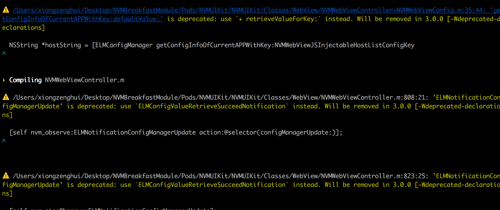

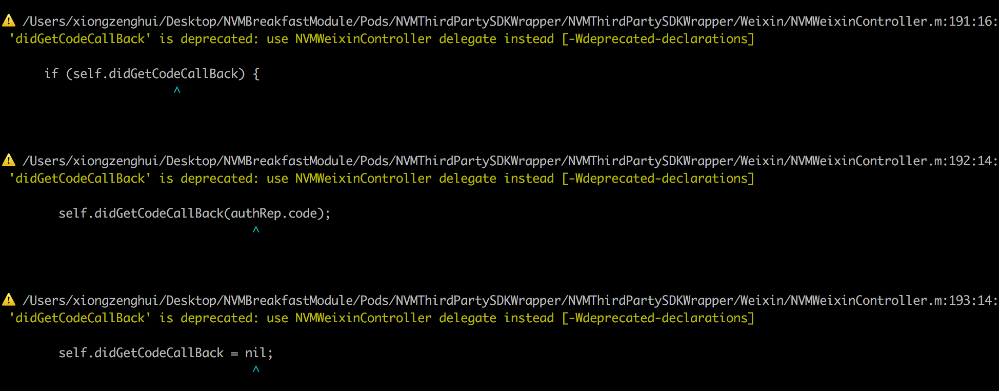

### 分析完成后，会在当前目录下生产一个`infer-out`的目录

当 Infer 分析代码后，会将发现的问题记录并保存到文件 infer-out/bugs.txt 中。

分析阶段产生的文件，Infer将分析bugs结果输出到不同格式文件中，如csv、txt、json 方便对分析结果进行加工分析。


```
infer-out
├── captured/
├── log/
├── multicore/
├── sources/
├── specs/
├── bugs.txt
├── procs.csv
├── report.csv
├── report.json
└── stats.json
```

- captured/ 包含了 Infer 分析需要的每个文件的信息，具体看 下面

- log/, multicore/, 和 sources/ 文件夹是分析器内部驱动所需。

- specs/ 包含了所分析的各个方法的 参数指标，Infer 据此推断文件。
bugs.txt, report.csv, 和 report.json 为三种不同格式的分析结果。

- procs.csv and stats.json 包含 debug 信息的分析结果。

每一个被捕获的源码文件，都会在`infer-out/captured` 下都有一个对应的文件夹，大致如下:

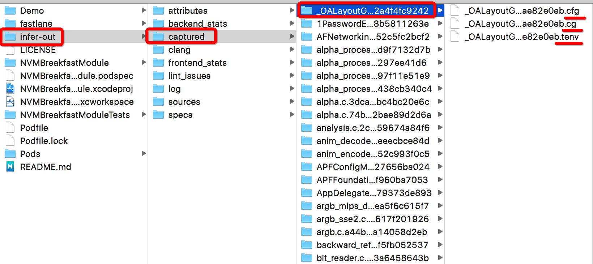

如果有一个文件名为 `example.c`，那么在`infer-out/captured/`下就会存在一个`example.c/`的文件夹，里面存在如下三个文件:

- (1) example.c.cfg
- (2) example.c.cg
- (3) example.c.tenv

.cfg， .cg 和 .tenv 后缀的文件包含了所分析文件的中间表示，这些数据传送给 Infer 的后端程序进行分析。 这些文件包含了序列化后的 OCaml 数据结构。.cfg 文件包含了代码文件中每个函数或方法的控制流程。.cg 包含了代码文件中定义的函数的调用关系，以及该文件对外部函数的调用关系。 .tenv 包含了代码文件中定义和用到的类型。

### Capturing using xcpretty

```
sudo gem install xcpretty
```

如果安装失败，尝试添加如下ruby镜像源


```
ERROR:  While executing gem ... (Errno::EPERM)
    Operation not permitted - /usr/bin/rougify
```

解决

```
sudo gem install -n /usr/local/bin 软件名
```

如果是SSL之类的错，替换gem source

```
http://rubygems-china.oss.aliyuncs.com
```

或

```
https://ruby.taobao.org/
```

一个对xcodebuild编译的日志log进行格式化的工具，等待一段时间让他完成...

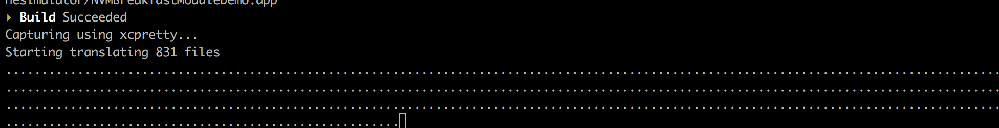

### inferTraceBugs查看具体问题 

在项目根目录，执行如下命令

```
inferTraceBugs
```

执行完之后，会以`编号: 0, 1, 2, .....`列出所有存在问题的代码：

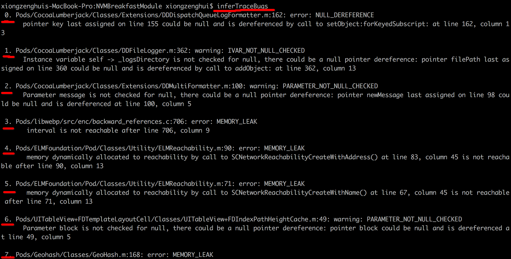

然后选择某一个进行具体显示:

```
96. Pods/NVMTracker/NVMTracker/Classes/Log/NVMWebUrlLog.m:24: warning: BAD_POINTER_COMPARISON
      Implicitly checking whether NSNumber pointer is nil at line 24, column 3. Did you mean to compare against the unboxed value instead? Please either explicitly compare the NSNumber instance to nil, or use one of the NSNumber accessors before the comparison.

97. Pods/YYModel/YYModel/NSObject+YYModel.m:1647: warning: BAD_POINTER_COMPARISON
      Implicitly checking whether NSNumber pointer is nil at line 1647, column 13. Did you mean to compare against the unboxed value instead? Please either explicitly compare the NSNumber instance to nil, or use one of the NSNumber accessors before the comparison.

Choose report to display (default=0):
```
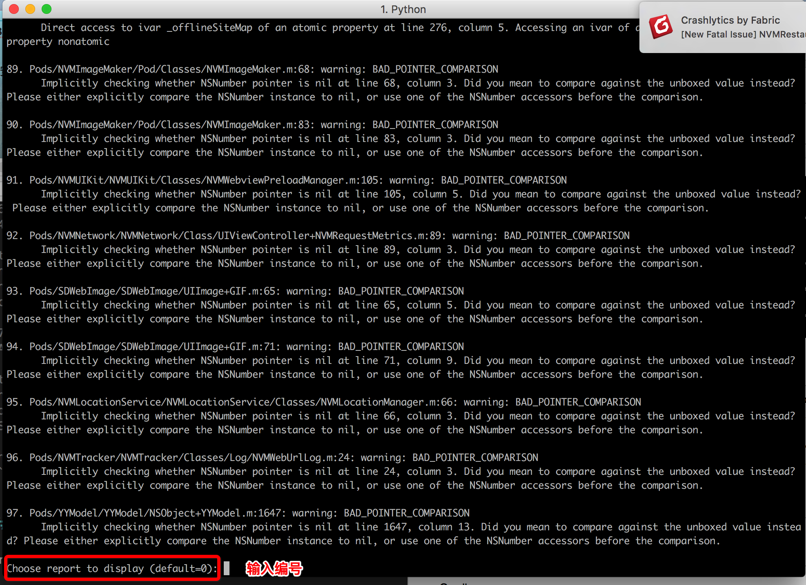

接着继续提示输入:

```
Choose maximum level of nested procedures calls (default=max):
```

直接输入`max`，也可以直接回车，就会输出此次捕获的源文件中的所有存在问题的代码片段。

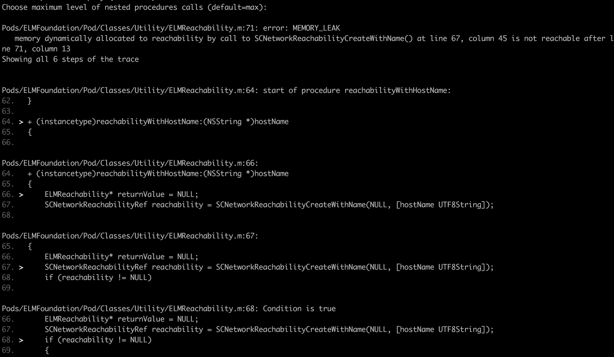

### 更多的资料，官网地址

```
http://fbinfer.com/docs/getting-started.html
```

对应中文社区

```
https://infer.liaohuqiu.net/docs/getting-started.html
```

## 使用shell或者python脚本，嵌入到xcode编译过程中进行代码分析

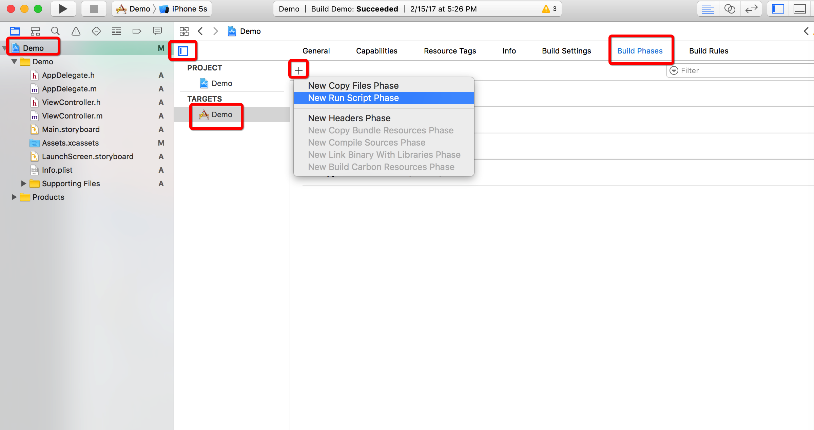

```
xcodebuild -target Demo clean
#open ./infer-out/
infer -- xcodebuild -target Demo -scheme Demo
```
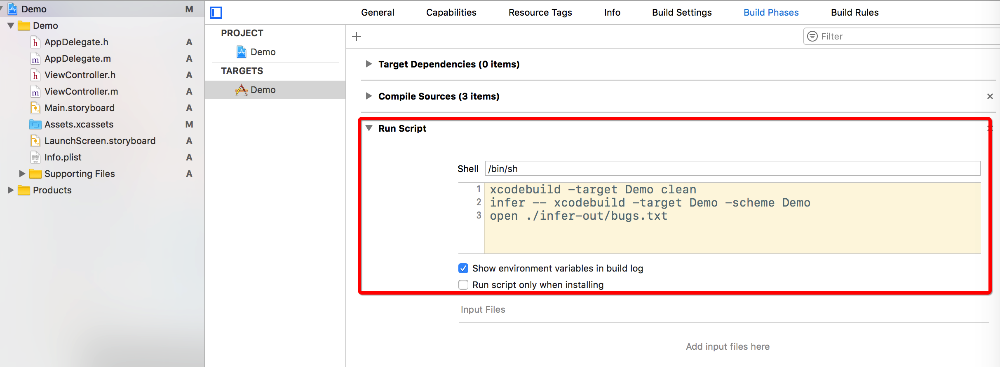


发现，当infer检测到代码有问题的时候，不会让xcode编译通过，xcode会报错

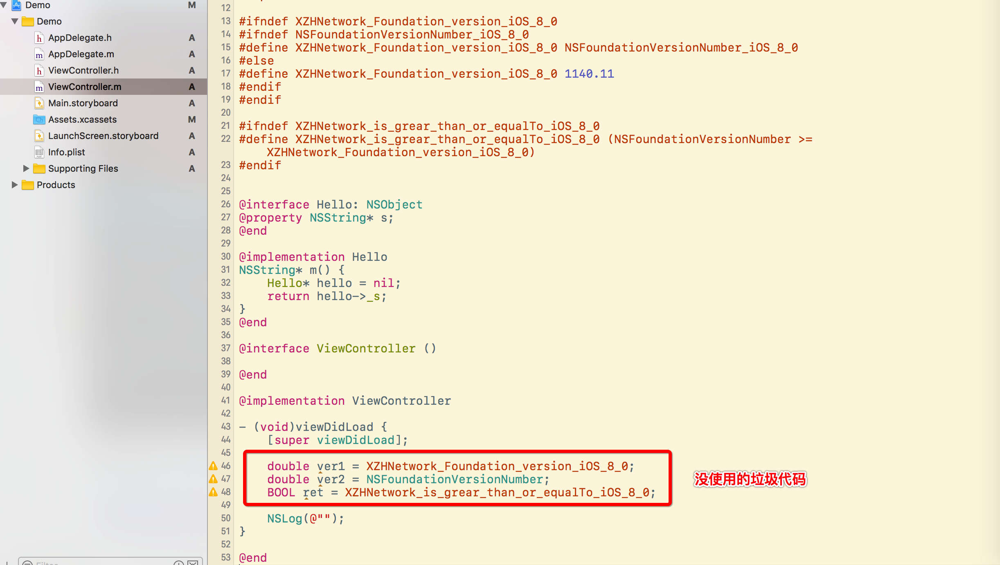

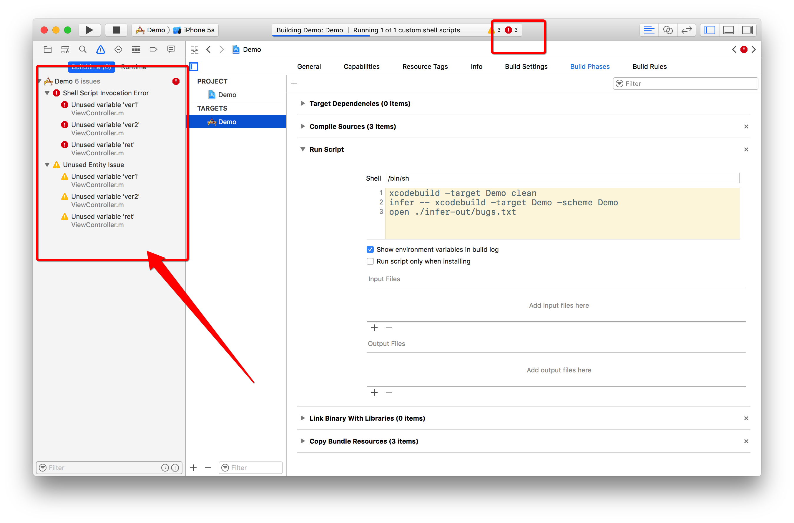

注释掉没用的代码之后，从新让xcode编译就可以了。

> Infer会触发xcodebuild，所以不能嵌入到xcode编译过程中执行，否则不但的死循环执行xcode编译过程。