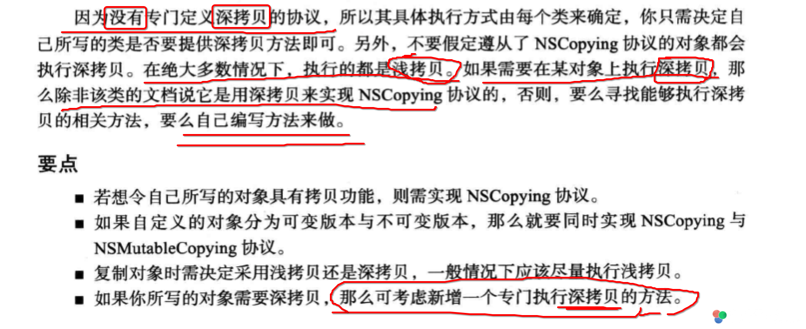
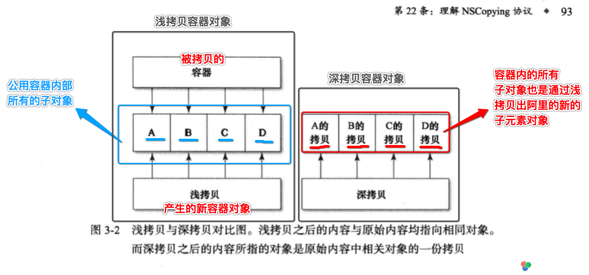
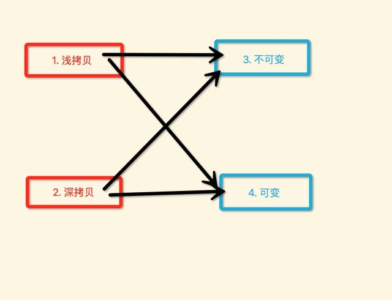

## Objective-C中有提供直接深拷贝对象的方法吗？

首先从《Effective Objective-C 2.0》书上很清楚的说道:



有时候面试的人，也总会问如何让一个类实现深拷贝，他其实就是想让你回答在NSCopying协议的copyWithZone:方法实现内，对内部子对象也执行copy。

我觉得这样是可以的，但是Foundation类基本上都是使用的浅拷贝方式来实现NSCopying协议与NSMutableCopy协议。

所以我觉得就不要去打破苹果的这种约定，我们可以通过额外协议来规定使用`深拷贝`的方式来实现NSCopying协议与NSMutableCopy协议，来完成可变与不可变版本的深拷贝。

而且《Effective Objective-C 2.0》也是赞成这样的....

## 书上的一个拷贝协议的实现例子

```objc
#import <Foundation/Foundation.h>

@interface Person : NSObject <NSCopying>

// 简单属性
@property (nonatomic, copy) NSString *pid;
@property (nonatomic, assign) NSInteger age;
@property (nonatomic, copy) NSString *name;

- (instancetype)initWithPid:(NSString *)pid Age:(NSInteger)age Name:(NSString *)name;

@end

@implementation Person

- (instancetype)initWithPid:(NSString *)pid Age:(NSInteger)age Name:(NSString *)name {
    self = [super init];
    if (self) {
        _pid = [pid copy];
        _name = [name copy];
        _age = age;
        
        _mutableCars = [NSMutableArray new];
    }
    return self;
}

- (id)copyWithZone:(NSZone *)zone {
    
    // 创建出一个新的对象，并复制所有的数据项
    Person *newCopy = [[Person alloc] initWithPid:_pid
                                              Age:_age
                                             Name:_name];
    
    return newCopy;
}

- (NSString *)description {
    
    return [NSString stringWithFormat:@"<%@: %p, %@>",
            [self class],
            self,
            
            //使用一个字典组装对象的所有属性值
            @{
              @"name" : _name,
              @"age" : @(_age)
              }];
}

- (NSString *)debugDescription {
    return [self description];
}

@end
```

测试拷贝对象的代码

```objc
- (void)test6 {
    
    //1. 
    Person *p1 = [[Person alloc] initWithPid:@"person1" Age:19 Name:@"person1"];
    
    //2. 
    Person *p2 = [p1 copy];
    
    //3. 
    Person *p3 = [p2 copy];
}
```

输出结果

```
(lldb) po p1
<Person: 0x7fa11ac9c0a0, {
    age = 19;
    name = person1;
}>

(lldb) po p2
<Person: 0x7fa11ac9c4d0, {
    age = 19;
    name = person1;
}>

(lldb) po p3
<Person: 0x7fa11ac9c9b0, {
    age = 19;
    name = person1;
}>

(lldb) 
```

可以看到:

- (1) 得到的每一个对象都是新的对象
- (2) 但是其数据都是一样的

这就是对象拷贝的作用。

## 看下NSArray与NSMutableArray的copy与mutableCopy

> 针对容器对象（Array、Set、Dictionary）.

### 测试实体类

```objc
@interface XZHUser : NSObject
@property (nonatomic, copy) NSString *name;
@end
@implementation XZHUser
- (NSString *)description {
    return [NSString stringWithFormat:@"<%@ - %p> name = %@", [self class], self, _name];
}
-(NSString *)debugDescription {
    return [self description];
}
@end
```

### 测试下NSArray与NSMutableArray的copy与mutableCopy

```objc
- (void)testFoundation1 {
    XZHUser *user1 = [XZHUser new];
    user1.name = @"user1";
    XZHUser *user2 = [XZHUser new];
    user2.name = @"user2";
    XZHUser *user3 = [XZHUser new];
    user3.name = @"user3";
    
    
    id arr1 = @[user1, user2, user3];
    id arr1_copy1 = [arr1 copy];
    id arr1_copy2 = [arr1_copy1 copy];
    id arr1_copy3 = [arr1 mutableCopy];
    id arr1_copy4 = [arr1 mutableCopy];
    
    id arr2 = [@[user1, user2, user3] mutableCopy];
    id arr2_copy1 = [arr2 copy];
    id arr2_copy2 = [arr2 copy];
    id arr2_copy3 = [arr2 mutableCopy];
    id arr2_copy4 = [arr2 mutableCopy];
    

}
```

输出如下

```
(lldb) po arr1
<__NSArrayI 0x600000059530>(
<XZHUser - 0x600000200680> name = user1,
<XZHUser - 0x600000016480> name = user2,
<XZHUser - 0x6000000165b0> name = user3
)


(lldb) po arr1_copy1
<__NSArrayI 0x600000059530>(
<XZHUser - 0x600000200680> name = user1,
<XZHUser - 0x600000016480> name = user2,
<XZHUser - 0x6000000165b0> name = user3
)


(lldb) po arr1_copy2
<__NSArrayI 0x600000059530>(
<XZHUser - 0x600000200680> name = user1,
<XZHUser - 0x600000016480> name = user2,
<XZHUser - 0x6000000165b0> name = user3
)


(lldb) po arr1_copy3
<__NSArrayM 0x600000059560>(
<XZHUser - 0x600000200680> name = user1,
<XZHUser - 0x600000016480> name = user2,
<XZHUser - 0x6000000165b0> name = user3
)


(lldb) po arr1_copy4
<__NSArrayM 0x600000059680>(
<XZHUser - 0x600000200680> name = user1,
<XZHUser - 0x600000016480> name = user2,
<XZHUser - 0x6000000165b0> name = user3
)


(lldb) po arr2
<__NSArrayM 0x6000000595f0>(
<XZHUser - 0x600000200680> name = user1,
<XZHUser - 0x600000016480> name = user2,
<XZHUser - 0x6000000165b0> name = user3
)


(lldb) po arr2_copy1
<__NSArrayI 0x6000000596e0>(
<XZHUser - 0x600000200680> name = user1,
<XZHUser - 0x600000016480> name = user2,
<XZHUser - 0x6000000165b0> name = user3
)


(lldb) po arr2_copy2
<__NSArrayI 0x600000058e10>(
<XZHUser - 0x600000200680> name = user1,
<XZHUser - 0x600000016480> name = user2,
<XZHUser - 0x6000000165b0> name = user3
)


(lldb) po arr2_copy3
<__NSArrayM 0x600000059410>(
<XZHUser - 0x600000200680> name = user1,
<XZHUser - 0x600000016480> name = user2,
<XZHUser - 0x6000000165b0> name = user3
)


(lldb) po arr2_copy4
<__NSArrayM 0x6000000595c0>(
<XZHUser - 0x600000200680> name = user1,
<XZHUser - 0x600000016480> name = user2,
<XZHUser - 0x6000000165b0> name = user3
)
```

根据输出的信息可以得到：

- (1) 对NSArray对象进行copy，得到的都是`同一个 __NSArrayI*`对象（**这种情况属于特例，估计是系统内存优化的问题**）
- (2) 对NSArray对象进行mutableCopy，得到的都是`不一样的 __NSArrayM*`对象
- (3) 对NSMutableArray对象进行copy，得到的都是`不一样的 __NSArrayI*`对象
- (4) 对NSMutableArray对象进行mutableCopy，得到的都是`不一样的 __NSArrayM*`对象
- (5) **全部arr数组对象中存放的XZHUser对象，都是同样的三个** 

### 所以 NSArray、NSMutableArray，不管是copy还是mutableCopy拷贝出来的数组对象中`子元素对象`，都是直接指向`原始数组内部所有的对象`

其实这就是`浅拷贝`与`深拷贝`最大的区别了，而这种情况就是`浅拷贝`。

还可以证明前面说的问题：

Foundation类（Set、Array、Dic、其他类型的NSObject子类...）在实现NSCopying协议和NSMutableCopying协议时，都是采用的`浅拷贝`对象的方式来实现。只拷贝容器对象本身，而不继续对容器内部子元素对象进行拷贝，而是直接指向。

那为什么这么做了？下面再看看`深拷贝`的不同之处。

## NSArray、NSDictionary、NSSet提供了`深拷贝`对象的方法，只是可能同常不会使用深拷贝而已

```objc
// NSArray提供的
- (instancetype)initWithArray:(NSArray<ObjectType> *)array copyItems:(BOOL)flag;

//  NSDictionary提供的
- (instancetype)initWithDictionary:(NSDictionary<KeyType, ObjectType> *)otherDictionary copyItems:(BOOL)

// NSSet提供的
- (instancetype)initWithSet:(NSSet<ObjectType> *)set copyItems:(BOOL)flag;
```

第二个`copyItem:`这个参数传一个BOOL值:

- (1) 如果传递`YES`表示进行数组的`深拷贝`
- (2) 如果传递`NO`表示进行数组的`浅拷贝`

测试下使用

```objc
- (void)testFoundation2 {
    XZHUser *user1 = [XZHUser new];
    user1.name = @"user1";
    XZHUser *user2 = [XZHUser new];
    user2.name = @"user2";
    XZHUser *user3 = [XZHUser new];
    user3.name = @"user3";
    
    id arr1 = @[user1, user2, user3];
    id arr2 = [[NSArray alloc] initWithArray:arr1 copyItems:NO];
    id arr3 = [[NSMutableArray alloc] initWithArray:arr1 copyItems:NO];
    id arr4 = [[NSArray alloc] initWithArray:arr1 copyItems:YES];
    id arr5 = [[NSMutableArray alloc] initWithArray:arr1 copyItems:YES];
}
```

程序运行后发现，崩溃到`arr4`创建的代码所在行，前面3个arr输出如下

```
(lldb) po arr1
<__NSArrayI 0x608000055c60>(
<XZHUser - 0x608000005a00> name = user1,
<XZHUser - 0x608000005b60> name = user2,
<XZHUser - 0x608000006a00> name = user3
)


(lldb) po arr2
<__NSArrayI 0x6080000559f0>(
<XZHUser - 0x608000005a00> name = user1,
<XZHUser - 0x608000005b60> name = user2,
<XZHUser - 0x608000006a00> name = user3
)


(lldb) po arr3
<__NSArrayM 0x608000055de0>(
<XZHUser - 0x608000005a00> name = user1,
<XZHUser - 0x608000005b60> name = user2,
<XZHUser - 0x608000006a00> name = user3
)

```

可以看到前面1、2、3这三个数组内部的三个子对象，仍然都是一样的。也就是说2、3都是直接指向了1中对应位置的XZHUser对象，并没有进行子对象的拷贝。

但是创建4的时候，代码直接崩溃了，其实创建5也会崩溃。为什么了？

那么这就是`深拷贝`的特点了。

## 从书上截取的浅拷贝与深拷贝的区别图示:




### 浅拷贝与深拷贝的相同点:

- 都对`当前`指向copy/mutable消息的`对象本身`进行拷贝

### 浅拷贝与深拷贝的不同点:

- `浅拷贝`
	- 拷贝出来的容器对象直接`指向`原始容器对象的`内部其他子对象`
	- 也即是`不会`创建新的子对象

- `深拷贝`
	-  会对原始对象内部的`子对象`继续执行`拷贝`操作
	-  也即是`会`创建新的子对象，并从原始对象中的子对象复制数据
	-  就是会对内部所有的子对象以此执行`[arr[i] copy];`


所以，上面的代码会崩溃的原因就是这了，因为`深拷贝`会对item继续进行`拷贝`，但是我们的`XZHUser`并没有实现`NSCopying或NSMutableCopying协议`，所以当然会崩溃。

那么为啥直接NSArray拷贝，不会崩溃了？

```objc
@interface NSArray<__covariant ObjectType> : NSObject <NSCopying, NSMutableCopying, NSSecureCoding, NSFastEnumeration>

....

@end
```

看到了吧，系统的大部分类都实现了NSCopying, NSMutableCopying，so
....

## 让 XZHUser暂时实现NSCopying

```objc
@interface XZHUser : NSObject <NSCopying>
@property (nonatomic, copy) NSString *name;
@end
@implementation XZHUser
- (NSString *)description {
    return [NSString stringWithFormat:@"<%@ - %p> name = %@", [self class], self, _name];
}
-(NSString *)debugDescription {
    return [self description];
}
- (id)copyWithZone:(NSZone *)zone {
    XZHUser *newUser = [XZHUser new];
    newUser.name = [_name copy];
    return newUser;
}
@end
```

然后继续执行上面的测试代码

```objc
- (void)testFoundation2 {
    XZHUser *user1 = [XZHUser new];
    user1.name = @"user1";
    XZHUser *user2 = [XZHUser new];
    user2.name = @"user2";
    XZHUser *user3 = [XZHUser new];
    user3.name = @"user3";
    
    id arr1 = @[user1, user2, user3];
    id arr2 = [[NSArray alloc] initWithArray:arr1 copyItems:NO];
    id arr3 = [[NSMutableArray alloc] initWithArray:arr1 copyItems:NO];
    id arr4 = [[NSArray alloc] initWithArray:arr1 copyItems:YES];
    id arr5 = [[NSMutableArray alloc] initWithArray:arr1 copyItems:YES];
    
}
```

这次程序正常运行，没有任何的崩溃，输出信息如下：

```
(lldb) po arr1
<__NSArrayI 0x600000240a50>(
<XZHUser - 0x6000002075b0> name = user1,
<XZHUser - 0x60000001d3b0> name = user2,
<XZHUser - 0x6000002076b0> name = user3
)


(lldb) po arr2
<__NSArrayI 0x600000240cf0>(
<XZHUser - 0x6000002075b0> name = user1,
<XZHUser - 0x60000001d3b0> name = user2,
<XZHUser - 0x6000002076b0> name = user3
)


(lldb) po arr3
<__NSArrayM 0x600000240e10>(
<XZHUser - 0x6000002075b0> name = user1,
<XZHUser - 0x60000001d3b0> name = user2,
<XZHUser - 0x6000002076b0> name = user3
)


(lldb) po arr4
<__NSArrayI 0x600000240d20>(
<XZHUser - 0x6000002078c0> name = user1,
<XZHUser - 0x600000207850> name = user2,
<XZHUser - 0x6000002078e0> name = user3
)


(lldb) po arr5
<__NSArrayM 0x600000240ed0>(
<XZHUser - 0x6000002078b0> name = user1,
<XZHUser - 0x600000207920> name = user2,
<XZHUser - 0x6000002078f0> name = user3
)
```

可以看到，arr1、arr2、arr3内部的三个XZHUser对象都是`一样`的。但是arr4、arr5内部的三个XZHUser对象都是`不一样`的。

所以，这也就是深拷贝的独特之处了，会依次对拷贝对象内部的所有的item对象，继续进行`copy`。

也就必须要求，item对象的所属类必须实现NSCopying或NSMutableCopying协议。

那么这一点，正好是Foundation类为什么默认都进行`浅拷贝`的原因了。因为系统并不知道，我们开发者写的类型是否已经实现了NSCopying或NSMutableCopying协议，如果强制按照`深拷贝`，结果就是崩溃。

而且，其实大部分情况下，也很少用到`深拷贝`，我是基本上从来没用到过...

其实，到这里位置，对于浅拷贝与深拷贝的概念已经解释的很清楚了。但是好像，还没有重点说`copy与mutableCopy`的区别，也就是说怎么选择`实现NSCopying还是NSMutableCopying？`

## `-[NSObject copy]与-[NSObject mutableCopy]`的区别

### iOS提供了两种拷贝对象的协议:

- (1) 第一种、`-[NSObject copy]`

需要实现如下协议

```
@protocol NSCopying

- (id)copyWithZone:(nullable NSZone *)zone;

@end
```

- (1) 第二种、`-[NSObject mutableCopy]`

需要实现如下协议

```
@protocol NSMutableCopying

- (id)mutableCopyWithZone:(nullable NSZone *)zone;

@end
```

### `Effective Objective-C 2.0` 上指明的NSCopying协议与NSMutableCopying协议的区别:

mutableCopy这个 “辅助方法”（helper）与 copy相似，也是用默认的 zone 参数来调用 “mutableCopyWithZone:”。

如果你的类分为 `可变版本`（mutable variant） 与 `不可变版本`（immutable variant），那么就应该实现NSMutableCopying协议。

若采用此模式，则在 可变类 中覆写 “copyWithZone:” 时，不要返回 可变的拷贝，而应该返回一份不可变的版本。

无论当前实例是否可变，若需要获取可变版本的拷贝，均应调用 mutableCopy 方法。同理若需要不可变对象，则总应该调用 copy 方法来获取。

### 我简单总结就是，如果你的类类似Array分为如下两种版本:

- (1) NSArray 不可变版本
- (2) NSMutableArray 可变版本

那么就需要:

- 同时实现NSCopying协议与NSMutableCopying协议
-  NSCopying协议: 提供一个`不可变`版本的拷贝(new)对象
-  NSMutableCopying协议: 提供一个`可变`版本的拷贝(new)对象

而如果就是简简单的一种不可变情况，就只需要时NSCopying即可。


### 我看到有一些说法与做法

- （1）第一个协议是浅拷贝实现，第二个协议是深拷贝实现。
- （2）或者有的说自己实现如上方法来分别做浅拷贝or深拷贝实现。

第一种说法，从《Effective Objective-C 2.0》所示错的很离谱。而第二种说法一定程度上是正确的，但是不建议这么做，后面有更好的做法。


## 对自定义NSObject类型增加深拷贝的最好的做法

### 基于`浅拷贝`的 copy、mutableCopy，仍然使用系统的协议

```objc
@protocol NSCopying

- (id)copyWithZone:(nullable NSZone *)zone;

@end

@protocol NSMutableCopying

- (id)mutableCopyWithZone:(nullable NSZone *)zone;

@end
```

### 基于`深拷贝`的 copy、mutableCopy，我们自己重定义额外的协议


```objc
/**
 *  对应 NSCopying协议
 */
@protocol NSDeepObjectCopying <NSObject>

- (id)deepCopy;

@end

/**
 *  对应 NSMutableCopying协议
 */
@protocol NSDeepObjectMuatbleCopying <NSObject>

- (id)deepMutableCopy;

@end
```

因为前面说了，Foundation基本上都是采用`浅拷贝`实现的所有的NSCopying、NSMutableCopying。

而我们突然使用`深拷贝`来改写NSCopying、NSMutableCopying，这会打破系统的平衡。

### 然后需要实现深拷贝的类型去实现我们自定义的协议即可

```objc
#import <Foundation/Foundation.h>
#import "Account.h"

//深拷贝协议
#import "XZHDeepCopying.h"

/**
 *  添加对 深拷贝协议的实现，由于当前User类就只有一个不可变版本，所以实现XZHDeepCopying协议
 */
@interface User : NSObject <NSCopying, XZHDeepCopying>

@property (nonatomic, assign) NSInteger uid;
@property (nonatomic, copy) NSString *uname;
@property (nonatomic, copy) NSString *upassword;

- (instancetype)initWithUid:(NSInteger)uid
                      uName:(NSString *)name
                  uPassword:(NSString *)password;

- (void)addAccount:(Account *)account;
- (void)removeAccount:(Account *)account;
- (NSArray *)accounts;

@end
```

```objc
#import "User.h"

@implementation User {
    NSMutableArray *_mutaAccounts;
}

- (instancetype)initWithUid:(NSInteger)uid
                      uName:(NSString *)name
                  uPassword:(NSString *)password
{
    self = [super init];
    if (self) {
        _uid = uid;
        _uname =
        _upassword = [password copy];
        _mutaAccounts = [NSMutableArray new];
    }
    return self;
}

- (void)addAccount:(Account *)account {
    [_mutaAccounts addObject:account];
}

- (void)removeAccount:(Account *)account {
    [_mutaAccounts removeObject:account];
}

- (NSArray *)accounts {
    return [_mutaAccounts copy];
}

#pragma mark - 浅拷贝 + 不可变

- (id)copyWithZone:(NSZone *)zone {
    
    //1. 创建一个新的User，并直接传入当前对象的属性值
    User *newUser = [[User allocWithZone:zone] initWithUid:_uid
                                                     uName:_uname
                                                 uPassword:_upassword];
    
    //2. 内部数组子对象同样直接指向
//    newUser->_mutaAccounts = self->_mutaAccounts;//这样会导致修改内部子对象，会影响原来的数组内部子对象
    newUser->_mutaAccounts = [self->_mutaAccounts mutableCopy];//建议对数组浅拷贝一下，这样就互相不会影响
    newUser->_mutaAccounts = [[NSMutableArray alloc] initWithArray:newUser->_mutaAccounts copyItems:NO];//与上一句效果一致，都是浅拷贝一下容器对象本身
    
    //3. 如果是还有单个1:1的对象
    //newUser.car = _car;
    
    //4. 返回新User容器对象
    return newUser;
}

#pragma mark - 深拷贝 + 不可变

- (instancetype)xzh_copyWithDeep {
    
    //1. 创建一个新的User，并传入copy后的属性值（Foundation类直接copy即可）
    User *newUser = [[User alloc] initWithUid:_uid
                                        uName:[_uname copy]
                                    uPassword:[_upassword copy]];
    
    //4. 对内部数组对象分别进行copy操作，得到新的子对象
	// 对数组执行深拷贝，得到一个新的数组对象，并且新数组内部子对象也同样是新的
    newUser->_mutaAccounts = [[NSMutableArray alloc] initWithArray:self->_mutaAccounts copyItems:YES];
    
    //5. 如果是还有单个1:1的对象，继续子对象的深拷贝
    //newUser.car = [_car xzh_copyWithDeep];
    
    //6.
    return newUser;
}

@end
```

如上代码，分别以`浅拷贝`和`深拷贝`两种形式，实现了对象的拷贝，而且都是拷贝的`不可变`版本，不过这个类型也只有`不可变`版本。


## 再看下 copy、mutableCopy、浅拷贝、深拷贝 

```objc
- (void)testFoundation3 {
    XZHUser *user1 = [XZHUser new];
    user1.name = @"user1";
    XZHUser *user2 = [XZHUser new];
    user2.name = @"user2";
    XZHUser *user3 = [XZHUser new];
    user3.name = @"user3";
    
    id arr1 = @[user1, user2, user3];
    
    // 浅拷贝 + 不可变对象
    id arr2 = [[NSArray alloc] initWithArray:arr1 copyItems:NO];
    
    // 浅拷贝 + 可变对象
    id arr3 = [[NSArray alloc] initWithArray:arr1 copyItems:NO];
    
    // 深拷贝 + 不可变对象
    id arr4 = [[NSArray alloc] initWithArray:arr1 copyItems:YES];
    
    // 深拷贝 + 可变对象
    id arr5 = [[NSMutableArray alloc] initWithArray:arr1 copyItems:YES];
    
}
```

输出如下

```
(lldb) po arr1
<__NSArrayI 0x608000243fc0>(
<XZHUser - 0x608000018150> name = user1,
<XZHUser - 0x60800000e1a0> name = user2,
<XZHUser - 0x608000018130> name = user3
)


(lldb) po arr2
<__NSArrayI 0x608000058240>(
<XZHUser - 0x608000018150> name = user1,
<XZHUser - 0x60800000e1a0> name = user2,
<XZHUser - 0x608000018130> name = user3
)


(lldb) po arr3
<__NSArrayI 0x608000059c50>(
<XZHUser - 0x608000018150> name = user1,
<XZHUser - 0x60800000e1a0> name = user2,
<XZHUser - 0x608000018130> name = user3
)


(lldb) po arr4
<__NSArrayI 0x608000059200>(
<XZHUser - 0x608000018190> name = user1,
<XZHUser - 0x6080000181b0> name = user2,
<XZHUser - 0x6080000181d0> name = user3
)


(lldb) po arr5
<__NSArrayM 0x608000059ef0>(
<XZHUser - 0x60800000e180> name = user1,
<XZHUser - 0x608000018210> name = user2,
<XZHUser - 0x6080000180f0> name = user3
)
```

### 根据每个数组中的所有的item对象的是否一样，我想可以对`copy、mutableCopy、浅拷贝、深拷贝`得到这样的总结:

- (1) 首先是，拷贝出的可变还是不可变的对象
	- (条件1) 可变
	- (条件2) 不可变

- (2) 再次是，使用浅拷贝还是深拷贝去实现拷贝函数
	- (条件3) 浅拷贝
	- (条件4) 深拷贝

其实 (1)与(2) 中的条件是可以组合实现的:

```
- 情况一、 可变 	+ 浅拷贝
- 情况二、 可变 	+ 深拷贝
- 情况三、 不可变 	+ 浅拷贝
- 情况四、 不可变 	+ 深拷贝
```

其实图示如下




而对于Foundation类，默认只是使用 1与3 两种对象拷贝的方式.

