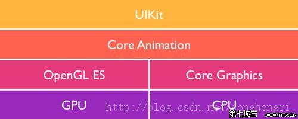
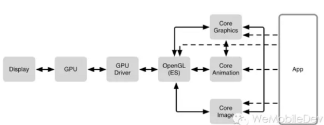
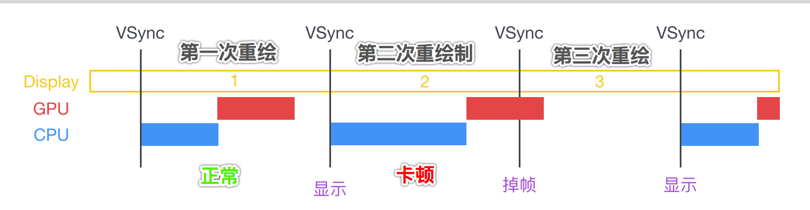

## iOS图像渲染框架结构



从图中可以得出:

- (1) UIKit作为CoreAnimation的入口
	- 分为iOS和MaxOS，两个不同的版本

- (2) CoreAnimation负责调用更加底层的基于c语言的绘图框架:
	- GPU 硬件绘图
	- CPU 软件绘图

- (3) OpenGL ES >>> 基于GPU渲染

- (4) Core Graphics >>> 基于CPU渲染

所以，CoreAnimation不仅仅只是用来做`动画`而已，而是进行`数据显示`的一个很重要的`入口`。

## UIView是如何到显示的屏幕上的？



图1、往右侧的App往左侧看。


图2、从左往右看。


### 结合2个图，可以总结到：

- (1) 我们写的各种界面显示代码，首先都交给`CPU`进行处理
	- 包括几种形式的绘图代码：
		- CoreGraphics
		- CoreAnimation（我们创建的各种UIView、CALayer、动画）
		- CoreImage
	- 对象创建、图片等资源文件读取、frame计算、文本尺寸计算...

- (2) 然后CPU将处理好的数据，提交给`GPU`

- (3) GPU拿到数据，进行渲染生成`帧数据`，并存放到`帧缓冲区`
	- 取出CALayer的各种数据进行图像渲染
	- 多个CALayer的混合合成
	- 最终的纹理合成
	- 生成最终要显示的图像

- (4) 视频控制器，接收到绘制屏幕指令后，从`帧缓冲区`逐行读取帧数据，然后传递给显示器进行显示


所以，大致一个UIView，从创建到渲染、到GPU处理、到`帧缓冲区`、到显示器最终显示的过程就是这样子了...

## 界面卡顿产生的`大方面`原因

### iOS系统每一次`重新绘制屏幕`的时间间隔（FPS，Frames Per Second，每一秒刷新的帧数）

- (1) 屏幕`每一秒`默认会`重新进行绘制`屏幕`60次`也称为`60帧每秒`、`FPS=60`
- (2) 意味着每一次进行屏幕绘制，的`时间间隔`只有`16毫秒（1/60 == 0.016..）`
- (3) 但是还要除去，系统大概`5毫秒+`的开销，实际上大概只有`10毫秒`左右

也就是说，每一次屏幕刷新的时间间隔，留给开发者的时间，只有`10毫秒`左右。

### iOS系统借助了`CADisplayLink计时器`，完成屏幕每隔`1/60秒`就会进行重绘。系统他是不管我们代码有没有执行完，反正他就是每隔`1/60秒`就会将屏幕上东西全部擦除，然后进行绘制新的一帧数据。




可以看到，在第二次屏幕刷新的期间，由于`CPU`占用了很大的处理时间，导致`GPU`处理图像渲染结束的时间，超过了`1/60`秒。

造成`第二帧`的数据，延迟提交到了`帧缓存区`，也就导致了`控制器`在超过的这一段时间内，无法读取到最新的针数据，所以这一段时间内屏幕都是`第一帧`的内容。

而屏幕的画面在一段时间内，一直不发生变化，这就是所谓的界面卡顿感。

### 造成控制器无法在`1/60`内读取到最新的帧数据的两个大方向原因

- (1) CPU 占用大量时间 
- (2) GPU 占用大量时间

CPU 和 GPU 不论哪个阻碍了显示流程，都会造成掉帧现象。所以开发时，也需要分别对 CPU 和 GPU 压力进行评估和优化。


## CPU 资源消耗原因与解决方案

### 1. 对象创建

- (1) 一般是一些比较大的对象创建，如：从磁盘读取图片、对象归档文件、plist文件、二进制文件...等。

```
dispatch_async(global_queue, ^() {
	//读取磁盘文件
});
```

- (2) 然后就是必要时刻，使用一些轻量级的对象，来代替重量级的对象。比如，CALayer来代替UIView。

- (3) 一些常用的对象，可以考虑内存缓存、内存缓存池这样的容器缓存起来，不要频繁的创建与废弃。

### 2. 对象的调整

- (1) 对于CALayer进行属性值调整是很耗性能的。

CALayer 内部并没有属性，当调用属性方法时，它内部是通过运行时 `resolveInstanceMethod` 为对象临时添加一个方法，并把对应属性值保存到内部的一个 Dictionary 里，同时还会通知 delegate、创建动画等等，非常消耗资源。

而UIView的常见属性（比如 frame/bounds/transform），其实都是对内部的CALayer对象进行操作。

- (2) 当视图层次调整时，UIView、CALayer 之间会出现很多方法调用与通知。所以在优化性能时，应该尽量避免调整视图层次、添加和移除视图。


### 3. 对象销毁

一般情况下，对于普通的对象销毁到没啥。但是如果量比较大，或者对象的体积很大，那么同一时刻在`主线程`上进行销毁，也会给`主线程`带来一定的消耗。

在一个子线程上，异步释放主线程上的对象的写法:

```objc
- (void)asyncReleaseArray {
    
    //1. 假设存在一个很多子对象的数组
    NSMutableArray *dataSource = [NSMutableArray new];
    for (int i = 0; i < 3; i++) {
        Cat *cat = [Cat new];
        cat.name = [NSString stringWithFormat:@"cat%d", i+1];
        [dataSource addObject:cat];
    }
    
///////////////2. 现在要在子线程完成对数组对象的释放，如下固定三步/////////////////
    
    //第一步、增加一个临时数组持有所有的子对象，此时存在2个数组（dataSource、holder）持有所有的子对象
    NSArray *holder = [[NSArray alloc] initWithArray:dataSource];
    
    //第二步、释放掉之前的数组对象，此时只有holder数组持有所有的子对象
    dataSource = nil;
    
    //第三步、将holder数组的释放操作，异步放到子线程
    dispatch_async(dispatch_get_global_queue(0, 0), ^{
        [holder count];//当在子线程执行完方法后，该临时指针变量被废弃，于是holder指向的数组对象被废弃
    });
}
```

在主线程上，完成了`dataSource`局部变量的指向释放。

但是还有一个局部的`holder`指向，虽然是在主线程的方法块内定义，但是由于被block捕获，所以`holder`指针变量默认拷贝到堆区。

而出了主线程的方法块后，处于该方法块内的`holder`指针变量，被废弃，但是堆区还是存在一个拷贝的`holder`指针变量。

那么，此时对于之前的那个`Cat对象数组`，只存在一个位于堆区的被拷贝的`holder`指针变量所指向。

而最后，在子线程上，执行完`[holder count];`之后，block对象被废弃，紧着`holder`变量也就被废弃了。

那么，对于`Cat对象数组`也就失去了最后的一个指向，跟着在同一个子线程上，进行废弃了。

### 4. 布局计算

视图布局的计算是 App 中最为常见的消耗 CPU 资源的地方。

尤其是`Autolayout`，如果写的有问题，经常是占用CPU 90% 几。

### 5. 文本计算

用 `[NSAttributedString boundingRectWithSize:options:context:]` 来计算文本宽高

### 6. 文本渲染

有两种方案:

- (1) 自定义UILabel、UITextView...等，然后重写`drawRect`实现，使用用 TextKit 或最底层的 CoreText 对文本`异步`绘制。

- (2) 使用 CATextLayer + TextKit/CoreText 对文本`异步`绘制。

(2)比(1)更好，因为(2)不要立刻创建CALayer的寄宿图，而且还会使用OpenGL高性能绘图。

注意，使用CoreText来进行文本排布的好处:

- (1) CoreText 对象创建好后，能直接获取文本的宽高等信息，避免了多次计算（调整 UILabel 大小时算一遍、UILabel 绘制时内部再算一遍）。

- (2) CoreText 对象占用内存较少，可以缓存下来以备稍后多次渲染

### 7. 图片的解码

- (1) 当我们使用UIImage的那些方法时，并不会立马触发图片的`解压缩`

- (2) 只有当CALayer被提交到GPU进行渲染前，才会触发图片的`解压缩`，但是默认都是在`主线程`完成

- (3) 可以在`后台线程`先把图片绘制到 CGBitmapContext 中，然后从 Bitmap 直接创建图片

### 8. 图像的绘制

当使用CoreGraphic进行基于CPU的软件绘图时，可以将CoreGraphic的代码，放到`子线程`进行。一个简单异步绘制的过程大致如下:

```objc
@implementation MyView

- (void)display {
    dispatch_async(backgroundQueue, ^{
        CGContextRef ctx = CGBitmapContextCreate(...);
        // draw in context...
        CGImageRef img = CGBitmapContextCreateImage(ctx);
        CFRelease(ctx);
        dispatch_async(mainQueue, ^{
            layer.contents = img;
        });
    });
}

@end
```

## GPU 资源消耗原因和解决方案

由于GPU基本就是对图像进行基于硬件的渲染了，进行变换、合成、得到最终要显示的bitmap位图。

### 1. 纹理的渲染

由于在渲染很大的图片时，GPU会降低性能很多。可以考虑使用`CATiledLayer`进行大图片的切割，异步按需去加载对应区域的小图片。

### 2. 视图的混合 (Composing)、图形的生成

这两块，好像并没有太多的优化点...